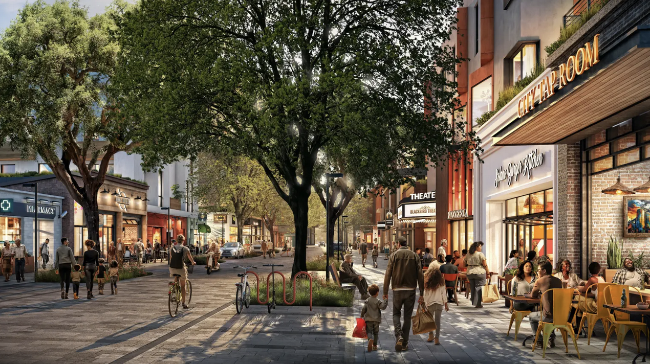
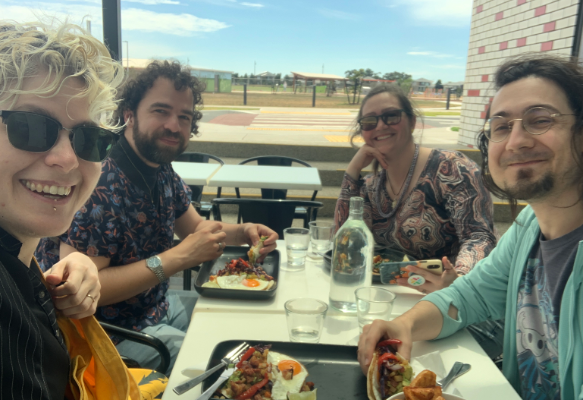
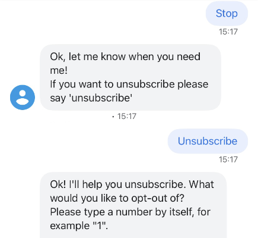

California Forever, a finance/tech-sponsored controversial housing plan pitched as a utopian tech town of the future (<a href="https://www.cbsnews.com/news/california-forever-tech-billionaires-planning-a-new-city-in-rural-solano-county/" target="_blank">via CBS News</a>).

I started working in consumer tech in 2012 as a front end developer. It wasn't for me, so I switched over to interaction design and later, research. I've since gone back into coding for my own personal projects. Along this meandering route, twelve years has gone by in a blink of an eye.

I've been reflecting recently about the future. This post comes at a dark time for the queer, trans, and immigrant community in the US, given the new president elect. The future seems pitch-black. Most of my early thirties was spent looking at some variation of this darkness. When the metric for success in my country was owning a home and having kids, and I was unable to do either of these, I couldn't imagine my future anything else but surviving for no particular reason.

When I moved to a new country, I started to see what a new, fulfilling future _could_ look like for me. My outlook is brighter, albeit cautious. And throughout this change I've been wondering how much technology will play a role in shaping a sustainable and hopeful future I can look forward to along with future generations.

I'm talking about hope because it's something commonly overlooked in the wealth of a country and a gap that millennials and Gen Z have articulated in so many words; compared to what we hear—that the economy is growing and unemployment is low—it does not match our lived experience.

Via Carol Graham's recent essay, ["Why economists—and everyone else—should care about hope,"](https://press.princeton.edu/ideas/why-economists-and-everyone-else-should-care-about-hope?)

"...the most important dimension of wellbeing to future outcomes is not happiness [...] but hope."

  

"Hope is distinct from optimism, which is the belief that things will get better, as it is based on individuals believing <strong>they</strong> can <strong>make</strong> things better, and reflects agency. In contrast, people without hope tend to have miserable life outcomes."

When I was in my twenties, I was convinced consumer tech would play a crucial role in bringing hope to the future; now, after years of career investment I'm starting to doubt its central role.

The things I've made have changed the way people work and interact with one another. They have accelerated economic growth and expanded our global literacy. Some of them were a billionaire's pet project or actively caused harm.

## People like people

When I think back to the thousands of hours of interviews I've done over the course of my career for various products, a common theme emerged—**_people like people more than products._**

Goods and products aren't what make people's eyes light up when they talk about what excites them. They aren't part of their definition of what makes "a good life" or "a healthy life" or "a life worth living."

An example of some people that make my life worth living.

If a product becomes hard to use or too expensive, they leave. It's pretty simple. Most technology is not critical to their survival, unless that technology is something they _have to use_ for some reason. When it comes to other people, however, they _will_ continue to interact, even if those people are difficult to get along with or cost money to see. It's a completely different set of heuristics.

I picture these people's faces when I read news about the "tech revolutionizing lives." It makes our lives more convenient, and makes it easier for us to be in touch, but do we really need services to live happily? What if we need less than we think we do?

## The more I think about it, the more I wonder

The more my monthly subscriptions drain my bank account and the more time I spend in the Settings waiting for my system to update, the more I think about this. Double that for any company's website that claims to have 24-hour customer support but only via AI chatbot.

Or, in this case, an AI chatbot that required my email to ask a question and then auto-subscribed me to more than one newsletter. Thanks, I hate it.

How much am I giving up for my own convenience?

I wonder when I hear companies claim their products are superior but [later it's found in court they've maintained an illegal monopoly.](https://edition.cnn.com/2024/08/05/business/google-loses-antitrust-lawsuit-doj/index.html) I wonder about how it is so easy to sign up for an Adobe subscription, but it is [so difficult to cancel.](https://www.deceptive.design/types/hard-to-cancel)

If these companies truly had superior products, they wouldn't have to prevent people leaving...right? The product's quality should speak for itself. At least, this is what I learned as a junior designer.

As Twitter (and then Elon Musk himself) [used policitally biases information used to move the needle in the current US election](https://www.theverge.com/2024/10/31/24284607/hey-where-are-all-the-angry-congressional-hearings-about-x-being-politically-biased), companies are calling for less government oversight and regulation. I wonder if these "brilliant entrepreneurs" in tech really have their customers' and employees' best interests at heart [as opposed to their year over year sales.](https://www.aboutamazon.com/news/company-news/ceo-andy-jassy-latest-update-on-amazon-return-to-office-manager-team-ratio)

If these folks were invested in their customers' and employees' wellbeing, why would they spend company resources to coerce others?

I want to consume things intentionally and think about my actions critically. There's no "free pass" that tech—any tech—gets simply because it is useful or convenient. I want to understand what the tradeoffs are, and what the real motivators are for the people creating them.

There are times where tech will save me tons of time; and other times it costs me more time and money. People can be difficult—but for me, at the end of the day, it is extremely rewarding to work through conflicts, to find resolution, and to facilitate shared understanding.

So, which is a better return on my investment of time and energy?

## What am I getting for what I'm investing?

I've already invested a lot of my time, energy and resources into technology. I work in it. But recently, I find it harder and harder to get excited about the futures tech companies are painting for us. I wonder about what we need to give up. I wonder what the sustainable business plan is and what the motivation is for CEOs are. There are altruistic people in this world. However, most of them are both altruistic and transparent. Tech's track record on delivering happiness and connection is underwhelming me.

In 2005, Facebook promised me connection with my high school friends. Now, [according to Forbes, it's a profitable content generator for fraudulent ads.](https://www.forbes.com/sites/emilybaker-white/2024/10/31/facebook-ads-election-misinformation/)

In 2013 when I joined Twitter, I was promised more professional growth and contacts. Now, [it's a personal feed for whatever Elon Musk wants to say](https://www.theverge.com/2023/2/14/23600358/elon-musk-tweets-algorithm-changes-twitter) that barely works half of the time. Outrage is profitable, right?

I honestly cannot imagine in what specific way my life will improve from more fraudulent ads or hearing more of what Elon Musk has to say. And that's why I've been thinking more about imagining a hopeful future; one that is not techno-centric, but techno-supported.

## My own hopeful future

The hopeful future I see comes from investing in people—cooperatives, education, artists, government and infrastructure to strengthen our collective safety net and well-being. It's a world where we are connected more to some, and less to others. It's a world where we recognize our shared humanity and protect the environment we want to live in, the streets we want to linger on and say hello to our neighbors, and a world that supports a diversity of human, animal, plant and other life.

Technology is a part of this. But it's not the star of the show. The environment is. The living creatures in it are, and we are. It will still be part of our lives, but not dictating our interactions with each other. It will help us pursue our goals, not keep us from them by being endlessly scrollable.

It will help give us the transparency to fight for equal pay, reduce the income gap, and living, well—livable. It will help us live in more walkable and more connected cities, not help us gerrymander, gentrify and kick out people who have been living there for ages. It will give us the means through which we can connect, but we are doing the connecting.

I personally don't have the answer of whether I've made a difference. Most of the work I've done that _felt_ like it mattered was mentorship, volunteer work, organizing, protesting and co-operative work. I still want to believe in a hopeful future, though.

One not just for "white people in tech" like me. That sounds like hell.

I'd rather have a future where my friends are liberated, thriving, and free to exist as just...people. Free to have bodies, to love, to take up space. Free to be human. And perhaps, for that, I need to depend on tech less and each other more.

* * *
