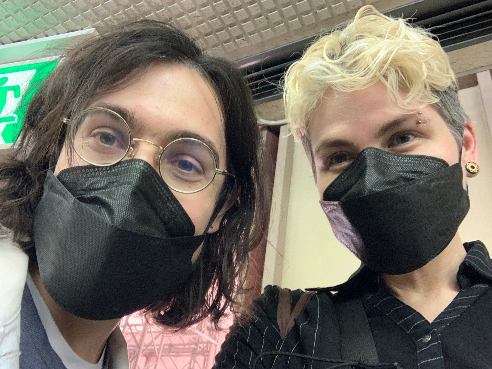

So **@mabbees** and I went out to [Tokyo Indie Games Summit](https://indiegamessummit.tokyo/) today, accompanied by my mother, who, despite not playing a video game in her life, nor speaks Japanese, still allowed us to drag her there.

Below are some of my rough impressions of the games + my mother’s impressions because they’re funny.

[Harvest Yuuka](https://www.nintendo.com/store/products/harvest-yuuka-switch/) - I admit, I was talking to my mother more than playing the game. Explaining to my mother what Touhou Project was harder than I thought. Despite this, I got through the first ~10 minutes of the game and liked the cute characters + the overall concept. I’m a fan of Harvest Moon simulators, but as a non-native speaker of Japanese I needed a _little_ more time than what the game gave me before it auto-skipped to the next part. Because of this, I’ll probably play this in English next time as I want to understand the story.

[Rakuen](https://www.laurashigihara.com/rakuen-en) - Mabbees says this game will definitely make him cry. I agreed. I really love the art style and dark story.

[Minabo: A Walk Through Life](https://store.steampowered.com/app/1822560/Minabo__A_walk_through_life/) - This game really reached out and grabbed me with its art style. It’s about a daikon, and its walk through life; making friends and connections along the way. I was trying to chase after a daikon friend who previously had rejected my friendly approach—as I said, “please don’t run away!” the exhibitor chuckled and said, “life and friendships are like that sometimes.”

Oh. Strangely deep for a game about radishes.

CJ’s Mom: I liked the art style of this one too; I could tell you had a lot of fun with it.

[Potion Permit](https://pqube.co.uk/potion-permit/) - I didn’t get to play this one because there was a cute kid excitedly playing with his character and there was no way I was going to ask for a turn. Again, farming simulators are my jam, and the character creator looked so fun. But I’m downloading this tonight to play. I can’t wait.

_Update: I 100% cleared Potion Permit and it was so, so charming._

I also thought [Memory Girl](https://novelgame.jp/games/show/7123) and [Melon Journey](https://beep-company.com/melon-journey/) seemed cool, but since the area around them was crowded, I wasn’t able to see them clearly.

[Unko Curry](https://tabletopgame.kadokawa.co.jp/products/cardgame/unnko/) - The dark horse of the Indie Games Summit. I wanted to avoid this game because if the name. My mother was so-so on the video games, but she _loved_ this game so much she bought a copy for me to translate into English (unofficially) for my nieces. The tagline is, roughly, カレーの中でうんこが入ってしまった！でもとてもお腹が空いたので、仕方ない。食べましょう！or in a direct translation, “Oh no, some poop got in the curry! But you’re really hungry, so oh well. Let’s eat!” which _raises far more questions than it answers._

The gameplay is memory-style; you put cards down in a central area, then continue to add cards to the area. The back of the card says, “Indian Curry?” which again, is horrifyingly intriguing because it means you don’t know if there’s poop in the curry. You can either “look” at one card, or if there are three of the same card, you can “eat” them. The game gets more complex as time goes on.

I wanted to be mad at Unko Curry for a kind of disgusting concept, but my family had so much fun with it and caused Mabbees and I to laugh until we cried asking each other if it would be worse if the poop’s source was specified or not. (The answer: the worst case scenario would be if the poop’s source was not specified, and also, that the phrase, “the poop got in the curry…again” was added.)

So thanks, Unko Curry. You made my mom’s afternoon, and by proxy, mine as well.

From a games perspective, it was great; from a getting-to-know people perspective, I was disappointed. The event was packed and lively, but that also meant if I didn’t already know people, I wouldn’t meet anyone new, so we stayed within our group. I’m hoping to meet more folks at Tokyo Indies!
