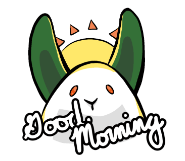
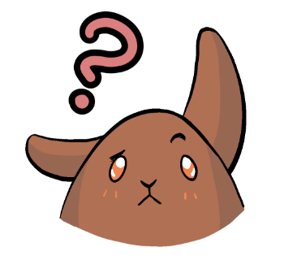

Last Winterseve, [**mabbees**](https://mabbees.neocities.org/) gave me a book on How to Use Procreate. It uses project-based learning to teach the reader about basic to advanced Procreate techniques, and I started on a mini-project aimed at teaching how to build your own color palette and shortcuts for large-batch doodles. The project was for custom chat stickers.

I did the exercise, put it away for a while, then came back to finish it. Introducing...Mochi and Mugi the Eggbuns!

This is **Mochi.**

This is **Mugi.**

I made a LINE version for 120 yen, and a Telegram/Signal sticker pack for free. You can find the downloads below:

### LINE Stickers (EN and JP)

[Mochi the Eggbun](https://store.line.me/stickershop/product/23204797/en?utm_source=gnsh_stickerDetail) | [Mugi the Eggbun](https://store.line.me/stickershop/product/23215688/en?utm_source=gnsh_stickerDetail) | [卵ウサギもちくん](https://store.line.me/stickershop/product/23213003/ja?utm_source=gnsh_stickerDetail) | [卵ウサギむぎちゃん](https://store.line.me/stickershop/product/23213004/ja?utm_source=gnsh_stickerDetail)

### Telegram (free)

[Mochi the Eggbun](https://t.me/addstickers/MochiTheEggbun) | [Mugi the Eggbun](https://t.me/addstickers/MugiTheEggbun)

### Signal (free)

[Mochi the Eggbun](https://signal.art/addstickers/#pack_id=37538c972d358bcef121055c3dce7a19&pack_key=8fc47d2935699af34780c1d6f6c82cd51475327e650b19837e90e8671db60978) | [Mugi the Eggbun](https://signal.art/addstickers/#pack_id=627075ba7361a104dc256c8a69cbf686&pack_key=0a0d558584bfa42176edd3e1b6dbdc8e0b50c18aae4aad6c07cdcc3ab56e1302)

Enjoy these little eggbuns! I liked making them.
