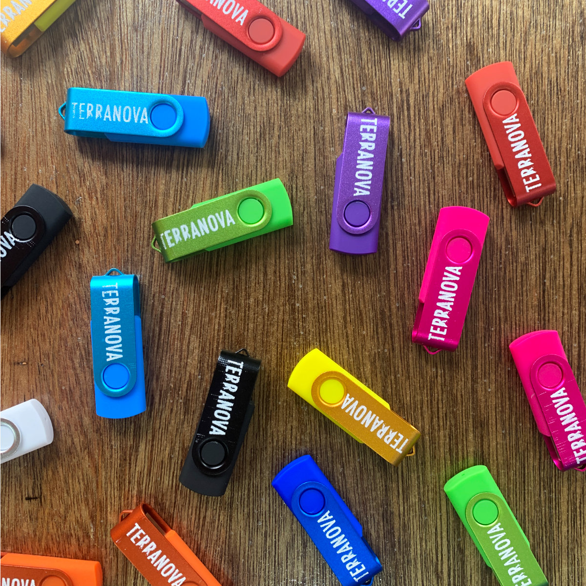

Our game, [Terranova is going to be at BitSummit!](https://bitsummit.org/en/game/terranova/) This is our first in-person event, so I wanted to make something special.

I hand-screenprinted these USB sticks that will have the game + a steam key included; excited to show off these colorful dudes. Printing on a 3.3cm surface was crazy difficult.

_Psst...[I did a reprint of these keys.](/posts/2024-06-20-Terranova-USB.html) You can purchase them on our [Ko-Fi shop](https://ko-fi.com/illuminesce) (limited supplies only)._

_CJ is a designer, indie dev and artist. You could [say hello in an email](https://illuminesce.net/contact) or [check out their games on itch.io.](https://illuminesce.itch.io/)
