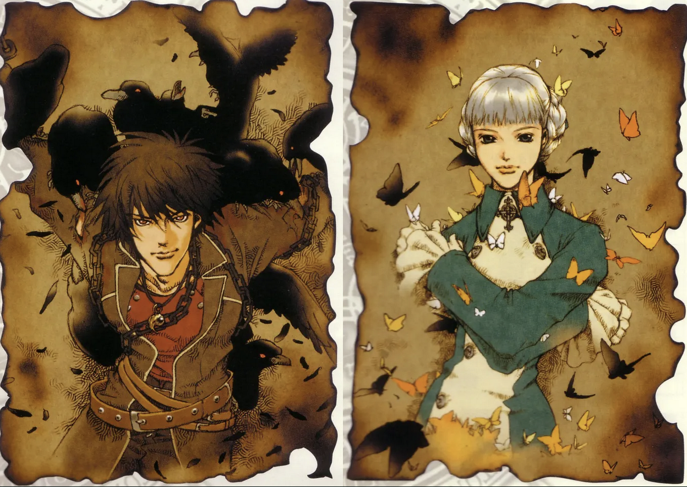

_Originally posted on cohost.org on July 3rd, 2023. This article mentions "chosts" which are posts on cohost. Cohost closed down in 2024, and so the original is archived here._

The Shadow Hearts series has captured my heart for a long time—and since there's recently been an _exciting update_ to the series, I thought I'd write a post talking about why I love Shadow Hearts and why I still look to it as an influence, twenty-plus years later.

I'm going to give you a (mostly) spoiler-free longchost about why Shadow Hearts is so inspirational.

Read on.

* * *

## What is Shadow Hearts?

Shadow Hearts is the name of a game series that came out for the Playstation 1 and 2, developed by Sacnoth and produced by Aruze Corp (now Universal Entertainment). It is a JRPG, and stood out because its unique gameplay and dark, gothic/cosmic horror storyline.

There are four games in the series:

-   [_Koudelka:_](https://en.wikipedia.org/wiki/Koudelka) 1999~2000
-   [_Shadow Hearts I:_](https://en.wikipedia.org/wiki/Shadow_Hearts_\(video_game\)) 2001-2002
-   [_Shadow Hearts: Covenant/Shadow Hearts II:_](https://en.wikipedia.org/wiki/Shadow_Hearts:_Covenant) 2004-2005
-   [_Shadow Hearts_](https://en.wikipedia.org/wiki/Shadow_Hearts:_From_the_New_World)

And a manga series, _Koudelka II_, following the events after the Koudelka game. There are also pachinko machines (WTF?) which I will get to later.

The concept for the Shadow Hearts series was created by Hiroki Kikuta, who left Square to work on a darker, more mature RPG than what Square was doing. He left Sacnoth after the development of _Koudelka_, but his influence was present in varying degrees throughout the series. Following the departure of Kikuta, the creator who took over the PS2-era Shadow Hearts was Matsuzo Machida.

Sacnoth was one of the many small studios founded from ex-Square employees; some others include Monolith Soft _(Xenoblade Chronicles)_, Love-de-Lic _(Moon: Remix RPG Adventure)_, and Mistwalker _(Blue Dragon)_.

The Shadow Hearts series inspired me in three ways: its story and thematic elements, its experimental soundtrack, and its intuitive, but hard to master gameplay.

## The Flawed Stories of Shadow Hearts

I love dark and tragic stories. If I think about the types of media I was into back then, it was primarily apocalyptica and cosmic horror like [CLAMP's X](https://clamp.fandom.com/wiki/X_\(X/1999\)) and Kaori Yuki's [Angel Sanctuary](https://en.wikipedia.org/wiki/Angel_Sanctuary) and bands like Malice Mizer, Dir en Grey and Evanescence.

I grew up in the era of Nintendo 64, so my first experience with video games was colorful characters talking in cute voices (Banjo-Kazooie, Diddy Kong Racing, Mario 64). I saw these games as great, but targeted for kids. I was thirteen,and a 中二病 goth, and wanted something _edgier._

Enter Shadow Hearts.

_Koudelka_ is set in 1898 in Wales; _Shadow Hearts I_, in 1913 across Shanghai and London; _Shadow Hearts II_, in 1915 during World War II in Europe and _Shadow Hearts III_ in 1920 during the Prohibition-era United States. Most sequels are set many years or even generations after their prequels; Shadow Hearts follows world events during a very specific 25-year period of time, which means that each game is a snapshot of a larger world at a very specific point in history.

### Something Bigger Than Us

The world of Shadow Hearts is based on actual history but with a cosmic horror twist; the late 1800's and early 1900's were known as the Progressive Era, which was a period of social and political reform in reaction to the unethical and unfair practices born of the Industrial Revolution. For context, the [Triangle Shirtwaist Factory fire](https://www.history.com/topics/early-20th-century-us/triangle-shirtwaist-fire) happened during this time, one of the deadliest fires in New York. Despite evidence that the owners of had been horribly negligent, they evaded indictment.

I wondered why Shadow Hearts took place at this time. The Progressive Era was an era of discovering people, with the right resources, could do horrible things to others and ultimately get away with it. It was an era of cynicism and feeling helpless but hopeful as the public fought against entities bigger and wealthier than them. Now, in 2023, we're in a similar situation.

In cosmic horror, helplessness is a common theme. Perfectly normal people encounter something that is so great and so horrible they don't stand a chance of completely eliminating it. They cannot be the "perfect hero" or have a happy ending where there isn't some doubt the horror still survives. And this helplessness is terrifying. It's bigger than us. It's bigger than anything.

_Koudelka_ explores this kind of horror by making the central plot of the game the discovery of a dark conspiracy around the Nemeton Monastery. The characters have their own reactions to their discoveries; some of them fight it with denial, and others accept it glumly. Others still fight until the bitter end. _Shadow Hearts I and II_ explores political tensions between countries prior and during World War I as well as the people who stood to profit off of it.

For a RPG, this isn't as easy as killing the bad guys and saving the day; the forces at play here are larger than the characters. The Émigré Manuscript, a central document to the lore of Shadow Hearts, has the power to bring the dead back to life. It exchanges hands throughout the story, and in the wrong hands with the wrong motivation it can be downright terrifying. The monsters, sometimes who once were human, too, have their own horrible lore that adds to the overall unease of the series.

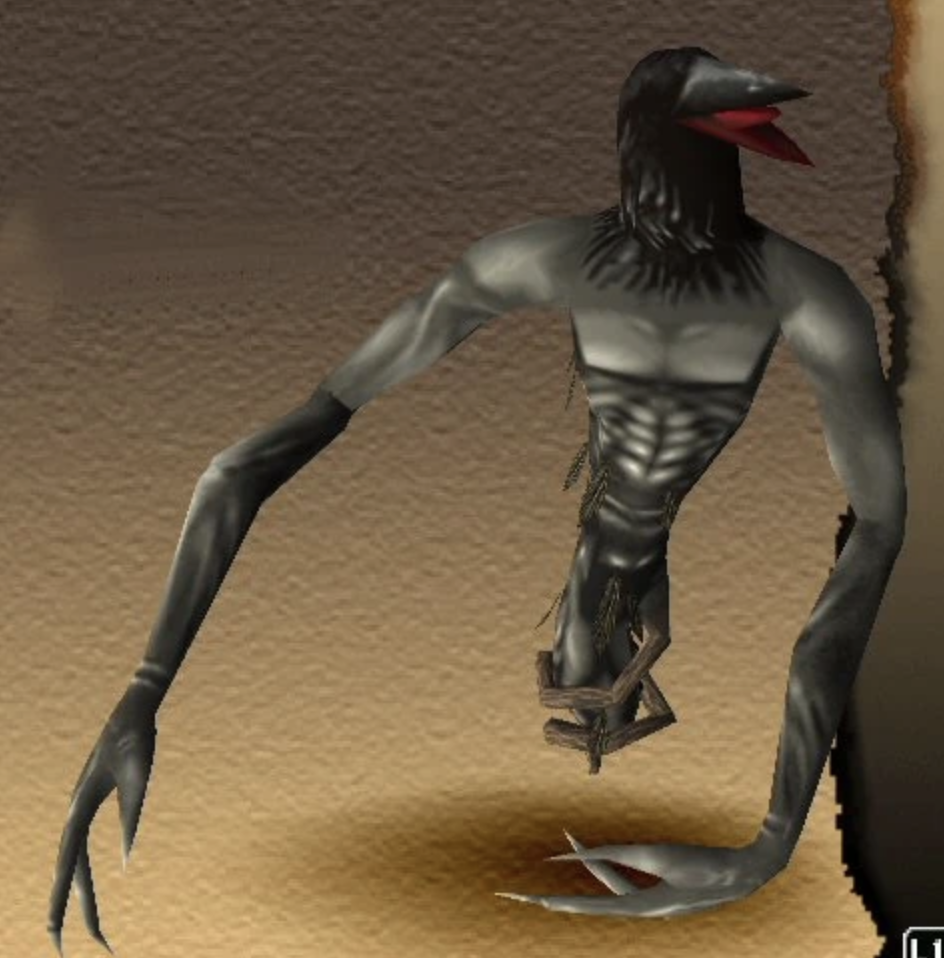

_"Ghost of a bell ringer who took his own life. His body was pierced by a pole when he jumped off a bell tower. The story goes that the birds ate his flesh."_ (via [Shadow Hearts wiki](https://shadowhearts.fandom.com/wiki/Bird_Man))

### Hope is Human

Another thematic element is how each of the characters are flawed in their own way and how tragedy shapes them to be better people. For instance, Yuri Hyuga from _Shadow Hearts I and II_. When he first rescues Alice Elliot from a train to Manchuria in the opening sequence, it is not because he's heroic—it's because he feels compelled to by a mysterious "voice in his head." He comes off as brusque at first; but as the player gets to know him, he's shown as the neither the smartest or most likeable character in the series. Alice (and later, Karin), are smarter and more diplomatic than he is. He's not a strategist, or a leader—he's a Harmonixer—meaning—he can turn into a demon at the cost of his own sanity.

His own fusions are in the same vein as enemy monsters in Shadow Hearts—it's interesting to have a main character's own demons be so close to the ones that your party is killing. (Side note: did I mention I love the Shin Megami Tensei series for the same reason?)

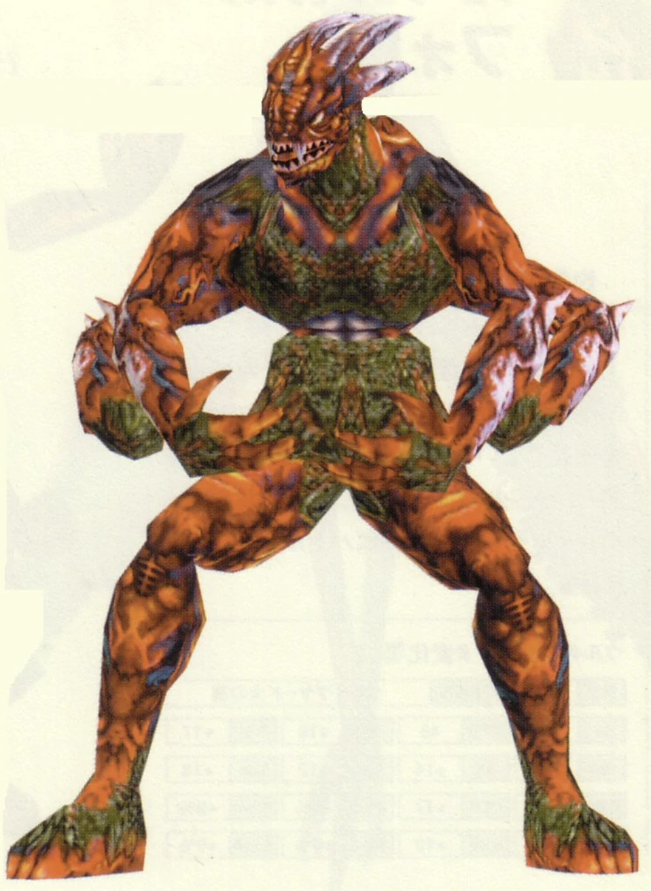

_Pictured: one of Yuri's flame fusions._

I love Yuri in particular because at the beginning of _Shadow Hearts I_ he seems to be a guy who was put in a shitty situation (being possessed by demons and hunted by a man in a fox mask) and he's not chipper about his condition. He's a downer in the beginning. However, as the game progresses and he grows closer to his various party members, something very tragic befalls him at the end of the game.

_Shadow Hearts II_ picks up with Yuri in an even worse state than before—he's lost someone very important to him, and he's dying. And yet, we as the players get to see a gentler Yuri—someone who is still rough around the edges but who takes in moments of kindness and friendship because he doesn't know how long they'll last.

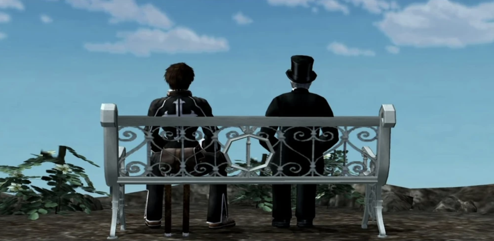

_Pictured: Yuri and his old enemy, sitting on a bench together under a blue sky._

I still write dark stories, but I enjoy giving them elements of brightness or hope. Perhaps it's the romantic in me, but I really resonated with Shadow Hearts' message—that hardship softens, rather than hardens, people. I want to believe that during tragedy, hope can bloom.

Unfortunately, due to criticism that the game was too dark, the horror tones of _Koudelka_ and _Shadow Hearts_ I loved were slowly scrubbed away in _Shadow Hearts II and III_. II still follows a dark storyline, but its characters get sillier in dialogue and concept. For instance, Joachim, one of the party members in Shadow Hearts II, can get weapons from various environmental items, like _pulling a postbox out of the ground and using it as a cudgel._ While I'm generally cool with those sorts of shenanigans in light-hearted games, having characters talk about one of their friends dying while holding a post box they stole from someone takes away from the gravity of the story.

_Shadow Hearts III_ was the silliest of the series; the character designs seemed to be pulled from a hat of stereotypes and little thought was given into how each of the characters would interact with one another on a deep level.

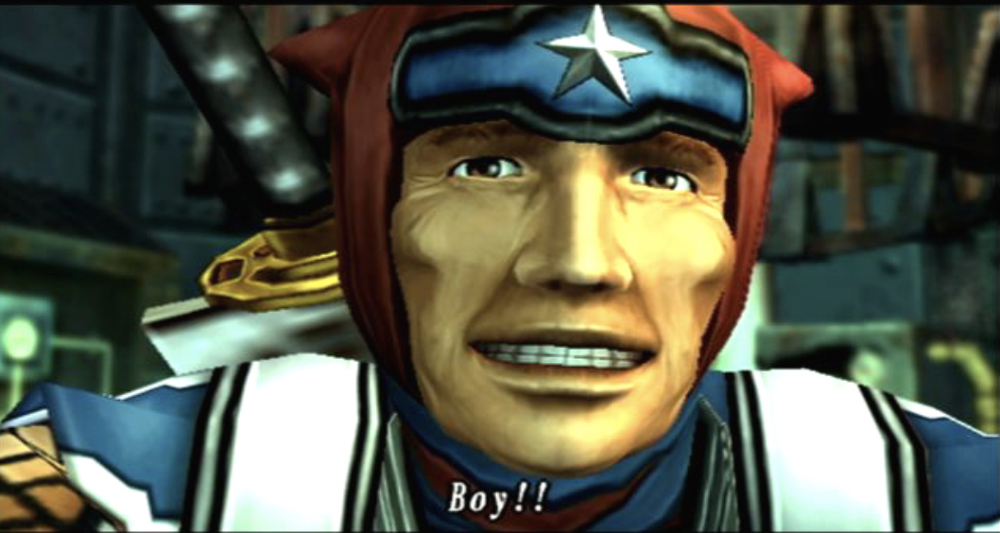

_Pictured: Frank, the American ninja from Shadow Hearts III._

Overall, I loved the blending of real with cosmic and demonic, the relatable characters and the threads of hope each of the characters carry throughout the story, even though they aren't always hopeful at the darkest points in the story. Shadow Hearts, true to its JRPG roots, has a theme of "friendship can overcome anything," which I find especially charming given the dark tones.

It's the kind of story where time it spent developing each of the characters' arcs and focusing not only on their personal journey, but how they are affected by others in their life.

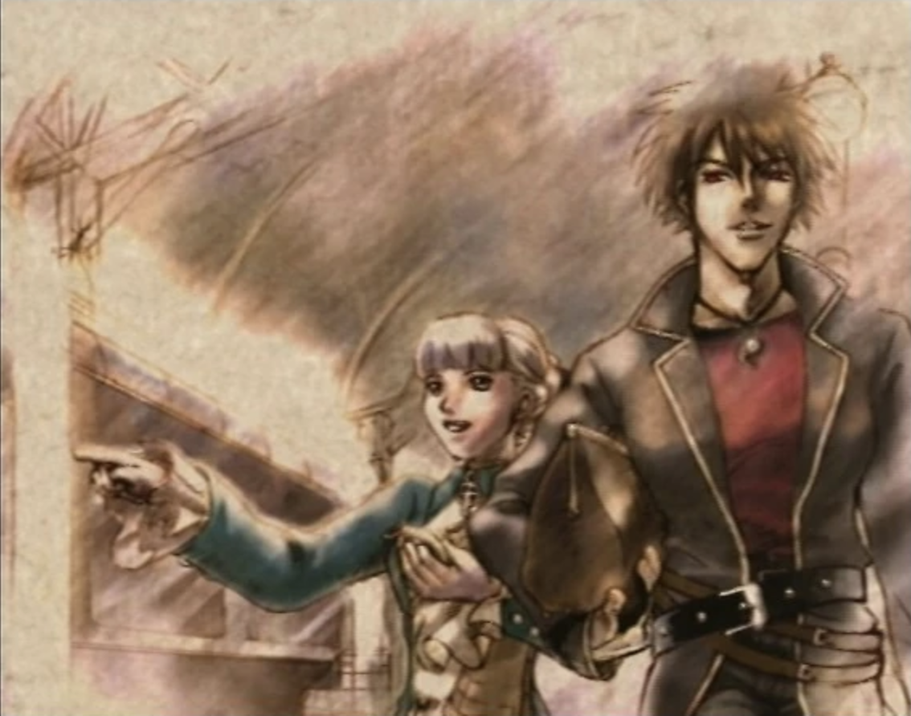

## The Soundtrack of Shadow Hearts

Even though Kikuta left the development studio after Koudelka, a lot of care and thought was put into the music of _Shadow Hearts I, II and III._ Yoshitaka Hirota was the main composer for these three. Koudelka's soundtrack is more choral and ambient than I, II, and III, but I'll be talking more about Hirota's work than Kikuta's.

Before playing the Shadow Hearts series, I'd played _Final Fantasy, Secret of Mana, Tales of Destiny_ and other popular JRPG's—Shadow Hearts' soundtrack gripped me in a way no other soundtrack had. It blended natural orchestral elements like choirs and church organs with a grungy, electronic edge. I loved the natural blend of organic and inorganic sounds. It felt like it was from a completely different world.

<iframe width="560" height="315" src="https://www.youtube.com/embed/lJfhsgsVaTo?si=nQnzQ7psxPcwh-lX" title="YouTube video player" frameborder="0" allow="accelerometer; autoplay; clipboard-write; encrypted-media; gyroscope; picture-in-picture; web-share" referrerpolicy="strict-origin-when-cross-origin" allowfullscreen=""></iframe>

I'm not sure if this music _hits_ the same way to someone seeing this for the first time, but for me, it still gives me goosebumps. It brought out the "uncanny horror" aspect of each Shadow Hearts—a beautiful aria, but with something darker lurking underneath it. Even _Shadow Hearts III_, arguably the game with the most light-hearted plot and characters, still had this as the battle music:

<iframe width="560" height="315" src="https://www.youtube.com/embed/ewzof2aF3Fk?si=teWoSEt_2aKAVPP2" title="YouTube video player" frameborder="0" allow="accelerometer; autoplay; clipboard-write; encrypted-media; gyroscope; picture-in-picture; web-share" referrerpolicy="strict-origin-when-cross-origin" allowfullscreen=""></iframe>

The lessons I took out of these games was how important music was to a "gamefeel" experience: part of the reason why our game _Terranova_ doesn't have music at the moment is because [mabbees](https://mabbees.neocities.org) and I knew that we'd be really picky on the sound and it would delay the game by at least a year or two, if not more, if we chose to do sounds outside of SFX. Now that we've released our content update for the game, we can dive into music.

I highly recommend checking out the full soundtracks for each of the games if you liked either of these examples. If you like grunge in particular, I'd probably listen to _Shadow Hearts I, II, III_ and then _Koudelka_. Thanks to Shadow Hearts Wikia for uploading all of these on YouTube.

-   [Koudelka's Soundtrack](https://youtu.be/ecQiaMUtw6E)
-   [Shadow Hearts' Soundtrack](https://youtu.be/Xt2tz9u-4po)
-   [Shadow Hearts: Covenant's Soundtrack](https://youtu.be/EiWYksq4e6I)
-   [Shadow Hearts: From the New World's Soundtrack](https://youtu.be/d9hpXGgzu-c)

## The Gameplay of Shadow Hearts

If you're still reading this, thank you, and congratulations! I'm about to share with you my favorite part of the Shadow Hearts series; the gameplay. I'll mostly be focusing on _Shadow Hearts I, II, and III_ since _Koudelka's_ gameplay was less inspiring.

### The Judgment Ring

The battle system revolves around the mechanic of the Judgement Ring. It's a ring that has a clock like needle that rotates around the ring. It is used for items, attacking, and magic spells. Colored segments appear on the ring, and the player must hit them in a rhythm in order to execute the action.

Basic attacks and items have a relatively easy rhythm to hit; attacks have three sections and as such, three opportunities to hit. If the player hits only one or two, they will still do damage. Each character has their own Judgment Ring rhythm and, much like music games, with practice, it becomes more and more intuitive. (via [Judgment-Ring.com](http://judgement-ring.com/))

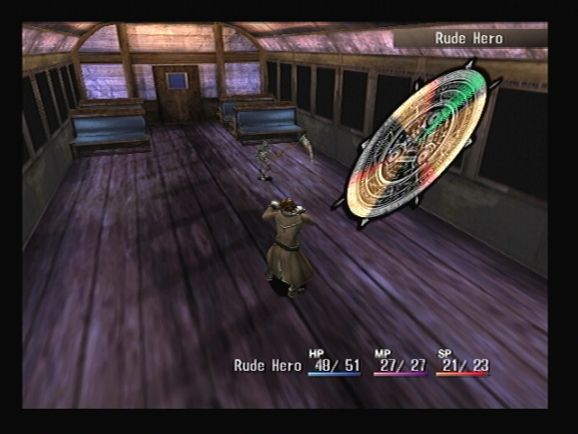

Because each of the characters' rings are unique and as they level up they access new skills that have completely different rhythms, the Ring mechanic starts off simple and gets more and more complex as the game progresses. The progression never feels steep; and eventually players will be hitting more difficult to hit sections.

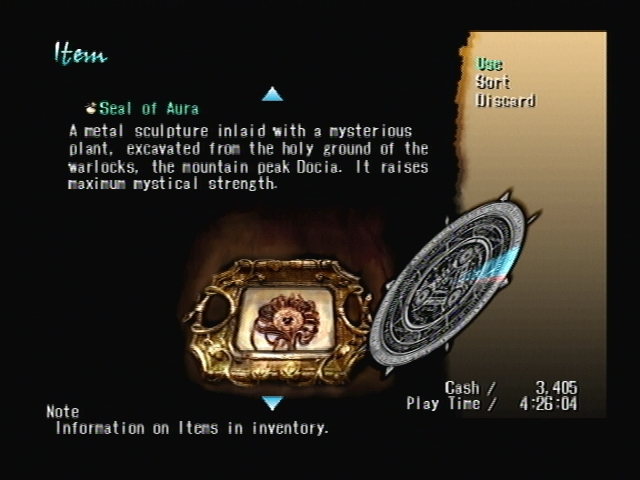

For people who are used to rhythm games and want to make the game even more difficult, there are special accessories in the game that will allow your characters to become more powerful—but with harder to hit Rings. It feels like a fun accomplishment every time you find yourself accessing harder and harder to hit Rings.

To me, the Judgment Ring is a perfect representation of what RPG battle systems should be—never boring, always changing, and able to master from any level. Even modern RPGs can fall into a rut of being endless menu navigators or single-trick hack and slash mechanics; Shadow Hearts was the first game to utilize rhythm game mechanics—which up until then had never before been mixed with classic RPGs.

### Harmonixing and Sanity Points

_Shadow Hearts I_ was the first to introduce the concept of Harmonixing, or defeating demons to turn into them, and the following series had improved versions of this mechanic.

Yuri, from _Shadow Hearts I and II_ and Shania from _Shadow Hearts III_ both have the ability to Harmonix. Each of the demons has an elemental alignment, and in order to gain their power, the player must fight and defeat them. The demons do not exist in the material world; but rather, in the main character's head or on a spiritual plane, which gives an even deeper meaning to the concept of "inner demons." The stronger the demons, the more "Sanity Points" the player must spend to have the demon in play. The player must work for each level and strategize how they'll use their demons.

The concept of sanity is inspired from HP Lovecraft's books, and in Shadow Hearts it's applied as a timer for any action the player takes. Each turn, each party member loses Sanity Points battling against demons. When their Sanity Points hit 0, they go Berserk, which means they become uncontrollable. They can attack party members, use healing items on enemies, or hurt themselves. Harmonixers have and use the most Sanity Points. It ensures that battles don't go on forever and puts a balance on especially powerful demon fusions so they can't be in play for long.

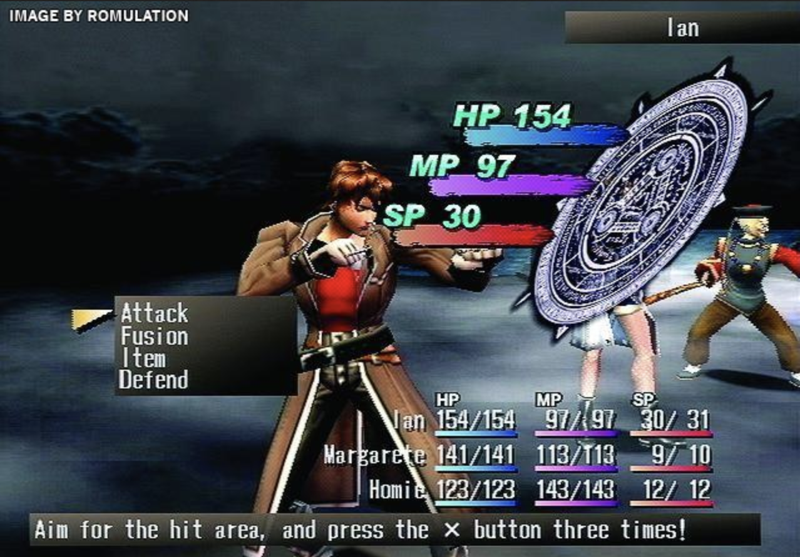

The cherry on top is that story-wise, the more powerful inner demons the player unlocks, the more Yuri and Shania deteriorate. The power to commune with demons is one a human should never have, and these consequences come to bear for both of the protagonists.

The final "demon" that Yuri must unlock is someone very close to him; and if players can achieve all of the fusions they will unlock a special part of the story, too.

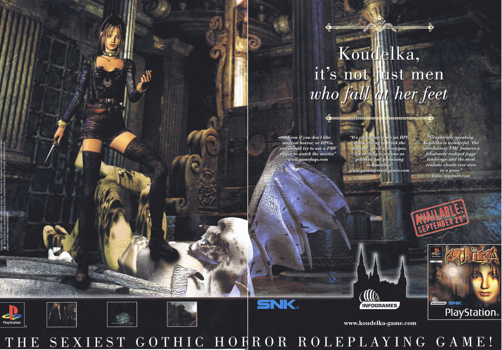

### Criticisms of Shadow Hearts

When I love something, I want it to be better. Shadow Hearts is no different. It suffers from severe 中二病, or edginess syndrome, where things are edgy for the sake of "coolness" sometimes as well as "[the aughts](https://www.tumblr.com/illuminesce/718631109072650240/when-i-say-something-suffers-from-the?source=share)," which is shorthand for casual misogyny, homophobia and transphobia. Even though it was unique in featuring women in leading roles, it still fell into the same misogynistic bullshit many games of its time did.

I'm especially critical of Karin; she's supposed to be in the military, and she was written as chronically indecisive and defers to Yuri, the male protagonist. Koudelka is supposed to be a psychic who is on a visit to a monastery, though she looks like she'd be more at home in a kink party. The way women look and are written in this series are so incongruous to their characters as capable, intelligent people who are fighting dangerous cosmic horrors.

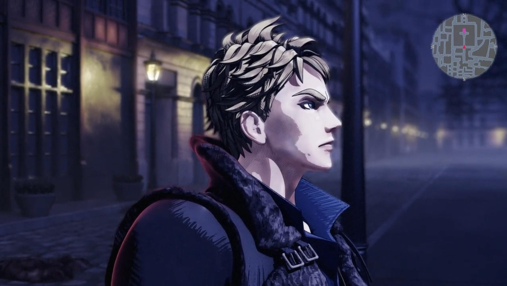

_"Koudelka—it's not just men that fall at her feet."_

There's also some really weird mother complex between two characters, and an unsettling character named [Cornelia](https://shadowhearts.fandom.com/wiki/Cornelia) from _Shadow Hearts II_ who is a doll, but also has the form of a prepubescent girl. Her power changes through the outfits she wears; but some of them are pretty revealing and in the Director's Cut, she has a nude outfit. Given her "puppeteer" is an old man and him dressing her is a necessary part of leveling up, it crosses the line into ick territory for me.

Another critique I have of Shadow Hearts is its pacing when it comes to random encounters. The battle system is snappy,but sometimes there are so many encounters the player can find themselves grinding a fair bit. I will probably play all of them again, but in the era of modern RPG's, I've lost a lot of patience for grinding for the sake of grinding that many RPG's of that era had.

## What Happened to Shadow Hearts?

So what happened to Shadow Hearts after _Shadow Hearts: From The New World's_ release? Well, there's good news and bad news.

Sacnoth was absorbed into Aruze, and Aruze gained the IP rights to Shadow Hearts. When they became Universal Entertainment, they stopped producing video games and focused on pachinko.

In a deeply sad moment for the Shadow Hearts franchise, cutscenes from _Shadow Hearts: Covenant_ were playable through a pachinko machine that was released in Japan around 2008. These machines are very hard to find, but in [2021 a Japanese Twitter YouTuber found one.](https://twitter.com/WeLoveSEVENSTV/status/1370913103227936772?s=20)

I was really bummed out when I learned about this—after all, the IP includes the Judgment Ring, which was a brilliant game mechanic. I'd hate to think that there will never be another game like Shadow Hearts that makes use of rhythm and timing-based attacks. The _Koudelka_ manga was published around the time of the PS1 game and there have been no sequels since.

It seemed that the series as of 2007 was more or less dead.

But then I learned about **Penny Blood.**

### Shadow Hearts: The Resurrection

If I've sold you this far, then you might be wondering—_what is Penny Blood?_

While I was checking my sources for this post, I happened upon a stray comment on some Shadow Hearts YouTube video about a game called [Penny Blood](https://www.gematsu.com/games/penny-blood).

_Penny Blood_ is said to be the spiritual successor of Shadow Hearts. It's a collaboration with Matsuzo Machida, the original creator of _Shadow Hearts I, II and III_ and Yoshitaka Hirota, the composer for the Shadow Hearts series. It looks like it will be the spiritual successor of Shadow Hearts and is in keeping with the series' dark roots.

_This is a screencap from the demo reel. Love the cell shading. It gives the game a retro feel without defaulting to PS2 graphics._

_Penny Blood_ takes place three years after Shadow Hearts: From the New World following Matthew Farrell, a New York cop who visits a seemingly abandoned asylum and discovers his own horrible powers. The demo of the game shows him entering the asylum under a blood red moon (it's cringey, but they really lean into over-the-top gothic elements), encountering a multi-eyed and multi-mouthed abomination and...

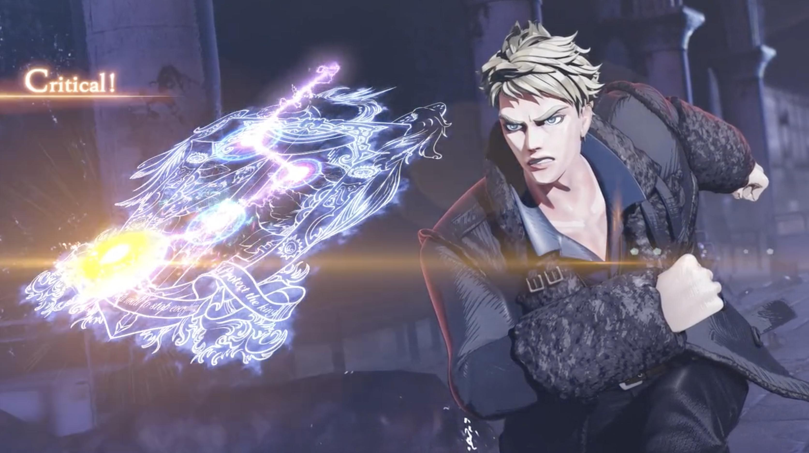

THE JUDGMENT RING—ahem, the **Psycho Sigil** battle system seems to also be timing and rhythm-based attack and magic-casting mechanics. Reader, when I saw this I was shouting for joy. I initially came to this post thinking that the Shadow Hearts story would end with pachinko slots, but in digging deeper into the franchise, I discovered _Penny Blood_. I really hope the designers improve upon lessons learned from the early 00's, and also that the non-male characters characters get the treatment and love they deserve; there's already two women protagonists, [Emilia and Suseri](https://www.pennyblood.jp/?page_id=972&lang=en#characters), who have interesting histories (robotic arms? yes please) and have some great potential.

As of September 2022, _Penny Blood_ and another JRPG, Armed Fantasia, were successfully funded + their stretch goals on Kickstarter. [If you check out the intro video](https://www.kickstarter.com/projects/doublekickstarter/armed-fantasia-and-penny-blood), you'll see cheesy references to _Shadow Hearts II_ and the Émigré Manuscript, the skull-shaped tome supposed to bring the dead back to life (nice pun since the Shadow Hearts series is essentially dead).

I can't believe my moratorium on this series turned into a discovery of its revival. My one regret is that I missed the Kickstarter; I'll be excitedly awaiting updates and getting my hands on _Penny Blood_ as soon as it comes out—estimated March 2025.

In the meantime, I'm looking forward to replaying the entire series.

For those of you who are just as excited as I am, here's [Penny Blood's official website](https://www.pennyblood.jp/?page_id=972&lang=en) which has all their links to their socials.

If you've read this long, thank you for indulging in my fixation on this unique series. For folks who love the series, to folks who are hearing about the series for the first time, if you love dark, psychological horror where characters confront their traumas and battle cosmic horrors, _this is the series for you._

Thanks for reading.

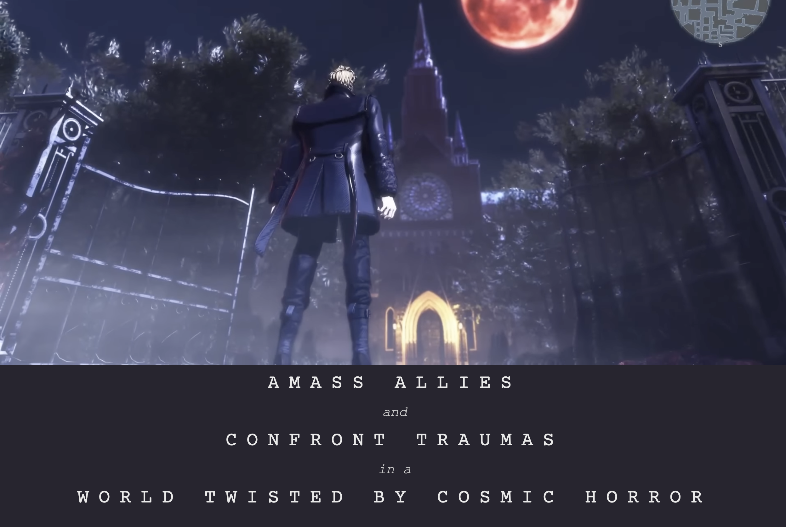

_**Author's edit, 2024/03/23:** Initially, I wrote that Penny Blood was a collaboration between Machida, the original producer of Shadow Hearts, and Kikuta, the creator of Koudelka, but this was in error. Machida is collaborating with Yoshitaka Hirota, the original composer for Shadow Hearts._

If you liked this post and want to talk about Shadow Hearts, leave a comment below! I co-founded Studio Terranova and have a [newsletter](https://buttondown.com/studioterranova) about video games and design.
