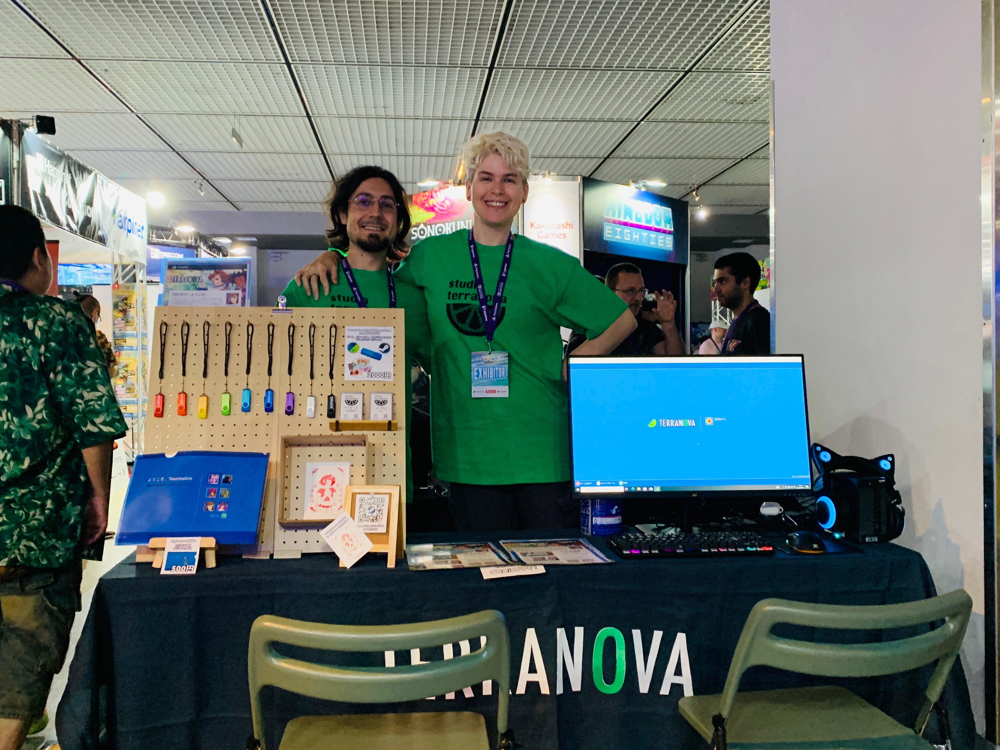
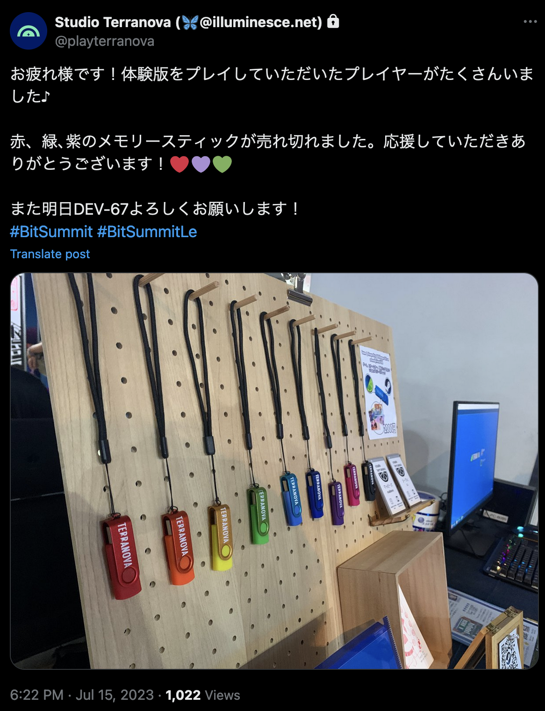
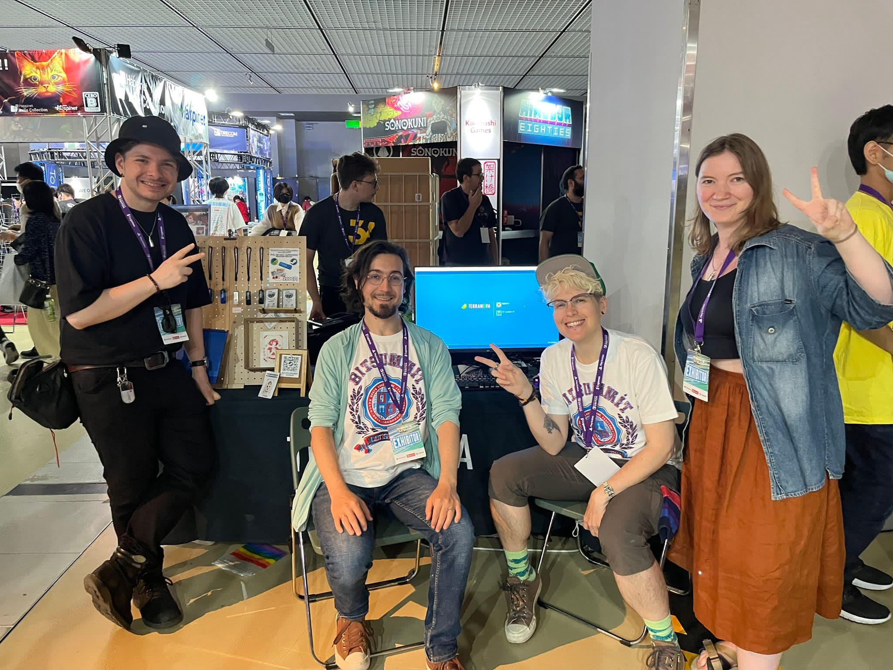

### Day One: Business Day
Business Day is done! Lots of meetings, lots of players trying out Terranova. When we first set up, it was hard for me to believe we were here.

### Day Two: Public Day
Man, it’s been a lot. I’ve been learning a lot. Yesterday, I explained the concept of BL to four very serious Japanese men who didn’t seem that interested in our game.

Today, two men started screaming at the top of our lungs when they saw the login screen. A mom showed her son, “see, this is what it was like when I was a teenager.”

### Day Three
It was so incredible to meet up with so many devs, yell at people about Shadow Hearts, and in general, feel very grateful for friends who asked me several times a day, “are you hydrated?”

Reader, I was, but only thanks to friends.

Will write up a longer, more thoughtful post on BitSummit once I regain cognitive function beyond “yes !!!!!!!!! gaMES!!!!!”

_CJ is a designer, indie dev and artist. You could [say hello in an email](https://illuminesce.net/contact) or [check out their games on itch.io.](https://illuminesce.itch.io/)
