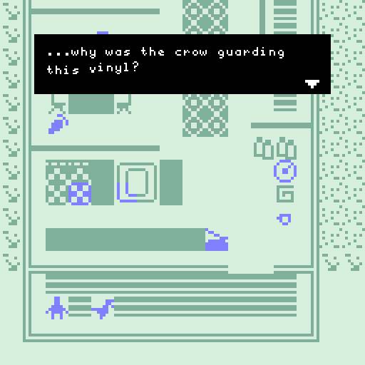

It's out! [My first published bitsy game!](https://illuminesce.itch.io/our-home)

Because of the global pandemic and rising flight costs, we can't welcome friends and family as much as we used to. So I built a little bitsy game for folks to explore our home and do fun things.

Since publishing Terranova, I've been messing around and prototyping the "next big game..." but in the meantime, I've been pushing myself to polish and publish some of my own prototypes. I tend to shut down on projects when it comes to posting them publicly. This isn't my first bitsy game, but it is my first published one...

There's lots of stuff to do in this game! You can...

- feed the rabbits and pet the cat
- play vinyls
- collect teacups
- do a quest for [**mabbees**](https://mabbees.neocities.org/)

The game is short and takes about ~5 minutes to play, depending on how much you explore. Try investigating things multiple times!

[Check out Our Home here.](https://illuminesce.itch.io/our-home)

P.S. (Thank you so much to [**ldx**](https://www.adamledoux.net/blog/) for [merging the branch fixing that bitsy bug.](https://cohost.org/illuminesce/post/2244782-update-update-it-s) I know what it feels like to come back to our project to have some kind of fire... I hope you're taking a break and getting some rest!)
