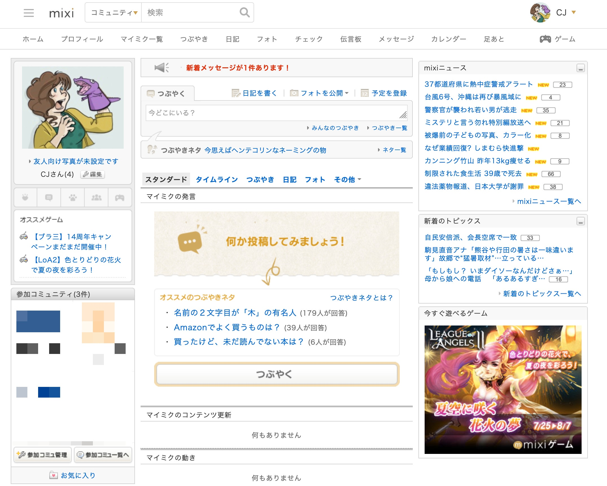

I've been doing a net exploration project where I find my old email accounts and take screenshots of old interfaces I used to use in high school and college.

I tell myself it's for research into new reto UI games (which is true), but it's also to walk through the ruins of the dead malls of my past and reconnect with people I missed.

I got a mixi was when I was studying abroad in Japan. This was prior to Facebook, mind you. It was where I kept up with my サークル活動 (college club) friends and where we promoted our first collab doujinshi at Comiket.

I wonder if I can get back in touch with some of my college friends by resurrecting this old thing.
