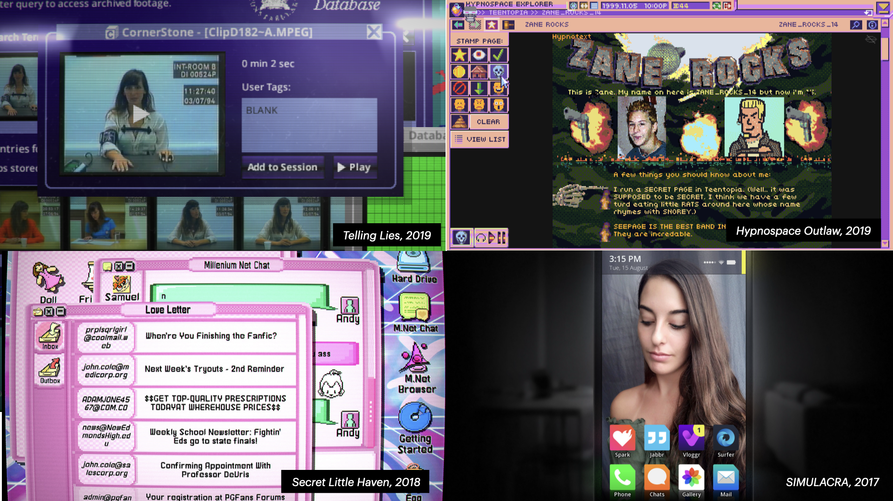

In December of last year, [**@mabbees**](https://mabbees.neocities.org/) and I gave a talk at Nerd Nite Tokyo about a genre of games that have been called "desktop simulators" or "UI games"—essentially, a narrative fiction that takes place entirely within an interface, whether it be a smartphone, an old school Mac, or an imaginary interface in hypnospace.

We called these types of games "Interface Dramas," as in, "telling dramatic stories through the use of interfaces."

We think this should be its own defined genre and should be something games can be tagged as on Steam, just like "point-and-click adventure" games or "story-rich" games.

[Check out the transcript of our talk](https://illuminesce.net/talks/202212-interface-drama)—it goes over what interface dramas have in common with other adjacent genres such as interactive fiction, visual novels, simulation games, and alternate reality games, and what makes them different.

[View transcript and slides here.](https://illuminesce.net/talks/202212-interface-drama)

_Games featured in the cover image are:_

* Her Story
* Hypnospace Outlaw
* Secret Little Haven
* SIMULACRA

From this post, I created the [**Interface Drama Master List**](https://illuminesce.net/interface-drama). Got a game you want to add? [Submit it here.](https://forms.gle/NKXv94fuBjSoZ9pv6)

---

### Related posts

* [Interface Drama Master List: What is it?](/blog/posts/2023-08-15-Interface-Drama-Master-List/)
* [The Genre of Interface Dramas, Fiction, Visual Novels and Epistolary Games](/blog/posts/2023-08-22-Interface-Drama/)
* [The Interface Drama Submission Queue](/blog/posts/2023-09-02-ID-Submission-Queue/)

See all posts tagged [Interface Drama](/tags/interface-drama/).
