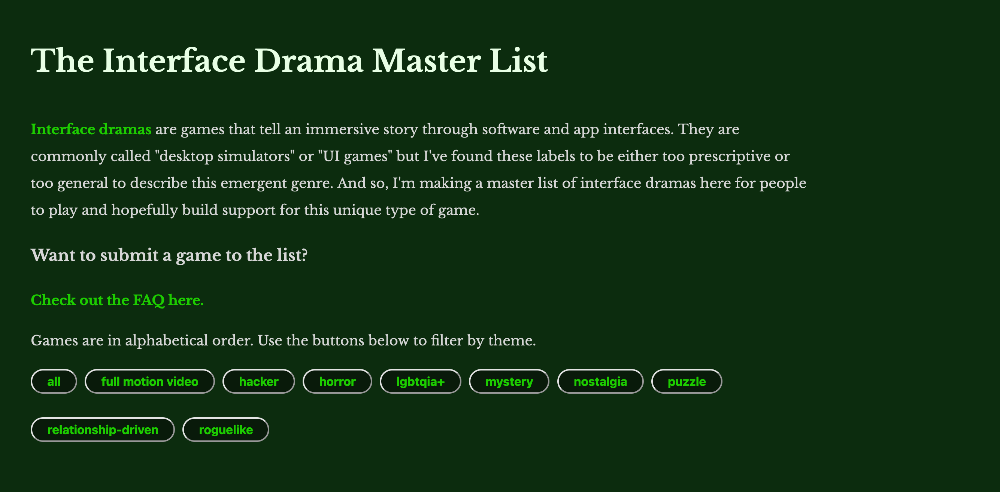
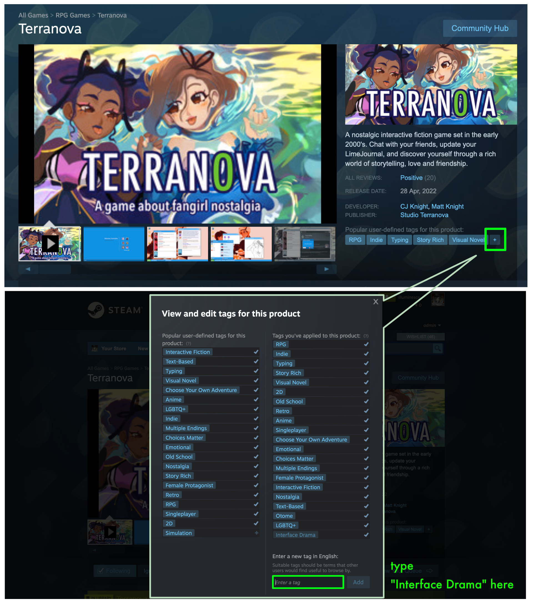
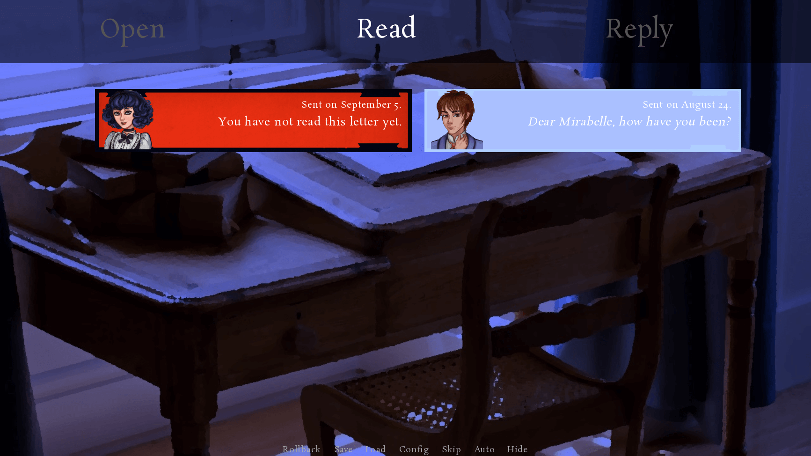
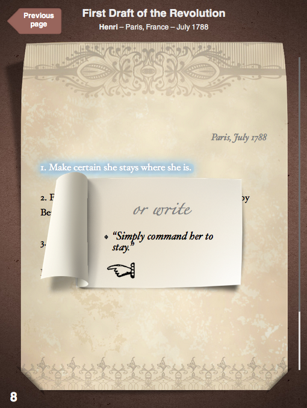
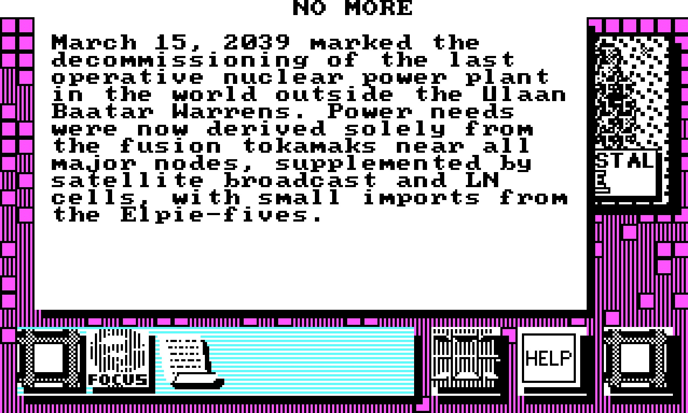
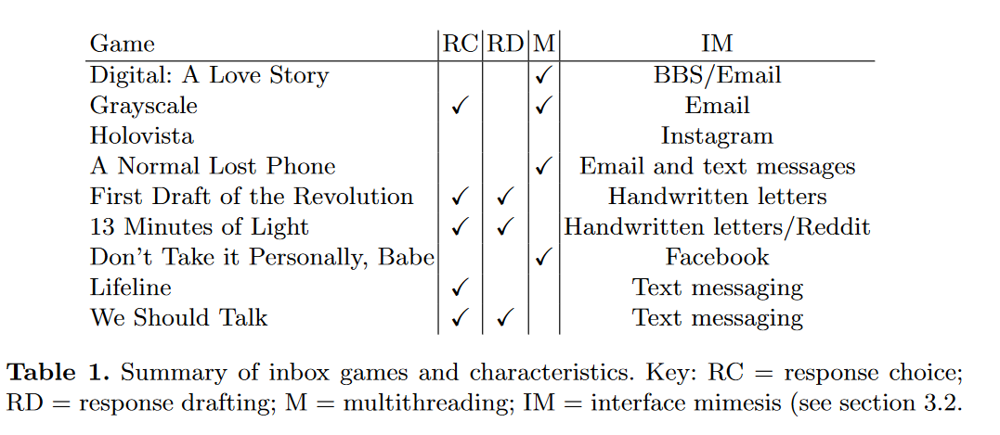

_This is a collection of posts in response to my announcement of the [Interface Drama Master List](https://cohost.org/illuminesce/post/2577656-the-interface-drama) that was posted on cohost in 2023._

_The genre was, and still is, not well-defined and it attracted some excellent comments from the community which I wanted to preserve here for sake of archive. Thank you to [Rastagong](https://mastodon.gamedev.place/@lrwerther), [Katherine Morayati](https://katherinemorayati.com/), and [Ian Michael Waddell](https://ianmichaelwaddell.ca/) for adding their voices to this as well. I'd love to continue the conversation in the comments here._

## Original Post by @illuminesce August 22nd, 2023

A week ago, I [made a post about interface dramas and what they are.](/blog/posts/2023-08-15-Interface-Drama-Master-List/) They're (usually software) interfaces that tell a story. Previously called UI games or desktop simulators, @mabbees and I are proposing a new name: interface dramas.

I made an [**Interface Drama Master List**](https://illuminesce.net/interface-drama) here. I hope to help boost visibility for this niche genre.

It's searchable by tags! So convenient!

We have:

* **@love's** Digital A Love Story
* **@QuestForTori's** Secret Little Haven
* **@mabbees** and my Terranova
* ...and more!

I'm still in the process of contacting devs to make sure the tagging/entries look right, so if you are one of the devs of this game, please look forward to a message from me.

### Don't see a game that you think should be on the list?

[Submit a new interface drama here.](https://forms.gle/NKXv94fuBjSoZ9pv6) I love new submissions! [Please take a look at the FAQ before submitting.](/blog/posts/2023-08-15-Interface-Drama-Master-List/) Info here will be regularly updated.

**Thank you to the person who submitted [Zachtronics' TIS-100](https://zachtronics.com/tis-100/).**

It's been added to the list.

### I think the interface drama genre is cool. What can I do to help?

Steam takes user-generated tags.

If you want interface drama to catch on as a genre, go to the Steam page of each game in this list and click the "+" button to add your own tags. If enough folks add tags, they'll appear on the Steam page of the game.

## @morayati and @ianmichael's work at Narrascope

**@ianmichael** and I did a talk on these last year at Narrascope, we mention several of these (full disclosure including one I did) and have a bunch at the end of the slides! Both major ones and lesser known: [link](https://docs.google.com/presentation/d/1VFXjpeXMUPjm3QcL5CiGXEhgOuZE8NLntcl9r6YDipo/edit?usp=sharing)
> [@morayati](https://katherinemorayati.com/)

---

Thank you for sharing these. Part of the reason [**@mabbees**](https://mabbees.neocities.org/) and I wanted to define something about this genre is because we made a game too, and felt it was difficult to describe with pre-existing words.

It's really nice to know other folks are thinking about this and presenting on this too. I'm going to take a look and add these to the list.

Do you mind if I include y'all's presentation on the FAQ? I can use your itch.io handles to credit you if that works for you.
> @illuminesce

---

absolutely, go ahead! [There's a video of the talk as well](https://www.youtube.com/watch?v=u5mMOsQDjJc). also can add entries separately in the form tomorrow
> [@morayati](https://katherinemorayati.com/)

---

Oh, excellent! Thank you.
> @illuminesce

---

hi! yeah, as katherine mentioned above we've done a bit of work on this as well — really appreciate more folks paying attention to the form!

not to quibble over terminology, but I find "drama" to be a bit prescriptive? for instance, such as hypnospace outlaw or pony island or there is no game, are largely comedic — feels a bit dissonant to call them dramas, lol

(this is why katherine and I opted for "interface fiction", which is perhaps undescriptive but at the very least inclusive)
> [@ianmichael](https://ianmichaelwaddell.ca/)

---

Quibble away! Thank you to both of you for your work and your talk; I read through the slides and I like your take on the nostalgia aspect. It's something [**@mabbees**](https://mabbees.neocities.org/) and I touched on but didn't dive in too deep.

As far as the word "drama" is being used I wanted to share two points of view. One is that we're using "drama" as in a play, or more specifically, “a composition intended to portray life or character or to tell a story involving emotions through action and dialogue.”

I can't speak to Pony Island as I haven't played it yet, but the ending of Hypnospace Outlaw has a lot of emotion in it.

**(spoilers for Hypnospace Outlaw incoming...)**
The player finds out that Hypnospace interferes with people’s brain waves and a person dies (or persons, depending on whether the player does their job as an Enforcer) due an event called the Mindcrash.
**(/spoilers)**

Granted, even if the gameplay was comedic, I'd still say if it uses action or dialogue to convey a story that has emotion or portray life or a character it counts as a drama.

The other is specifically in regards to interface fiction versus interface drama. I can see where fiction comes from, as this genre uses text to convey messages and developers who have done interactive fiction have done interface dramas and vice versa.

It's a name that is descriptive of the genre, but from a distinct naming perspective, and perhaps this is a personal discomfort, but I think **inter**face fiction shares too many letters with **inter**active fiction for newcomers to distinguish it via text.

In addition, interactive fiction has used the abbreviation "IF" a lot—see [ifcomp.org](https://ifcomp.org/) for the interactive fiction competition and [IFDB](https://ifdb.org/) for the interactive fiction database. Were the genre to go with interface fiction, it would also use "IF" as an abbreviation.

I can see the indistinct abbreviations in the future causing problems for people looking for interactive fiction but finding interface fiction and vice versa.

In summary, interface drama is:

1. descriptive
2. distinct enough from interactive fiction
3. has a separate acronym

You, Katherine and [Lee Tusman](https://leetusman.com/) so far are the folks I know of who have been talking about this genre. I'm sure there's others I haven't found yet, too. I think it'd be neat for us to talk about this more.
> @illuminesce

---

i think your point about interface fiction being too similar to interactive fiction is a fair one, and one that katherine and I considered (and jsyk katherine and I both have backgrounds in interactive fiction; we've both competed in IFComp several times, so you can probably tell where I'm coming from here a little bit)

ultimately though i think my reservation still remains; i feel like interface drama, as a term, foregrounds the content rather than the form. (this is the same reason why we say "interactive fiction" nowadays instead of "text adventure.") in my opinion, the term should be expanded to be as inclusive as possible of the sorts of games people can create rather than prescribing those games to be of a certain genre. interactive fiction, visual novel, hypertext, etc — all of these terms are necessarily broad because it's the form that's being described. whether or not the game elicits emotion A or emotion B is of less importance, imo (or that's a different type of categorisation going on.)

but! it's just a name. at the end of the day it's nice to see more folks talking about games like these bc they have such a rich history!
> [@ianmichael](https://ianmichaelwaddell.ca/)

---

## August 24th, 2023: @lrwerther adds a different take with epistolary games/VNs/interactive fiction

This is so interesting!
(I'd seen the transcript some days ago but was too tired to comment, woops... Then I started to comment and realised I should just make my own post because this is far too long.)

This is also a game medium/format I love love thinking about, though maybe a bit differently:

## Epistolary games/VNs/interactive fiction

I think the format I'm usually drawn to overlaps a lot, but is also distinct from the one talked about here.

I'm usually really drawn to **epistolary** games/interactive fiction/visual novels, which are similar to epistolary novels ([wrote about them here a while ago on tumblr](https://rastagong-tearoom.tumblr.com/post/170231731680/serving-of-tea-3-whats-an-epistolary-vn-anyway), in that:

1. The “events” of the story have already taken place in the past: as a player/reader, your main role is to discover what happened, to investigate, not to interact. “Classical” epistolary novels like Dracula give almost no space to the reader (though I guess more modern ones I think get more inventive with that). Or, less restrictively, maybe the “events” are still ongoing, but your role as a player is mostly to read rather to reply & interact with other characters. So most of your interactions through the fictional UI are about reading logs/emails/messages, maybe a few performative ones, but not actively _communicating_ through messages. So this excludes games/VNs like _Emily is Away_ or _Mystic Messenger,_ where the relationships you build day by day through fictional exchanges are really key.
2. As a result, the fictional user interface is fully optional! It can be present, as in _Analogue:A Hate Story_ where you're connected to the ship terminal, and have a bit of hacking to do, but it can also be absent, as in historical epistolary visual novels.

My own [Sylvan Disappearance](https://rastagong.itch.io/sylvan-disappearance) is a bit like that: the epistolary UI just represents receiving hand-written letters, and I guess replying, but the emphasis is really on receiving/reading.

There are many such period pieces in this [itchio collection of epistolary games](https://itch.io/c/961719/epistolary-games), mixed with epistolary TTRPGs. It's curated by [Emily Friedman](https://ecfriedman.itch.io/) ([Twitter](https://twitter.com/friede)), who studies epistolary/historical period games.

In other words, a _lot_ of of epistolary games/VNs/interactive fiction have fictional computer UIs too, but not all of them do.

And conversely, I'm sure there are interface-centred that aren't particularly epistolary either (to be confirmed, but I think 2001 hacking game [Uplink](https://en.wikipedia.org/wiki/Uplink_(video_game)) might be like that? I haven't played it).

On VNDB (the visual novel database), there are two distinct tags to categorise these two broad different directions:

1. [Operating System Simulation](https://vndb.org/g2490)
2. [Epistolary Storytelling](https://vndb.org/g3209)

Here are a bunch of theoretical articles I've bookmarked over the years about similar and distinct categorisations!

## Games of co-authorship

Max Kreminski (who I think meant to publish a piece about related IF formats too, not sure if he eventually did) once sent me this Emily Short piece about games of [co-authorship](https://emshort.blog/2015/01/14/games-of-co-authorship/), which she tagged as “epistolary interactives”.

It talks about pieces of IF where the player is a **co-author** rather than a reader.

So her conceptualisation is quite different:

* No emphasis on fictional computer UIs at all: it can well be about hand-written letters;
* But no emphasis on being passive as in epistolary novels either, like I do. In the games she mentions, you can often revise, select or alter the fictional correspondence, so you're very much active.

## Database-style games

[In this 2019 EGM writeup about Neurocracy](https://egmnow.com/hypertext-transfer-wikipedia-and-the-rise-of-the-database-game/), the framing is rather **database-style games**.

Here, the emphasis is on computer UIs with a fictional database, or website/Internet feel.

So _Her Story_ and its police investigation recordings database would probably fit, but not _A Normal Lost Phone_ which is about a singular personal device.

Some of the games mentioned on the list aren't even games with classical boundaries (an executable file you have to downloade, a Twine you play on itchio):

The fictional computer UI is itself a regular website, like Neurocracy, which is played through the fictional Wikipedia-style [Omnipedia](https://omnipedia.app/wiki/2049/10/07/Main_Page), or the [SCP Foundation](https://scp-wiki.wikidot.com/), which is a crowdsourced, wiki-style database of classified documents.

So some of these are almost veering towards the ARG/creepypasta territory, where verisimilitude is key.

The article also mentions a very early precursor: Activision's 1986 [Portal](https://en.wikipedia.org/wiki/Portal_(1986_video_game)), that I haven't played, so I'm not sure how to categorise.

## Inbox Games: Poetics and Authoring Support

This one is a bit of a Holy Grail, and I really need to reread it.

_Inbox Games: Poetics and Authoring Support_, is both a [talk](https://www.youtube.com/watch?v=X5Hx4HCh_D4) and a [paper](https://drive.google.com/file/d/1NZq02JIumJ06tiPXbGJM7gjx8JPava42/view) by Chris Martens and Robert J. Simmons, presented at the 2021 International Conference on Interactive Digital Storytelling (ICIDS).

It's very theoretical/academic, but I think it's also the broadest possible survey of all the related formats/interactive storytelling techniques I've mentioned here: it goes through a lot of the different dimensions a specific game in this space can take like the ability or not to reply, the presence or not of a fictional UI, etc.

> [@lrwerther](https://mastodon.gamedev.place/@lrwerther)

## Interface Drama Master List: Up to 60 games and growing

Since that initial conversation, there's been many requests to update the Interface Drama Master List. It's been through many iterations, but here is the most recent version:

* [Interface Drama Master List](https://illuminesce.net/interface-drama) - most up-to-date
* [Steam Community for Interface Dramas](https://steamcommunity.com/groups/interfacedrama)
* [itch.io list for Interface Dramas](https://itch.io/c/3586703/interface-drama)

In 2024, I did some live streaming of games along different themes: intrigue, longing, and uncanny. Check them out here:

* [Exploring Intrigue with Interface Dramas](/blog/posts/2024-04-18-Interface-Drama-Streaming-Vol1)
* [Interface as Longing](/blog/posts/2024-04-22-Interface-Drama-Streaming-Vol2/)
* [Abstracting away horror with UNCANNY interface dramas](/blog/posts/2024-05-11-Interface-Drama-Streaming-Vol3/)

One of the things I _haven't_ done but have been meaning to do is map out all of these different genres and sub-genres. I started researching the history of interface and did a writeup on its radical roots here: ["Remembering the Radical Roots of Interface"](/blog/posts/2024-05-07-Radical-Roots-of-UI/)

When I started out thinking about interface dramas, I had an artistic image in mind; and they do justify their own category, I think—but the more I read about other fields describing interfaces, the more I realize there's a big difference in:

* games that are using interface as polish vs.
* games that use interface as a narrative medium

In interface dramas, both of these are present—though the boundary sometimes isn't as clear; games can do either or, or both. That'll be a later blog post, but for now, enjoy these perspectives on the genre—or add your own below.
