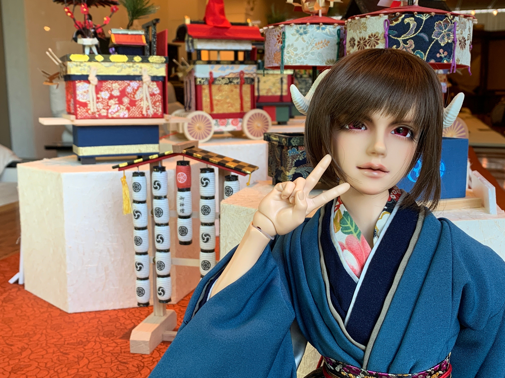
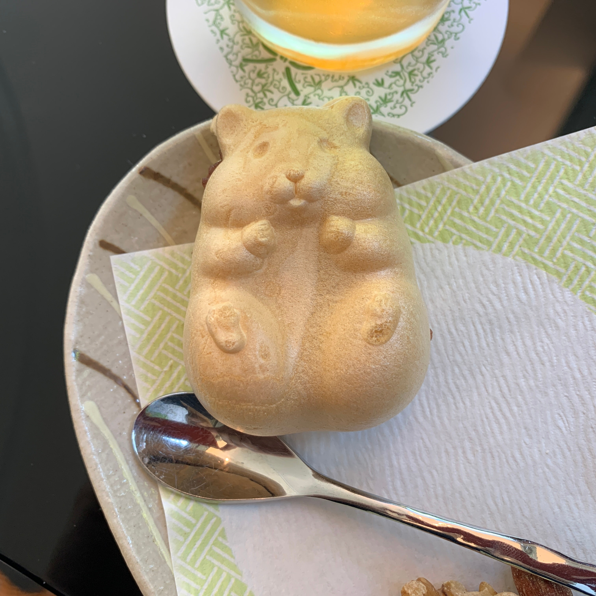
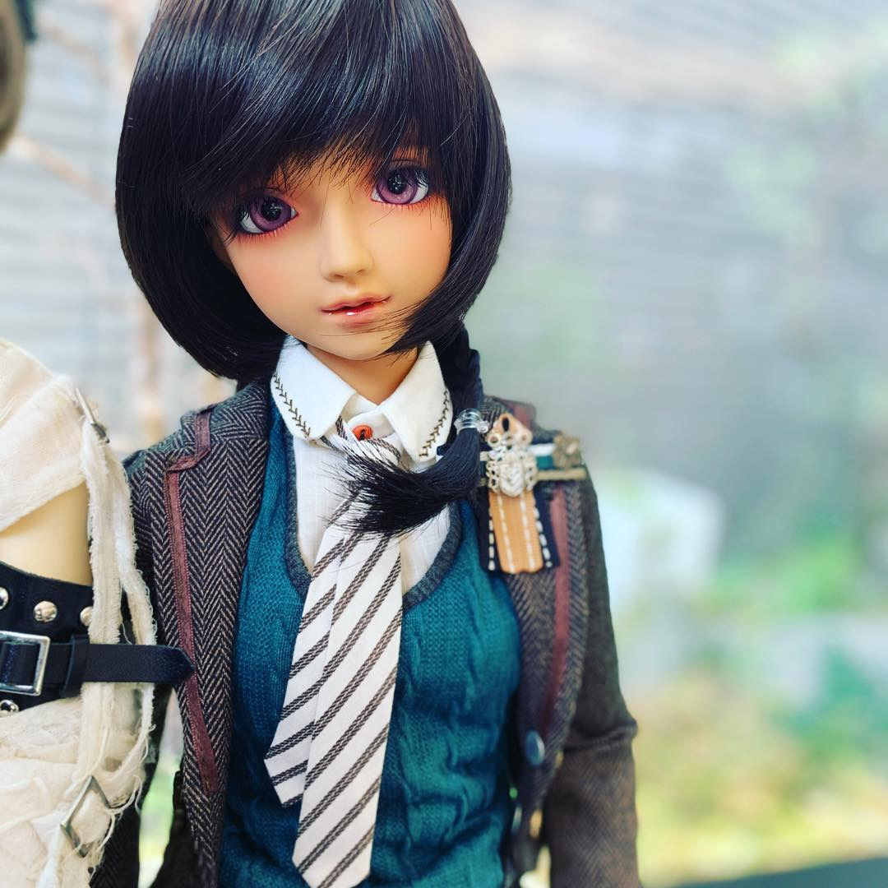
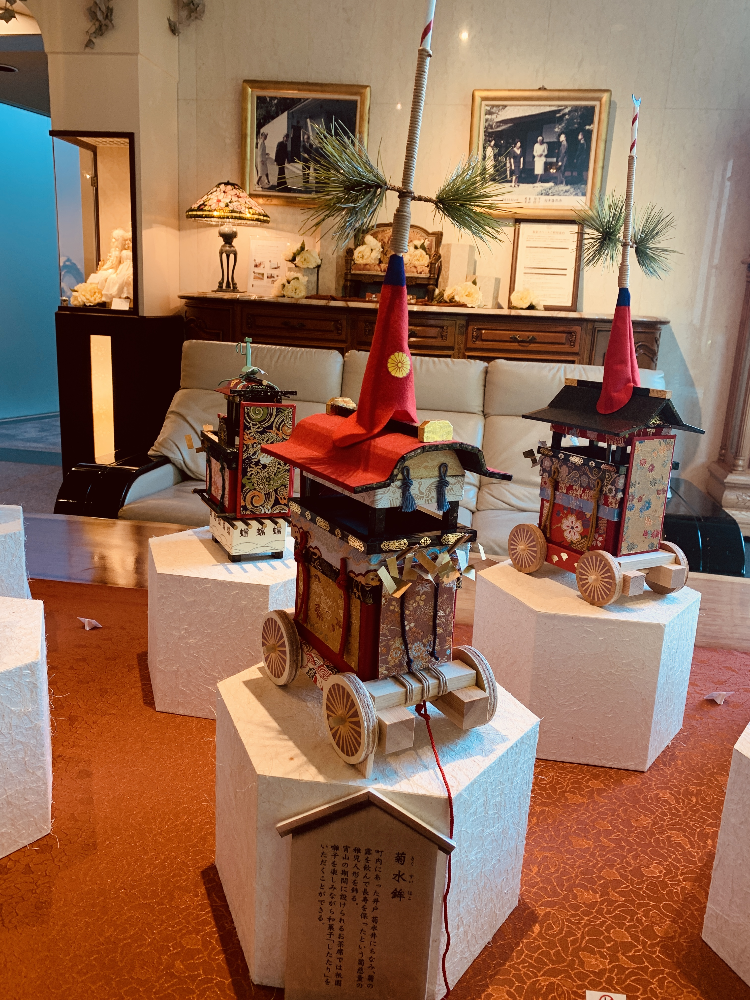

In response to あれく's blog post, ["if you love it enough, it will live."](content/blog/posts/2023-08-22-Interface-Drama)

---

This was a well-researched piece and worth responding to with my own experience to add to your observations about Volks capitalizing and encouraging the personification of objects by ウェット派 wet fans. It's also the reason why I enjoy the hobby mostly alone; I have few friends who are into dolls.

I've been collecting dolls since 2004, and most of them are Volks, so as of the time of this writing, about 19 years. I've been to Dolpas, Volks "special member" events and have been to most of the Tenshi no Sumikas; including VOLKS USA when it was open as a proper store in Torrance, CA and the Kyoto, Japan headquarters of Tenshi no Sato. I would call myself properly soaked in this subculture.

Here's an account of a recent trip to show some of my complicated feelings about the hobby.

## A Recent Tenshi-no-Sato Experience

Imagine; you are in Arashiyama, Kyoto, a place famous for its [iconic bamboo grove](https://www.japan.travel/en/spot/1141/) and [mossy temples](http://saihoji-kokedera.com/en/about.html). Tourists pour out of the ticket gates, and they turn left towards the south exit. You, alone, turn north. This is where the Tenshi-no-Sato grounds are; on the opposite side of the tourist mecca.

When you get to the reception area, the staff asks to see your member's card and proof of ID. They won't let anyone in otherwise. Then, they ask you if you'd like to have tea with your dolls; the cafe has floor-to-ceiling windows and a 360-degree view of the traditional Japanese grounds. Guests can enjoy rotating sweets based on season; this season is a hamster monaka filled with bean paste and a cold glass of green tea.

Then, they ask you about your doll; this is to indirectly determine what kind of model it is.

In Tenshi no Sato, the staff only permits resin dolls created by Volks. You've been here many times. You've tested the limits with this before; [Volks did a collaboration doll with Gentaro Araki in the 90's](https://bjd.fandom.com/wiki/Alchemic_Labo_Unoss) and while it was released under their name, they don't "recognize" it as an official doll. They also will not allow vinyl (anime) dolls by Volks as Tenshi no Sato is specifically tailored to resin. There is another site in Akihabara called Doll Point which is the nexus of vinyl doll owners, but they are purposely kept separate from the resin doll owners.

<iframe width="560" height="315" src="https://www.youtube.com/embed/CWT8L_294H0?si=XTt43qQ2PK-jGItd" title="YouTube video player" frameborder="0" allow="accelerometer; autoplay; clipboard-write; encrypted-media; gyroscope; picture-in-picture; web-share" referrerpolicy="strict-origin-when-cross-origin" allowfullscreen></iframe>

They will permit you to enter the facility with these "banned" dolls, but will ask you to keep them closed at all times. If you don't want a staff member following you around the grounds, it's best to ask them to take your luggage so they know the banned doll is out of sight from guests.

Sometimes, if a doll is too old and the staff is younger, they will question you about the origins of your doll. Some dolls were sold only by Volks USA's online shop, and at one time, they released a skin tone only the US customers. It was darker than most Volks dolls. It was tone-deafly called the "ebony" skin tone when the doll itself could easily pass the [Brown Paper Bag Test.](https://en.wikipedia.org/wiki/Brown_paper_bag_test)

You have a doll in this skin tone and have taken her to Tenshi-no-Sato before. The staff was suspicious of how "dark" your doll was and so asked you to recite your doll's head number, model number and where you purchased it before they would allow it on the premises. It's a bizarre reminder that this exclusive community that centers around "personification" of dolls has also imported the racist aspects of personification as well.

You're feeling bitter and angry at the injustice. But, the doll you brought today is not too old _or_ too dark, so the staff let you through without comment.

You go to the main atrium, past the statue of the Virgin Mary inspired "Mother SD;" back in the mid-00's people in the fandom who were Volks fanatics used to "pledge their devotion to Mother SD" or refer to Tenshi no Sato as "the compound." You're pretty sure they were joking when they said that, but the hobby does have cultish-like tendencies. You ignore the statue.

There's a long table with plush white leather sofas for sitting on while photographing dolls. It's [Gion Matsuri](https://kyoto.travel/en/season_festivals/gion_matsuri.html) season in Kyoto, so you're treated to a display of gorgeous handmade _yamaboko_, or floats. Gion Matsuri started as a religious ceremony to appease the gods at Yasaka Shrine and since has become a festival sponsored by some of richest families in Kyoto. During this time, city is alive with stalls selling sizzling meat or green tea shaved ice. The real _yamaboko_ are up to 25 meters tall. These _yamaboko_ are the miniature versions—they're lovingly crafted after the real _yamaboko_ and it's breathtaking to see. Each of these props are a work of art—and after they have been used in a display, Volks will either reuse them or will distribute them to lucky fans.

The cafe and the grounds are also here too. You can walk through the tranquil, carefully curated Japanese gardens. Everything in this world is adapted for you and your doll. A human-sized chair and a replica doll-sized chair; photobooths hidden away in nooks and crannies that have a rotating display of interesting props for your dolls to use. Wicker picnic baskets are provided for guests to carry their dolls around so they can enjoy their experience (mostly) hands-free.

Even if the first floor is busy, the fourth floor has always been utterly quiet. It is split into two rooms, each with a 180-view of different parts of Arashiyama. Even though you've been here many times before, and generally enjoy the pleasant experience of quietness, there's an escapism about this particular place that's grated on you. You feel pleased at the exclusivity of a club and enjoy the elaborate displays you can photograph your dolls in, but they rely on upholding and recreating certain systems of oppression that you _desperately_ want to unpack and dismantle.

Tenshi no Sato promises an oasis _away from it all_—a place where everyone is seen "equal" in the eyes of Mother SD—except for those without the privilege of forgetting.

There's a lot of stigma or judgment from the West about personification of objects that centers around people practicing wishful thinking or being "silly" to believe in inanimate objects that can connect with human emotions.

On the other side, from a company that actively promotes seeing dolls as "your lifelong friend," Volks sure does a lot of gatekeeping of obtaining said friends and making sure that your friends are the "right" (see: Volks-approved) ones. There are lots of dolls from China and Korea that are quite popular in the doll fandom; but since Volks is one of the biggest doll companies and they prohibit non-Japanese made dolls at their events, the places for gathering for people who love these dolls is small.

And as an activist friend once told me, the physical space is where transformation happens.

Volks, with their events and stores, controls almost all of the physical space for dolls in Japan.

Over the years, the doll hobby has given me a lot of inspiration and reflection about people and systems, which is probably why I'm still in it. I myself still have my own biases to unpack, especially about a complicated hobby like this.

My comments are open if folks have specific questions.
