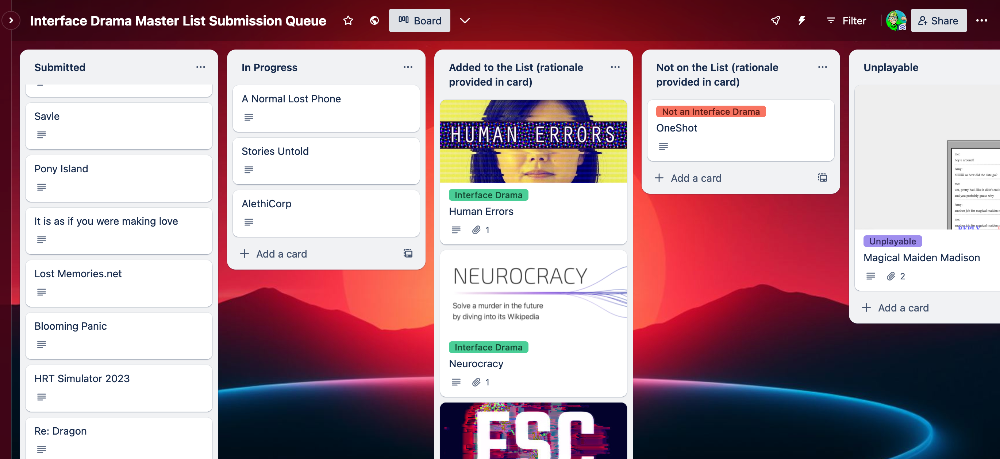

Thanks to [@morayati](https://katherinemorayati.com/), [@ianmichael](https://ianmichaelwaddell.ca/) and [@lrwerther](https://mastodon.gamedev.place/@lrwerther) who commented on the [Interface Drama Master List post](/blog/posts/2023-08-22-Interface-Drama/) and some who submitted games to the list, for sake of transparency we now have a queue of games being reviewed for the list and I've added rationale as to why some submissions are added vs. not added to the list.

[**Check out the queue here.**](https://trello.com/b/FsmPZht8/interface-drama-master-list-submission-queue)

## Updates to the FAQ

I started [codifying the criteria for interface dramas](/blog/posts/2023-08-15-Interface-Drama-Master-List/) and some of their overlapping categories like [epistolary games](/blog/posts/2023-08-22-Interface-Drama/); the submissions and questions from folks help challenge my own assumptions and state biases more explicitly rather than assuming implicitly. Let's keep conversations and discussions going.

In particular, one of my _own_ biases is as an _interface designer_, _storyteller_, and _queer person_. In general, I'm drawn to LGBTQIA+ and marginalized stories told through interface. Not to say that interface dramas are solely LGBTQIA+ stories; but rather, they happen capture a lot of LGBTQIA+ stories because much of "coming out" in the internet age happens online in trusted communities/with trusted friends.

## Updates to the Master List

Added:

* ESC
* Human Errors
* Neurocracy

Not added:

* OneShot
* Magical Maiden Madison

Thank you for the submissions! Rationale for all of these is written in the [submission queue cards.](https://trello.com/b/FsmPZht8/interface-drama-master-list-submission-queue)

Magical Maiden Madison is an interface drama, but due to a JQuery error the game doesn't scroll past a few responses. It's old enough that it doesn't warrant new development on it, and since the list is for _playable_ games, it won't go on the list, but is of note as it does fall within the genre.

'Til next time—I'll be triaging this list with **@mabbees** and giving these games a play.

[Check out the updates here.](/blog/posts/2023-09-12-ID-Update/)

---

### Related posts

* [The Interface Drama Master List: What is it?](/blog/posts/2023-08-15-Interface-Drama-Master-List/)
* [Submit an interface drama here](https://forms.gle/NKXv94fuBjSoZ9pv6)
* [The Genre of Interface Dramas, Fiction, Visual Novels and Epistolary Games](/blog/posts/2023-08-22-Interface-Drama/)

See all posts tagged [Interface Drama](/tags/interface-drama/).
