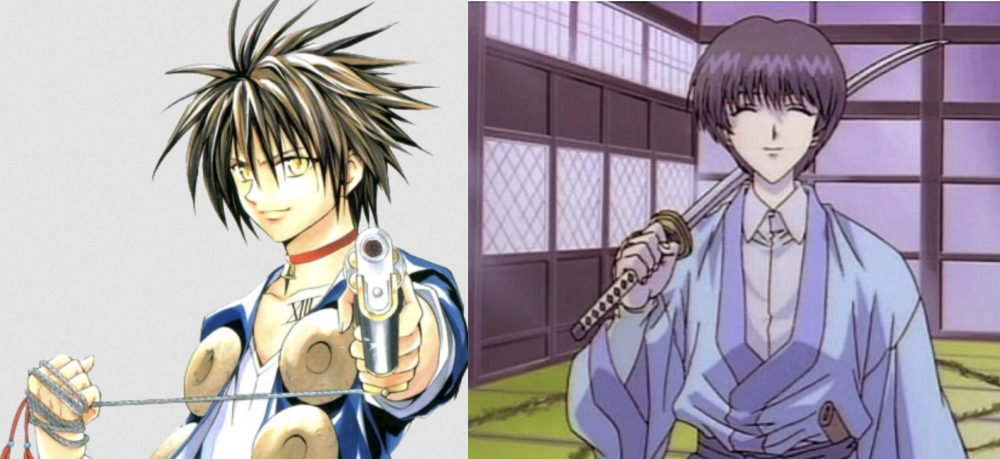
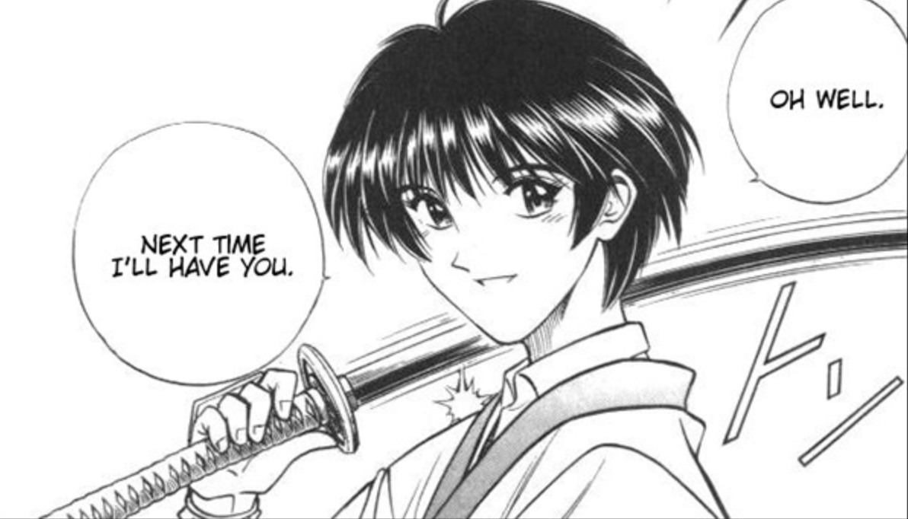
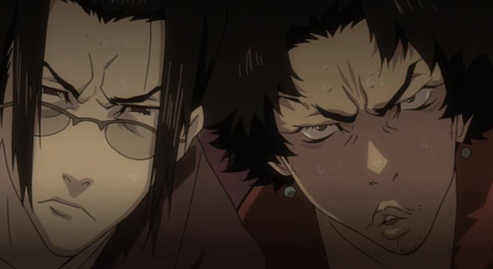
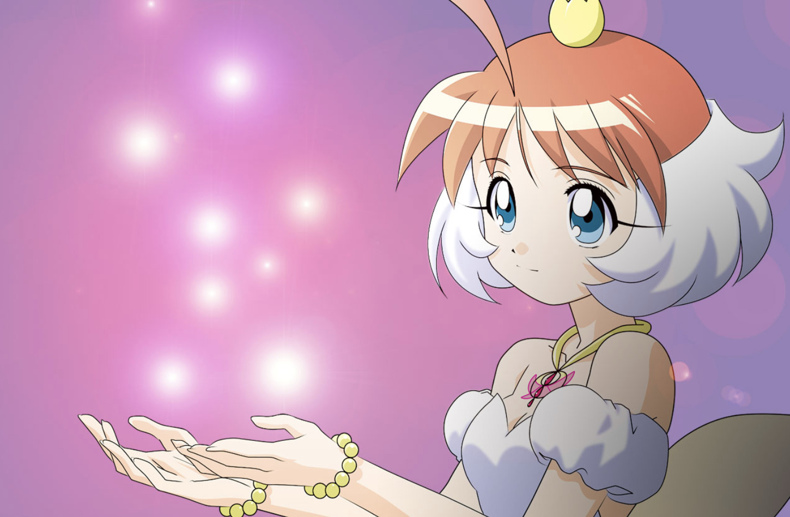
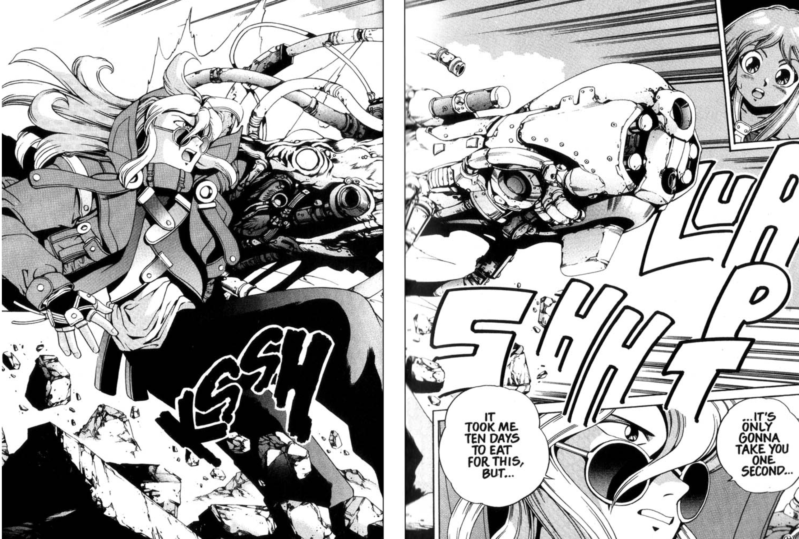
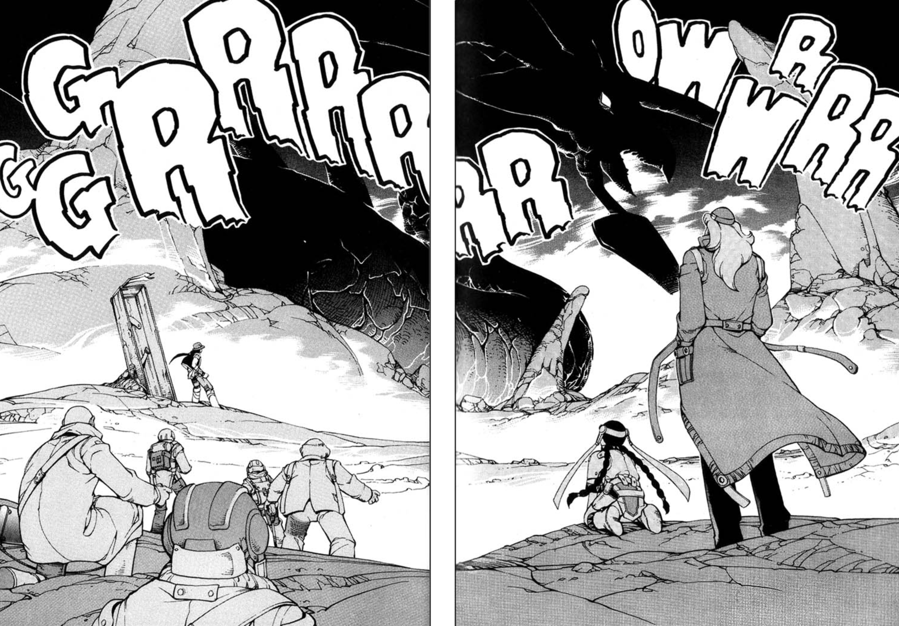

When I was actively posting on cohost, I answered an ask about the inspiration for the characters in [Terranova](https://store.steampowered.com/app/1728700/Terranova/). I'm reposting it on my personal blog for folks to read.

---

*Finally finished watching Trigun (1998) yesterday, and couldn't stop thinking about Wolfwood - Eytan parallels. T^T*

*Would love it if you could share any particular anime inspirations for the world, the characters, and the story of Terranova, if that's okay! 🙏*

> yaffle, via cohost

---

Yes. Absolutely yes. Thank you for the question. This is gonna be a long post...

I'm more of a generalist when it comes to anime. I like to pick up different series and blend the parts that I find interesting.

Eytan was inspired by the ["Hitman with a Heart"](https://tvtropes.org/pmwiki/pmwiki.php/Main/HitmanWithAHeart) genre of characters: I was really into Trigun and other anime like it, so Wolfwood was most certainly an inspiration. [Train Heartnet](https://en.wikipedia.org/wiki/List_of_Black_Cat_characters#Train_Heartnet) from Black Cat and also[Seta Sōjirō](https://en.wikipedia.org/wiki/Seta_S%C5%8Djir%C5%8D) from *Rurouni Kenshin* were two big inspirations that come to mind.

*Black Cat* is about Train, a cold-blooded killer who is now an easygoing mercenary. He works with his pal, Sven who looks out for him, and sometimes yells at him. Their relationship is on its surface congenial, but underneath the jokes is a shared mutual respect. When they get into shit, they have each other's backs. Train and Sven's relationship in the series inspired Eytan and Isaiah's relationship.

Sōjirō from *Rurouni Kenshin* is who Train would be if he didn't meet Sven, and rather met someone who wanted to exploit him. He's a cold-blooded killer who has no hesitation. Sōjirō has a deep desire to belong that has been twisted, through his own actions and by his boss, Shishio's nudging. Sōjirō and these type of "twisted villains" are my favorite types of characters.

In particular, Sōjirō's influence is one I see throughout the Terranova boys:

- an assassin who was forced into the life (Eytan)
- a person who, at the outset, appears as if he does not have emotions (Isaiah)
- attached to the person who "saved" him from his past life (Dominique)
- cheerful and upbeat to hide his own pain (Hikaru)

[**mabbees**](https://mabbees.neocities.org/) and I also enjoy the "[straight man and wise guy odd couple](https://tvtropes.org/pmwiki/pmwiki.php/Main/StraightManAndWiseGuy)" relationships. Isaiah and Hikaru's relationship is a blend of [Afro Samurai's](https://en.wikipedia.org/wiki/Afro_Samurai) Afro and Ninja Ninja and [Samurai Champloo's](https://en.wikipedia.org/wiki/Samurai_Champloo) Mugen and Jin.

*This is how I imagine Isaiah and Hikaru pose for pictures, lol*

I asked [**mabbees**](https://mabbees.neocities.org/) about his inspiration for Dominique; he was my roleplay partner for many scenes with Eytan and Dominique and gave Dominique a lot of his character. He mentioned that he was inspired by "transformation-type" characters—one was Yami Yugi from *YuGiOh!* and another, *Princess Tutu*.

Characters that have duality, or two separate personalities, where one is generally considered "weak" or "soft" and the transformation personality is considered "strong." They also play into a scheme that has been going on for a long time—and though we didn't get to the long-term scheme of Dominique's arc in Terranova, it's something I have written about in unpublished WIPs that I will probably at some point polish and put into form.

As far as the setting of Terranova, I was heavily inspired by both *Trigun* and [*Eat-Man*](https://en.wikipedia.org/wiki/Eat-Man). *Trigun* is a series that a lot of people know about, but I thought it'd be nice to introduce *Eat-Man* here. *Eat-Man* was a mostly unheard-of manga produced in 1996 that was the episodic adventures of Bolt Crank, a man who could eat anything and reproduce it from his body at will. For instance, if he ate all the parts of a radio, he could grow a radio in the palm of his hand. The story was okay and the anime series has some of the worst dubbing I've heard, but its setting had so much life.

*Isaiah's more fluid relationship with being a cyborg was based on Bolt's ability to morph into objects at will.*

*Eat-Man's* setting is one that blends fantasy with cyberpunk and centers on the environment being the most powerful character. Like in Miyazaki films, no one in the series is the master of their environment; the environment in *Eat-Man* is always drawn looming over the characters, even the abnormally tall Bolt.

I cherry-picked from a lot of different series, most of which were from the early 00's. [**mabbees**](https://mabbees.neocities.org/) first series were shonen ones like *YuGiOh!* so that also had an impact on him.

I love environments that are bigger than their characters, and while I don't think the *roleplay* for Terranova showed the depth to which I wanted the environment to play a part in the characters' lives, it's something I've been thinking about adapting into a comic or visual novel to bring the world outside of the roleplay.

There's so much more I'd like to do with Terranova (the roleplay world).

Thank you for taking an interest in this little world I'm obsessed about. ;;

I'm always happy to answer your questions. <3

*Have a question here? Feel free to ask in the comments.*
