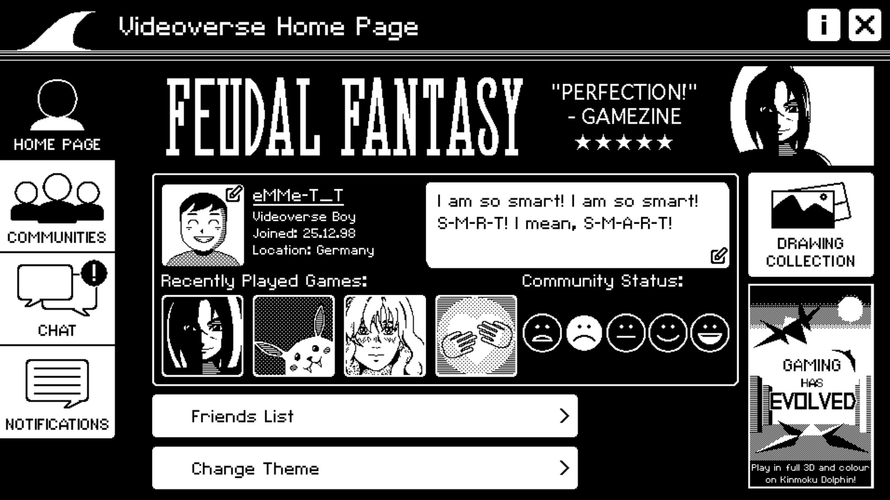
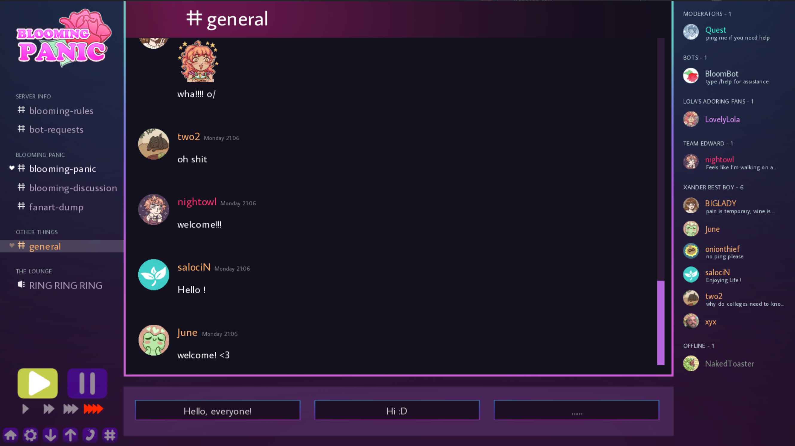

The [Interface Drama Master List](https://illuminesce.net/interface-drama) has been updated to include:

* [A Normal Lost Phone](https://dearvillagers.itch.io/a-normal-lost-phone)
* [Blooming Panic](https://robobarbie.itch.io/blooming-panic)
* [VIDEOVERSE](https://store.steampowered.com/app/2079180/VIDEOVERSE/)

## What is an interface drama?

Interface dramas are games that tell an immersive story through software and app interfaces. They are commonly called desktop simulators/UI games/inbox games/interface fiction.

---

### Related Posts

* [Interface Drama Master List: What is it?](/blog/posts/2023-08-15-Interface-Drama-Master-List/)
* [Submit an interface drama here](https://forms.gle/NKXv94fuBjSoZ9pv6)
* [Interface Drama Master List Update: A Date with Death and More](/blog/posts/2024-01-21-Interface-Drama-Master-List-Update.html)

See all posts tagged [Interface Drama](/tags/interface-drama/).
