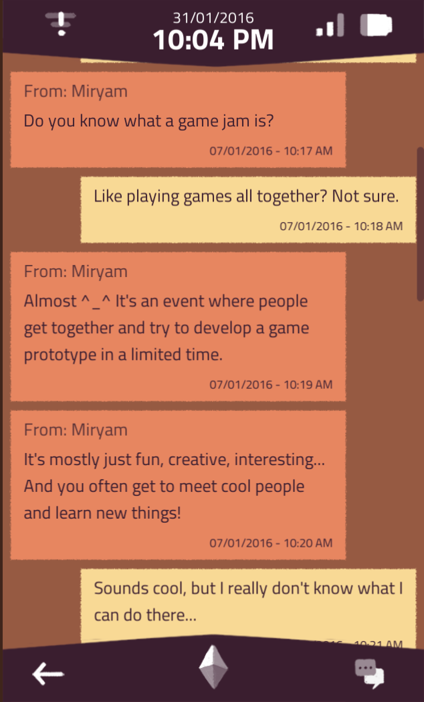

Played through [A Normal Lost Phone](https://store.steampowered.com/app/523210/A_Normal_Lost_Phone/), which is a recent addition to the [Interface Drama Master List](https://illuminesce.net/interface-drama). Although the game came out in 2016 and though folks had been urging me to play it, it kept dropping off my radar.

I thought this was a particularly cute section because A Normal Lost Phone was a [Global Game Jam game in 2016](https://globalgamejam.org/2016/games/normal-lost-phone) so it's a nice callback. Terranova was also a game jam project, too!

If you haven't played A Normal Lost Phone, you can find it [on the list](https://illuminesce.net/interface-drama)!

Also, if you haven't done a game jam yet, I highly recommend it.

(I'm biased, since I've run the Let's Games! Tokyo site for Global Game Jam since 2020. [Check out our 2024 After-Report here.](/posts/2024-02-07-Global-Game-Jam-2024-After-Report.html))
