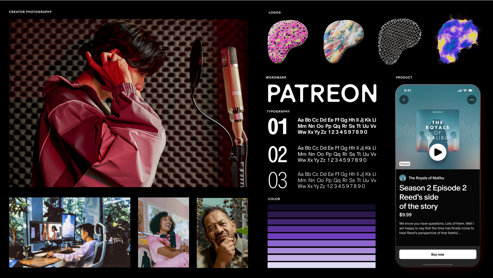
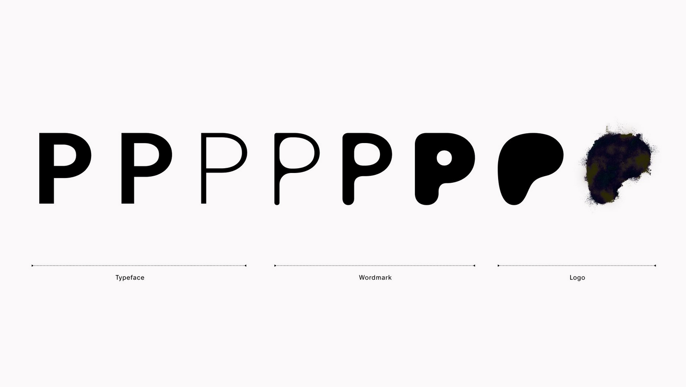
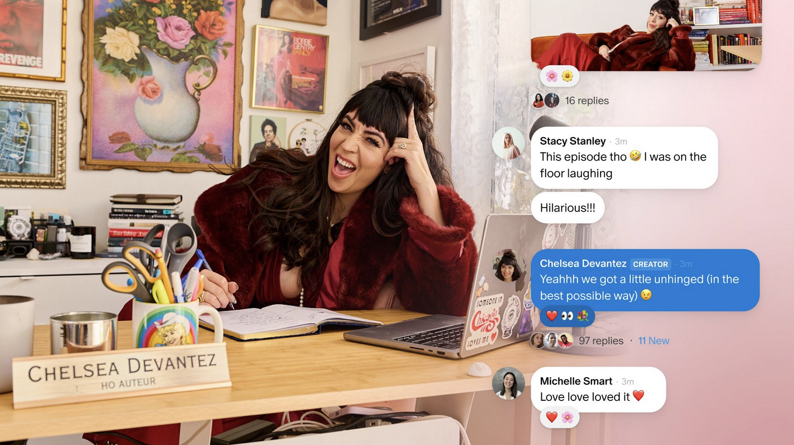
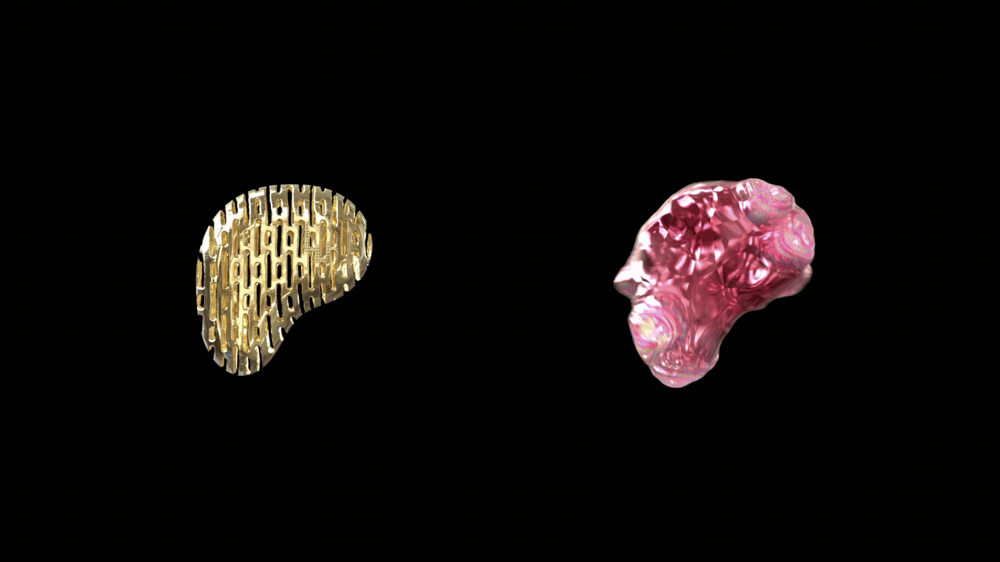

As a designer, I like looking through rebrand documents. Part of it is that I find visual design appealing, but it's also a safari hunt through a jungle of marketing-speak to tease out exactly why a rebrand decided to happen. [I just saw Patreon is getting a rebrand](https://news.patreon.com/articles/patreon-redesigned), so I jotted down some loose (and glib) thoughts while leafing through Patreon's documentation.

## Why do rebrands happen?

Usually a rebrand happens when:

1. the brand is associated with something they don't want to be and are looking to pivot their public-facing message
2. they have noticed their competitors doing something interesting, and want to steal it or steal + modify it
3. their design is outdated or clunky, and needs to be refreshed to something more modern
4. they want to grow to be a **One Stop Shop** or all-in-one app.

A **One Stop Shop** is marketing speak for, "making sure customers have everything they want so they don't go outside your product." I think this is a good idea on paper but a terrible idea in execution. It's great to have features that benefit people, but it's impossible to create and maintain everything that a person could possibly need at a massive scale, which means the core service will likely degrade over time as engineers are pulled in a bunch of directions to help service the "one stop shop" goal.

This is likely what Patreon is doing, according to [The Verge](https://www.theverge.com/2023/10/4/23899694/patreon-app-redesign-creator-pages-community-chats) and Patreon's own ["Patreon Reimagined"](https://news.patreon.com/articles/patreon-reimagined) post. It is noticing that its creators are going off Patreon (Discord, YouTube, TikTok) to upload content rather than doing it directly through Patreon.

## The Gooey P

Let's talk about Patreon's new logo. Not about the visuals, but what the "Gooey P" concept likely means.

Imagine, if you will, a place. Your place. Your home. Your home on the web. It's yours! You can choose to decorate it how you like, all your friends are there, and it's exactly how you want it. It's like a glob of Play-Dough, ready for you to play with it.

This kind of imagery of "your place" or "your home" or "your world" has been popping up recently—in 2021, Discord went from being a hub focused on gaming communities into a more generalized community management tool through their rebranding and subsequent movie, ["Imagine a place."](https://www.youtube.com/watch?v=l2rAz3lfdIA)

The gooey, malleable Patreon logo with the ability for creators to upload their own background or content to customize is a _very similar message_ to Discord's rebrand—users can create their "home" here. I see that reason #2 for doing a rebrand, "they have noticed their competitors doing something interesting, and want to steal it or steal + modify it" is coming into play here.

I wrote about ["Finding a Home on the Internet"](https://chostett.com/blog/posts/2023-07-01-Finding-a-Home-on-the-Internet) back in July about how most spaces feel like I'm renting, not owning, the space. Perhaps there was one time where I felt like I "owned" my Twitter too—but since 2022, I've been pretty disillusioned about a commercialized space ever feeling like a home to me. I don't seem to be the only one, either.

Discord and Patreon seem to have sensed this disillusionment and are speaking through their rebranding to this—they want spaces that are hyper-customizable, that feel like home. This is the essence of the Gooey P, is that you can customize it, that it is malleable to your needs.

## But is Patreon really home?

Quoting The Verge in their interview with Patreon CEO Jack Conte:

    > “Creators don’t have ownership and control on the platforms that they use, they’re renting space from these other services,” Conte says. “On Patreon, they own the surface. It’s theirs.”

    > But even creators on Patreon rely on platforms to not destabilize their business. Last year, Patreon creators using Vimeo to host videos were told they could lose their past work if they didn’t pay unexpected cost increases — shortly after, Patreon launched its own video hosting feature that creators had been waiting for. In August, multiple simultaneous issues with Patreon payment processing meant that some creators were unable to access their money, and fans were seeing their subscriptions being canceled.

I admit, with the insistent messaging towards creators that "A brand that is co-owned by creators," reading this quote makes me even more wary about what's going on in the sidelines.

## So, why did Patreon rebrand?

From a look at their branding documentation + some outside sources, my guess is that Patreon's rebranding comes from a mix of wanting to edge out other content/community providers like Discord, YouTube, Vimeo, and TikTok and have a one-stop shop, and perhaps wanting to associate themselves more as a benevolent business and disassociate themselves from the image of a business that can cancel subscriptions and stop income flow to creators.

Patreon is releasing a variety of new features, like marking posts as profile customizability, ability to organize posts into collections, and Community Chats, which appears to be an alternative to private members-only Discord servers. The addition of community chats does seems useful, especially for someone who doesn't want the set up of an entire Discord community, but some creators may feel overwhelmed if this feature is opt-in, since this will become an additional ask from Patreon to now moderate a chat section in addition to providing content every month.

My overall impression of this rebranding is pretty cynical. Mostly because I know what one-stop-shopism can do to a product as well as superficially, in the form of aligning oneself as an ally to creators while at the same time not particularly giving any outright control back into the hands of creators.

But I mean...we now have Gooey P.

So that's cool.

_(This post was subsequently updated on October 8th, 2023.)_

# Design is a tell

I've noticed this post has attracted a lot of attention from folks who are talking about how shitty Patreon is as a service or how dumb their rebrand looks.

Regardless of what I think about Patreon's usability or their CEO's business decisions, my intent was not to hate specifically on Patreon, and _especially_ not to hate on people who use Patreon for income. It was to point out that rebrands can signal something _important_ is happening at a company and that the decline of for-profit companies whose value is dependent on user generated content is a _systemic problem_, one not localized to just Patreon.

I was thinking about **@noescape**'s article ["It Hasn't Been a Good Year for Games"](https://noescapevg.com/it-hasnt-been-a-good-year-for-games/) and noticing some parallels between decisions Unity has made and decisions Patreon may make. [Patreon already laid off 17% of its workforce.](https://variety.com/2022/digital/news/patreon-layoffs-cuts-creator-partnerships-team-1235372211/)

Similar to Patreon, Discogs has [alienated their indie sellers by asking them to raise prices to account for the increase in postage and PayPal fees—while providing deep discounts on the site's top 11 sellers.](https://www.theverge.com/23899461/discogs-sellers-vinyl-cds-community-fees) This allows Discogs and the top sellers to make money, but buyers have to spend more money to stay with indie sellers. Most people don't have that kind of loyalty or extra cash to blow so indie sellers end up getting the short end of the stick.

And guess what? [Discogs is rolling out a redesign.](https://www.discogs.com/company/new-music-homepage-improvements-2023/)

That's a tell.

Any time a well-known platform that claims to support indie creators but does not feel significant financial pain when indie creators quit—_that's a moment when business decisions and rebranding/redesigns like this happen._ Whether it's for investors, for public valuation, being sold to a parent company, getting squeezed out by PayPal, payment processors and Apple...there's a host of reasons why companies make business decisions that screw over indies and small businesses.

I know pointing out systemic things like this triggers in me a helplessness and frustration that I can't point to one person to make fun of or that it's bigger than me. So I lash out. It's cathartic. But it doesn't change anything.

Here's some stuff to do instead:

- notice when brands are trying to publicly change their image and ask "why?"
- if you can, support indie creators even if their prices increase due to platform pressure
- support sites that have a slow growth or niche model (Dreamwidth and cohost come to mind, though folks share in the comments)
- support worker's unions, which can strengthen the company's financial pain if workers quit due to mistreatment of creators (in particular, [Bandcamp's worker's union](https://x.com/bandcampunited/status/1710280630163177624?s=20) could use your voice)
- support legislation that protects small-time creators (this will vary based on your location)
- or just like...take a break from online messages of systemic oppression of workers and creators for a while. It's heavy shit. Come back to it later, though.

Design for for-profit businesses whether it means to be or not, is a tell for how businesses prioritize things. If the business doesn't think it's worth spending money on, redesigns won't happen. It's telling that Patreon uses their money towards a refresh of their image and tools for monetization of "superfans" rather than improving the lives of creators.