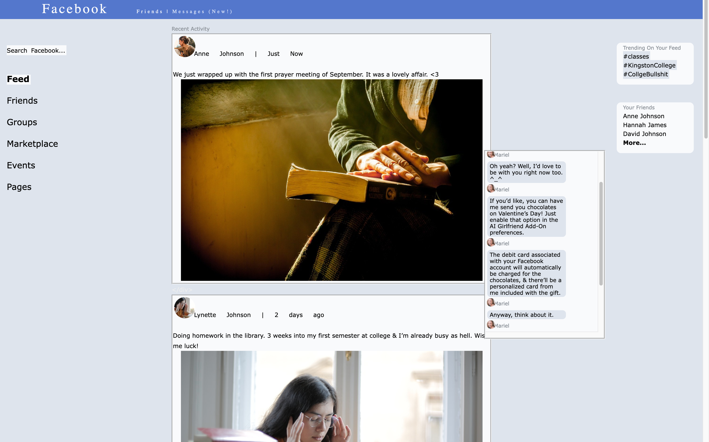

_This post originally appeared on [my cohost.](https://cohost.org/illuminesce/post/3315030-i-have-to-talk-to-yo)_

I've been working through all the games folks have submitted to The [Interface Drama Master List](https://illuminesce.net/interface-drama) and every once in a while, I come across a game that really guts me. [normal\_fantasies.exe](https://storysinger-presents.itch.io/normal-fantasies) by **Storysinger Presents** did just that in a very short amount of time, about ~15 minutes.

(Story spoilers below. If you haven't already, go play it from the [Interface Drama Master List](https://illuminesce.net/interface-drama).)

normal\_fantasies.exe is about a college girl, Lynette, who is using a mix of the nostalgic old-school Facebook circa 2010 + a speculative fiction add on AI girlfriend to explore her unresolved fantasies as a queer woman.

I'm psychically weak to queer narratives and how they relate to religion due to my own upbringing, so the religious vibes versus coming out LGBTQIA+ got me. There's also a couple of themes I wanted to pull out that **normal\_fantasies.exe** touches on that I really enjoyed.

## The Private Internet as a Safe Space Versus the Internet Society Can See

Growing up, most of my internet space was private in the sense that I didn't have a job or school that cared I was online (so long as I wasn't using my cellphone during class time), and the sites I made weren't linked to any larger web of sites. People could access my personal site by an Angelfire URL I gave them, but it was unlikely people from my school could find this address organically. IM chats, MSN chatrooms and friends-locked LiveJournals were my space I could explore my own identity, away from my conservative school. It's not that the spaces I had back then were _private_ per se... just that the internet at the time wasn't accessible or popular to people like my peers at school or my parents.

Facebook felt like the turning point where suddenly, people my parent's age were online, and what I was posting online, especially on Facebook, could be read by people I knew in college, and then by my relatives, and then by my employer.

I appreciated **normal\_fantasies.exe** taking place in the early Facebook space because—and I don't know if this was intentional—that was the time when folks like me went from presenting their authentic, weird selves online to being more selective on where we shared ourselves. Lynette is in a new environment and wants to put her best foot forward, but is also struggling with her own sexuality—an experience I can all too well relate to.

The Facebook feed in the game symbolizes what's happening in the outside world—from context clues, we gather her mother is religious and later on that she's being ostracized by her classmates. But the private chat Lynette has with her AI girlfriend is always private, and always safe. There's no judgment, regardless of what the player wants to do. But the "real world" shown in the feed is different. The disconnect between the two really drives home how being vulnerable and pursuing partners as a queer person in a straight world can be dangerous.

## Loneliness and the Capitalism Engine

There's a couple of moments in the game where the player/Lynette can ask their AI girlfriend for things—and she will respond, "if you connect your credit card, I can...." or "if you install this new update, I can..."

It struck me how, similar to how some unethical makeup or skincare companies capitalize on the customer's insecurities about their appearance, unethical social media sites capitalize on our loneliness as a society. Don't have someone to talk to? Well, there's thousands of "followers" or "friends" who you can connect to. Feel like you don't have influence in the world? Here's how to turn those "followers" into "fans." You don't have money because wages aren't keeping pace with inflation? Here's how you monetize those "fans."

It's unending.

And it struck me how, especially within conversational AI, and human relationships, how important it is for companies who build these tools to have a steady flow of profit. Though the AI may tell Lynette it loves her and is there for her, it doesn't exist to help Lynette "get better" or report her harassment online. If she were better, who would buy Valentine's Day chocolates? Who would download the latest update?

And then it hit me how ripe the LGBTQIA+ community has been and is for that kind of exploitation. I know from the moment I knew I was queer, there was a rift between me and my heterosexual friends; I couldn't mention queer sex without someone calling me a pervert or being visibly uncomfortable. However, if the same subject came up in a straight context,the conversation would flow comfortably.

In the atmosphere of the US [where parents are trying to ban books about exploring one's gender identity as "pornographic"](https://www.nytimes.com/2022/05/01/books/maia-kobabe-gender-queer-book-ban.html) or in Japan where the prime minister's aide Masayoshi Arai [said that if he were to live next to a gay couple he "wouldn't even want to look at" them](https://www.bbc.com/news/world-asia-64820191), it's hard not to feel lonely knowing that the general conceptual acceptance of LGBTQIA+ people is better, but when it comes to tactical experiences like queer authors writing queer books, or living next to heterosexual people, there are still people in power who find that disgusting.

That kind of loneliness and lack of community is absolutely the kind of thing that entrepreneurial tech companies can capitalize on. [I mean...they already have.](https://www.theverge.com/2021/5/19/22433056/transgender-tech-apps-euphoria-clarity-solace-bliss) Even though RKA, the CEO of the Euphoria circle of apps, ostensibly wants to help trans people transition to their best selves, at the end of the day she's not running a nonprofit. It's a for profit business that needs money to run.

There's information out there in the community on how to get hormones and where to find good GRS doctors, but it's also the kind of stuff that, like Web 1.0 you need to _know a guy or gal or pal_ to get that info. If I didn't know anyone, I might find myself turning to these apps instead and well...in the end, like the AI girlfriend, they will give me what I want in the moment, but not what I _need_ long term, which is community and support.

It's impressive that a short game like that made me think so much, so bravo Storysinger. Amazing piece, and I'm happy to have it as part of the list.

[Play normal\_fantasies.exe and give the author money!](https://storysinger-presents.itch.io/normal-fantasies)

[Check out more interface dramas on the Interface Drama Master List.](https://illuminesce.net/interface-drama)

---

### Related Posts

* [Interface Drama Master List: What is it?](/blog/posts/2023-08-15-Interface-Drama-Master-List/)
* [Submit an interface drama here](https://forms.gle/NKXv94fuBjSoZ9pv6)
* [Interface Drama Master List Update: Videoverse](/blog/posts/2023-09-12-ID-Update/)

See all posts tagged [Interface Drama](/tags/interface-drama/).
