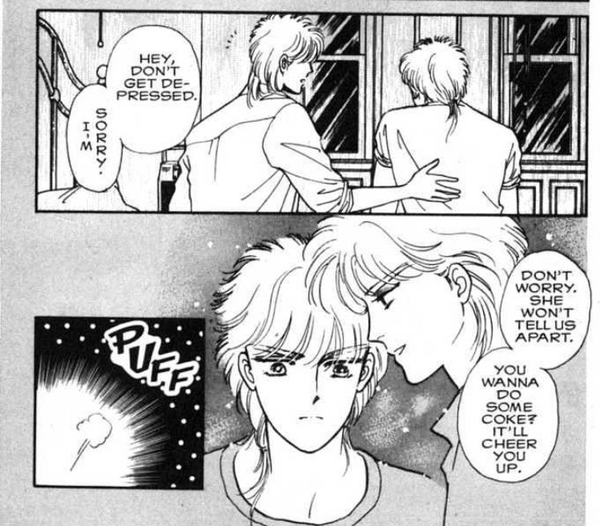
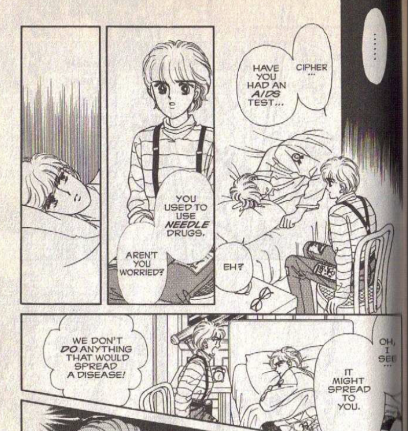
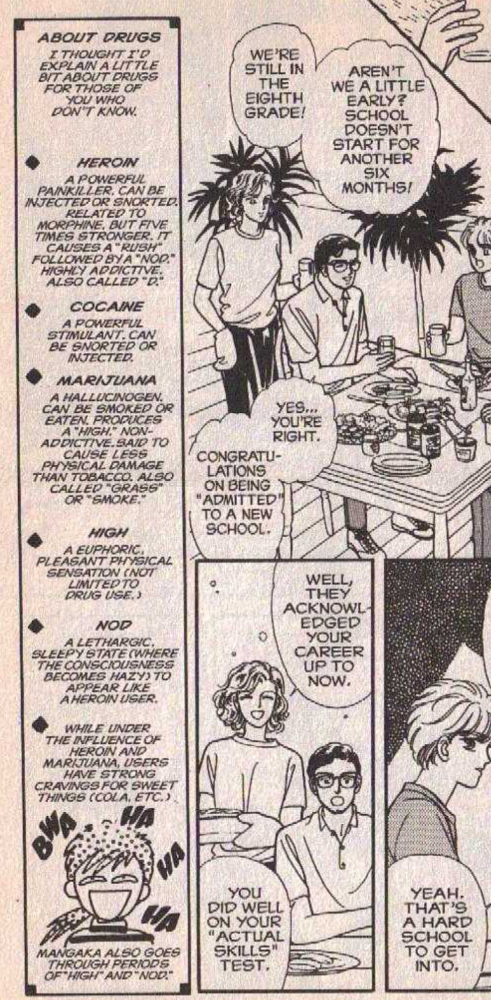
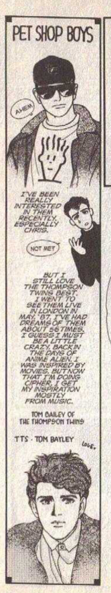
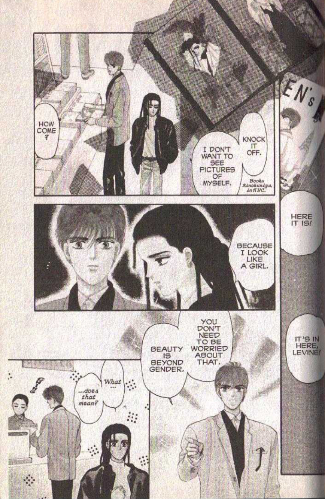

I was shocked that I, as a US person, had not heard about this 1986 shoujo manga by Narita Minako about two twins, Cipher and Shiva, living the life of one person in New York. It follows them and their friend, Anise, who discovers their secret.

I heard it was very popular in Thailand back in the 90’s so I thought I’d check it out.

This manga is not only progressive for the 80's, but for the current era.

The characters talk openly about periods, pads and tampon usage. They talk about how to fit a bra. They talk breezily about drug usage, what different types of drugs are, what are hard drugs that, if you get addicted to, you’ll regret it. There’s even a section in it about getting HIV tested.

The manga reads part like a shoujo manga from a Japanese author who is really into US culture, and part like an older sister giving life advice to younger, queer siblings.

Just a normal explainer about different types of drugs while American kids talk about their final year of eighth grade. I was exposed to drug use through my family, and I wish I had this kind of "cheat sheet" before I encountered my first "high" person when I was thirteen.

And she introduces bands that I as a young queer teen latched onto for their messages around fighting against the establishment as LGBTQ+ people in the industry. I was _obsessed_ with the Pet Shop Boys, introduced to me by a penpal in Austria. We met because we both loved Gundam Wing fanfic.

It’s not without its flaws, and the story hinges on a familial, yet somewhat romantic relationship between the twins (which, by the way, was why it was popular in Thailand—for the BL).

But, this manga has really captured my heart for not only its story but its directness in dealing with subjects often not spoken about to young teens. I kept thinking, “man, I wish I had read this manga when I was a teen. It would have given me so many messages I desperately needed to hear.”

---

### Related posts

- [BL from the 70's, 80's, and 90's](/blog/posts/2023-09-02-Visiting-the-First-Boys-Love-Exhibition-in-Japan/)
- [The Expansion of Modern BL](/blog/posts/2023-09-30-Visiting-the-First-Boys-Love-Exhibition-in-Japan/)
- [Let's talk about Shadow Hearts](/blog/posts/2023-07-03-Lets-talk-about-Shadow-Hearts/)

See all posts tagged [Fandom](/tags/fandom/).
