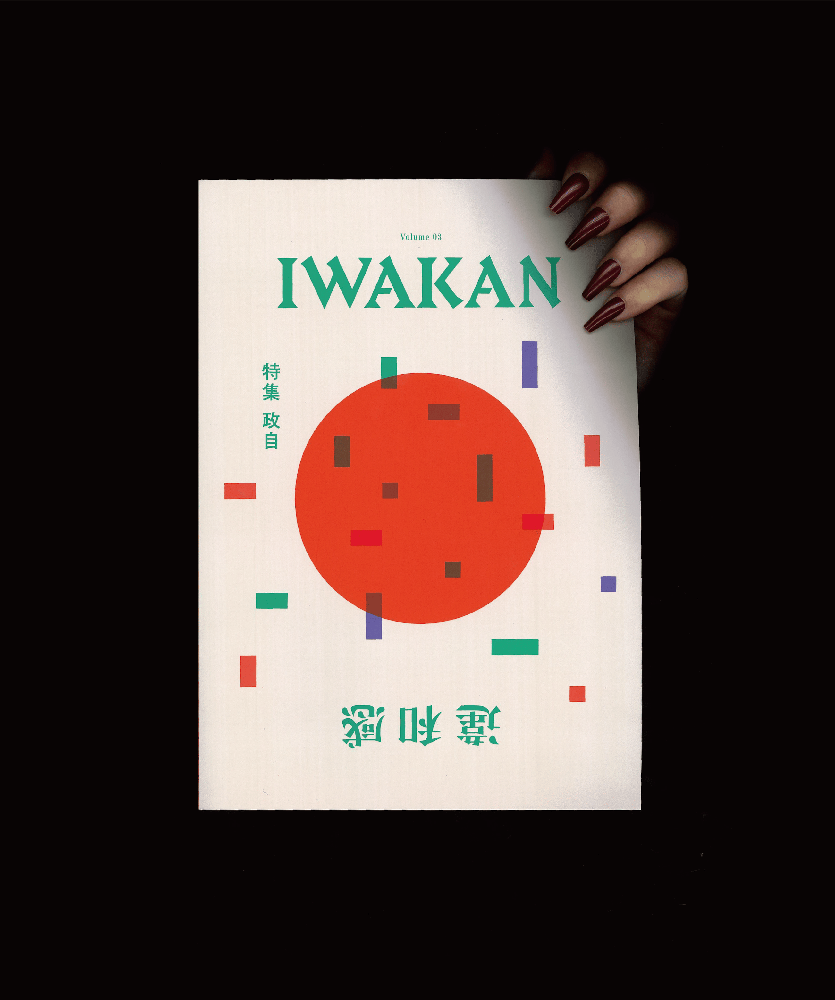
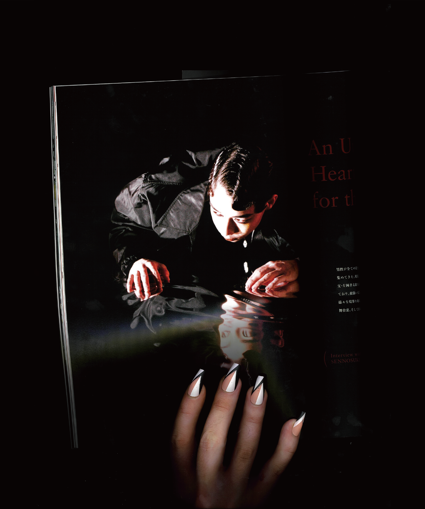
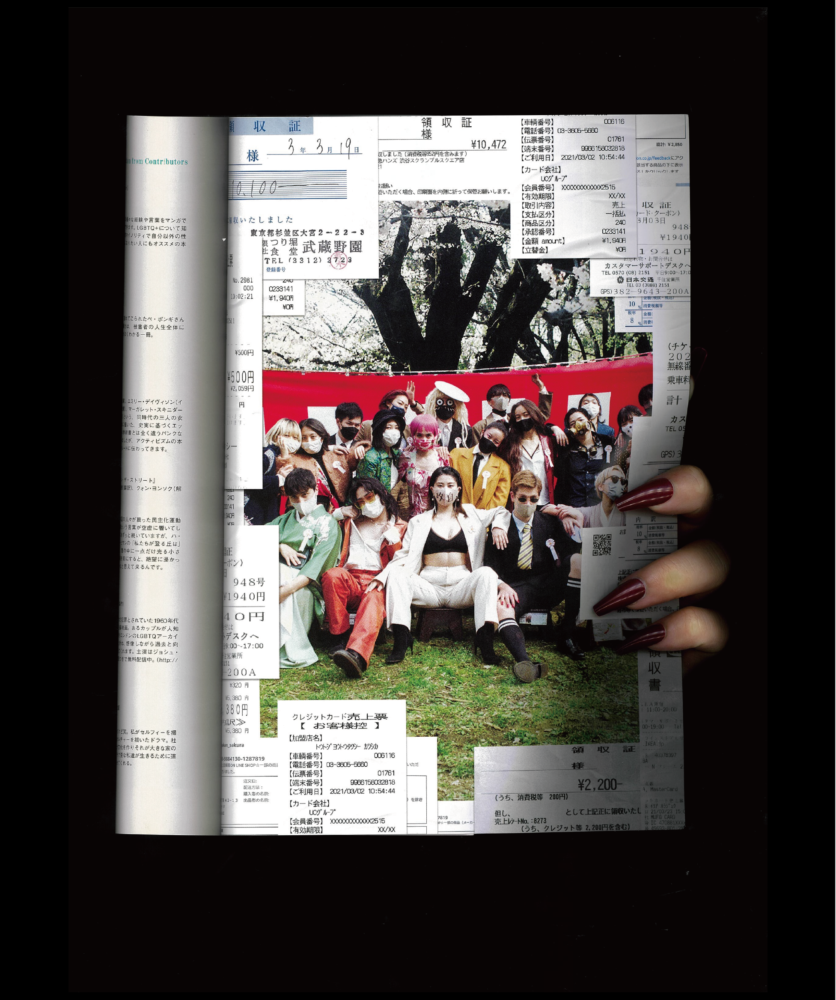
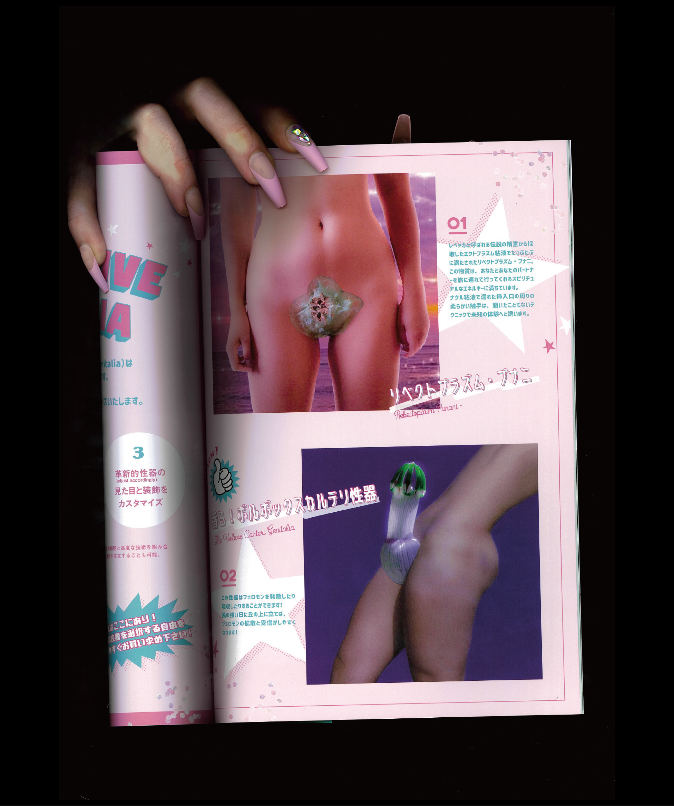

_IWAKAN magazine, a Japanese queer alt magazine that ran from 2020-2023._

Have you ever discovered something so inspirational or fascinating only to find out that it's no longer around?

I heard about IWAKAN Magazine in November. _Iwakan_ (違和感) is an uncomfortable feeling or sense of discomfort. The magazine's tagline is, 「IWAKANは、世の中の「当たり前」に「違和感」を問いかける雑誌です。」or "IWAKAN is a magazine that questions discomfort with what is "normal" in the world." It is part art magazine, part queer zine, part activist discourse, featuring interviews from a host of performers, drag queens, queer community activists, feminists from in and outside of Japan.

It started in October 2020, during the worst of the pandemic and published about an issue every six months including video interviews that are up on [their Instagram](https://www.instagram.com/iwakanmagazine/). Looking at the contributors, there were many folks I know in the Japanese LGBTQIA+ community, many whom are personal friends, who were interviewed or made illustrations for the magazine.

There are interviews with Japanese trans men and nonbinary folks on how their relationship to masculinity has changed over time. With lesbian sex workers on how they approach love as entertainers. With kabuki performers about how they personally inhabit the masculine and feminine spheres as they switch roles. It's an incredible archive of personal stories from the Japanese community, and many are radical and awe-inspiring.

I have heard blanket statements about the LGBTQIA+ community in Japan—how it's _behind the U.S. by twenty years_ or how the community is non-existent, and that it's hopeless. The _government and laws_ in Japan are **painfully** slow to change. But it's personally frustrating for me because in the streets of Ni-chome I see people organizing, protesting, taking action and fighting. There _is_ hope. And IWAKAN is a record of those conversations, especially during a time when people were sequestered in their homes.

On December 20th, 2023 [IWAKAN posted a blank white square on their Instagram](https://www.instagram.com/p/C1Ea0MnStg1/?utm_source=ig_web_copy_link&igsh=YzZhZTZiNWI3Nw==) with the words, "The end - IWAKAN" and a brief message: "We know this is a sudden announcement, but IWAKAN will cease production as of the end of this year...thank you to everyone who supported us."

My heart fell into my stomach when I read that. Only a month after I discovered this publication and they were ceasing production. There will be no more IWAKAN this year, the year when Japanese government is hearing the lawsuit for same-sex marriage.

But those voices are still alive. And their website (for now) is still alive. So I wanted to share my discovery with you.

### I made an unofficial translated archive

At the end of the month when the store deactivates, I am worried that we will lose the summaries, table of contents, and photographs of the magazine as well as a critical piece of Japanese queer history.

The degradation of Site Formerly Known as Twitter and shifting TOS of social media has made me aware about how we preserve queer media, especially personal stories about sexuality and gender. Some of the images of the magazine would be flagged as "porn" by social media sites though in context they are about discussions of queer liberation in sexuality.

I decided to make a small archive of each of the IWAKAN issues with photos of them and English summaries, translated by me. I hope this can preserve a piece of history online for longer.

- [Volume 01 特集 女男 (Feminine/Masculine)](https://illuminesce.net/iwakan/iwakan-vol1)
- [Volume 02 特集 愛情 (Love)](https://illuminesce.net/iwakan/iwakan-vol2)
- [Volume 03 特集 政自 (Government/Individual)](https://illuminesce.net/iwakan/iwakan-vol3)
- [Volume 04 特集 多様性？(Diversity?)](https://illuminesce.net/iwakan/iwakan-vol4)
- [Volume 05 特集 （不）自然 (\[Un\]Natural)](https://illuminesce.net/iwakan/iwakan-vol5)
- [Volume 06 特集 男性制 (Masculinity)](https://illuminesce.net/iwakan/iwakan-vol6)
- [未来の男性へーIWAKAN書簡集 (Dear Future Men - Letters from IWAKAN)](https://illuminesce.net/iwakan/iwakan-futuremen)

Please be aware Japanese is not my mother tongue, so if I have made errors, please get in touch to let me know. Spread the word if you find this interesting and want to spread this gem of Japanese queer culture. Thanks.

---

### Related posts

- [Pride House Tokyo](/blog/posts/2024-03-08-Pride-House-Tokyo/)
- [The Trans Tourists' Guide to Japan](/blog/posts/2024-05-19-Trans-Tourist-Guide-to-Japan/)
- [Rabbit Logic](/blog/posts/2024-12-16-Rabbit-Logic/)

See all posts tagged [LGBTQ+](/tags/lgbtq/).
