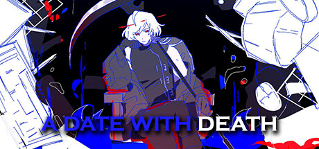
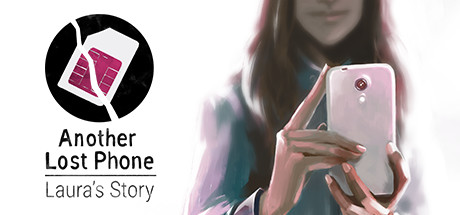
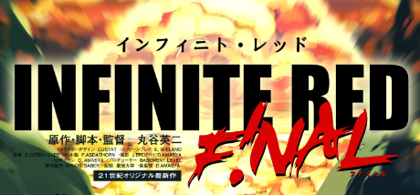
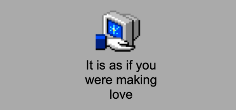
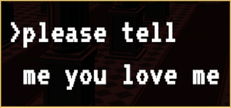

お久しぶりです！ Long time, no see!

The last time I updated the Interface Drama Master List was way back in October—I'd discovered upon playing more of these games there were some overlapping genres and sub-genres and I fell into a rabbit hole of trying to wrap my head around them instead of updating the list.

For now, I'm going to put that aside and percolate on these thoughts more—but in the meantime, here's seven new interface dramas that have been added to the Interface Drama Master List. Some are new releases, some are ones that had been submitted via the Interface Drama Submission Form, and others were ones that were suggested to me via comments on itch.io.

Though I haven't been actively updating, I _have_ been playing a lot of interface dramas, and it's been great to dig into these.

To those who have sent submissions—thank you! I've expanded my horizons thanks to you. If you'd like to submit an interface drama (especially if you're the dev!) [please submit to the list here.](https://forms.gle/NKXv94fuBjSoZ9pv6)

### A Date with Death

Two and a Half Studios isn't known for interface dramas, but as soon as I saw the trailer, I knew I had to play it. It's a romantic chat sim featuring the main character, who seems to be wickedly lucky—and Death, who is trying to reap their soul. The dialogue is punchy and funny; I highly recommend paying the devs the extra few bucks for the DLC, since you can unlock cool outfits and new dialogue choices.

### Another Lost Phone: Laura's Story

The spiritual successor to A Normal Lost Phone, Laura's Story follows the player trying to figure out what happened to Laura. I'm a personal fan of this kind of storytelling plot—it's used particularly well in SIMULACRA, too.

### HRT Simulator 2023

I've wanted to put this on the list since tofurocks put it up on itch.io. It's indicative of a common queer experience—you're experiencing something new but you don't have immediate friends who are also queer—so you experience your "firsts" with your online friends. A heartfelt and sweet love letter to HRT.

### INFINITE RED - The Day the Earth Stood Still

I may be spoiling a part of the plot saying this game is an interface drama, but this short story is just a small taste of what seems to be a larger world around INFINTE RED. About a fifteen-minute playthrough, I really enjoyed it.

### It is as if you were making love

This game is sexy.

There's no way around it. It's a speculative fiction interface set in the future where humans do not have erotic experiences but still have the psychological need to give pleasure to a partner. I handed this to my partner with no context and it was not only hilarious to watch but a fun thought experiment to ponder—what if sex didn't exist but our need to enjoy eroticism remained?

### Lost Memories Dot Net

I can't believe no one recommended me this game sooner—there are so many parallels to our game, Terranova. The chats, the teenage drama, the fussing over your website. The music is also very relaxing, too—I had a fun time playing this in the background.

### please tell me you love me

Thank you to the dev for submitting this! please tell me you love me is the story of an online MMO server's last days, and perhaps your last chance to confess your love to someone you met on there.

As a former MMO player, I very much resonated with this story. It's sweet, sad, and made me wonder about my friends I lost contact with after I cut ties with a certain MMO.

In addition, I've added the following to the [review queue:](https://trello.com/b/FsmPZht8/interface-drama-master-list-submission-queue)

* a phone found in tall grass
* Orwell: Ignorance is Strength
* MapFriend
* Do Not Feed the Monkeys
* Mythic Meetup

Thanks again for all your submissions, and once I play another batch of these games, I'll update.

Thanks, y'all!

_CJ is a designer and indie dev. They write as a hobby. If you like this article, why not [say hello in an email](https://illuminesce.net/contact) or [buy them a coffee](https://ko-fi.com/studioterranova) to support their work?_
