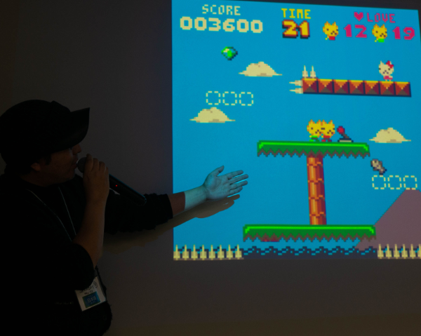
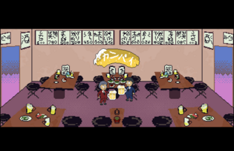
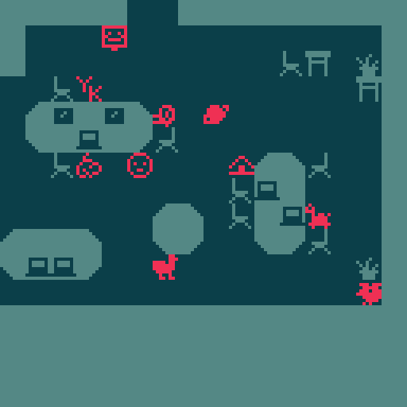
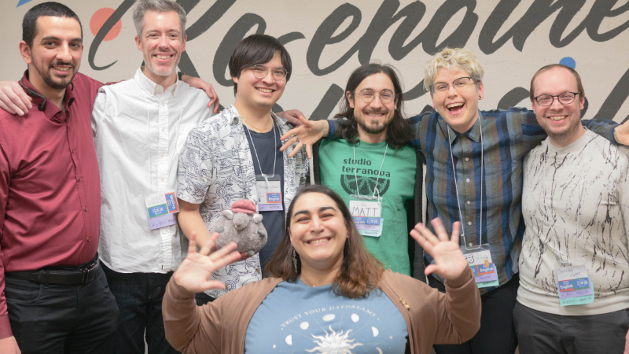

_写真家： [Shane Brown](https://www.instagram.com/xenoliving/)_

[The English version of the after report is here.](https://illuminesce.net/blog/posts/2024-02-07-Global-Game-Jam-2024-After-Report)

グローバル・ゲーム・ジャム (GGJ) Let's Games! TokyoのサイトオーガナイザーのCJ、ジョサイアとマットです。どうもよろしくお願いします。

今年で5年目を迎えたGGJですが、今年は参加者が多かっただけでなく、素晴らしいゲームをお披露目することができました。

ご存知ない方のために簡単に説明すると、Let's Games! Tokyo は東京で開催されるグローバル ゲーム ジャムです。2020年に 六本木コードクリサリス として25名ほどでスタートし、今年は39名が参加するまでに成長しました。

Let's Games! Tokyo が約束していることは：  

* どんな技術やノウハウでもゲームを作れるし、新しい友人を作ることができる対面式イベントを開催すること。
* バイリンガルのゲーム開発を支援するために、日本語話者と英語話者を繋げること。
* 男性でも女性でも、そしてノンバイナリー・Xジェンダーの方、トランスジェンダーの方、ジェンダーフルイドなど、多様なアイデンティティを持つインディー開発者コミュニティを育成すること。

今年のテーマは **_「笑せて！」_**です。

合計8組のチーム、5人のソロ開発者、そして13本のゲームが発表されました。

8組のチームのうち、バイリンガルチームが4組、日本語チーム1組、英語チーム2組となりました。

使用されたゲームエンジンは、PICO-8（ピコハチ）が中心でした。Unityのゲームが3本、Godotのゲームが3本、bitsyのゲームが1本、カスタム言語で作られたゲームが1本、**そしてPICO-8のゲームがなんと5本もありました！。**

_写真家: [Shane Brown](https://www.instagram.com/xenoliving/)_

Let’s Games! Tokyo で誕生したゲームをこれから紹介したいと思います。

## カンパイ～！

乾杯をするとき、謙虚に先輩のグラスのすぐ下で乾杯することを目指します。「カンパイ～！」は底まで競争しなければならないレーシングゲームです。お酒を守りながら、一番謙虚になれたら勝ちです。

[**(itch.io)**](https://jaysc.itch.io/kanpai)

## TRUST ME (トラスト・ミー）

PICO-8で制作した二人プレイ専用協力ゲームです。双子のネコを幼馴染のミーちゃんの元に導きましょう。協力だけでは乗り越えられない困難も...？！「信頼と裏切りから生まれる笑い」をコンセプトにしたゲームです。

[**(itch.io)**](https://donutshunter.itch.io/trust-me) | [**(donutshunterのブログ)**](https://www.donutshunter.com/blog/4ujyvns0j)

## Tamagoji (タマゴオジ）

このゲームでは、おじさんの面倒を見よう！食事を与え、ビールを飲ませ、タバコ休憩を取らせましょう。あなたがいてもいなくても、彼は役に立たない！＾＾

[**(GGJサイト)**](https://globalgamejam.org/games/2024/tamagoji-9)

## Chopstuck (チョップスタック)

お箸の女神様は、主人公にお箸の手を授られた（呪われたかな？！）お箸の手で、ドアを開けたり、ハンコを押したり、お寿司を食べたり...!

[**(itch.io)**](https://oilrattus.itch.io/chopstuck) | [**(サウンドトラックを聴く)**](https://acidcookie.bandcamp.com/album/global-game-jam-2024-chopstuck)

## What-A-Pain! (ワット・ア・ペイン）

主人公はスタンダップ・コメディアンで、面白いダジャレを求めて街を歩いています。そして、あるバーを見つけた。ただのバーではないです。未知の脅威に満ちたバーです。

[**(itch.io)**](https://gm7595.itch.io/what-a-pain)

## Spaceport Giggles (スペースポート・ギグルズ)

スタンダップコメディのキャリアを積んだ主人公は、知らない言葉を話す宇宙人が住む新しい惑星にやってきました。宇宙人に話しかけ、聞き慣れない言葉で冗談を作ったり、笑わせよう！

[**(itch.io)**](https://radicalslice.itch.io/spaceport-giggles)

## どろぼうキングSHOWTIME!

どろぼうキングがまたまたやってきた！今回は未知の魅力をもつ「永遠のダイヤモンド」を狙っているらしい！しかし、ミステリー博物館の警備員たちは、そう簡単にはダイヤモンドを奪わせてはくれないぞ！果たしてどろぼうキングは、人知れずダイヤモンドの部屋にたどり着くことができるのか！？

[**(GGJサイト)**](https://globalgamejam.org/games/2024/dorobo-kingu-showtime-torohoukinkushowtime-1)

## 象草（ゾウクサ）

笑ってはいけないです!15秒でおまけコミックを作り、友達に見せましょう。コンピュータのマイクが、あなたや友達が笑っているかどうかを追跡します。

[(Play on itch.io)](https://pressedelephant.itch.io/elephant-grass)

## Mi-Laugh (ミー・ラフ）

あなたは世界に一つだけの笑いを作る専門店のMi-Laughアトリエのオーナーです。顧客と話し、ストーリーを聞いたり、カスタマイズした「笑い声」を開発してください。

[**(itch.io)**](https://zachsarette.itch.io/mi-laugh)

## Surely, You Jest！（もう、冗談じゃないっすか！？）

PICO-8のゲームで、タイムスリップしてきたサラリーマン。王様はサラリーマンにアイテムを投げつけ、プレイヤーはそれをかわすか、王様に跳ね返さなければならないゲームです。

[**(PICO-8 BBS)**](https://www.lexaloffle.com/bbs/?tid=140000)

## sWORDplay (スワード・プレイ）

このPICO-8ゲームは、「モンキーアイランドの秘密」のワンシーンにインスパイアされたもので、敵が冗談の前半で戦ってくるので、プレイヤーは剣をぶつけ合いながら正しい後半フレーズを選ばなければならないです。

[**(GGJサイト)**](https://globalgamejam.org/games/2024/swordplay-0)

## ニワトリが道路を横切り、バーに入っていく

カスタムプログラミング言語ROFLangで作られた、冗談の寄せ集めのゲームです。ニワトリが道路を横断し、車をよけながらどんどん酔っぱらっていきます。FROGGER（フロッガー）からインスパイアされました。

[**(開発者のサイト)**](https://blakeohare.com/chickencross/index.html)

## Hello World!（ハロー・ワールド）

Let's Games! Tokyo のジャムの会場がピクセル世界で再現されました！会場でぶらぶらしたり、ジャマーと話したり、くだらないダジャレを見つけてください。

[**(itch.io)**](https://illuminesce.itch.io/hello-world)

---

[ゲームをプレイするには、GGJのページをチェックしてください!](https://globalgamejam.org/group/174/games)

ゲームをストリーミングしたいのなら、ジャマーにメッセージを送ってください！きっと喜んでくれると思います。

インディーズ通信がストリーミングをやってくれました。RenkonとDaikon、ありがとうございます！

<iframe width="560" height="315" src="https://www.youtube.com/embed/BTcXuAgb0jk?si=FpSUuxrRbkBDW_K4" title="YouTube video player" frameborder="0" allow="accelerometer; autoplay; clipboard-write; encrypted-media; gyroscope; picture-in-picture; web-share" referrerpolicy="strict-origin-when-cross-origin" allowfullscreen></iframe>

---

Let's Games! Tokyo は、皆さんのおかげで大成功になりました。まずは、メンターをして下さった、エリックさん、フィリップさん、ジェレンさん、マットさん、ジョサイアさん、CJさん、そしてヤヒヤさん、ご協力ありがとうございました。写真の撮影とお菓子の準備を手伝ってくれたボランティアの、シェンさん、コリーさん、そしてニックさん、に感謝を捧げます。

_写真家: [Shane Brown](https://www.instagram.com/xenoliving/)_

また、Ko-Fiのジャマーたちの協力により、お菓子と飲み物の応援として59,000円を募集しました。そのうちの52,923円を使い、残りはオーガナイザーの交通費としてサポートします。

ジャムを素晴らしいものにしてくれた皆さんに感謝します！

なお、次回のGGJのオーガナイザーチームに日本語ネイティブの方とスポンサーを募集しています。オーガナイザー、あるいはスポンサーは、[**globalgamejamtokyo@gmail.com**](mailto:globalgamejamtokyo@gmail.com)に連絡してください。

よろしくお願いいたします!

来年の2025年1月24日〜26日のグローバル・ゲーム・ジャムでお会いしましょう。

よろしくお願いいたします。

> _Let's Games! TokyoのオーガナイザーのCJ、マット、ジョサイアから_

写真家: [Shane Brown](https://www.instagram.com/xenoliving/)
