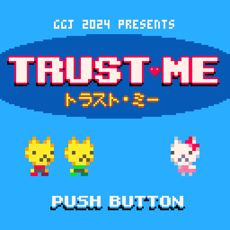
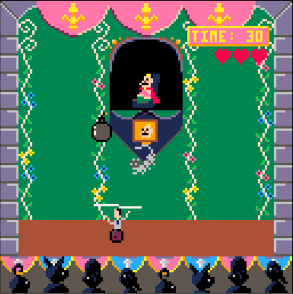

_Photo by [Shane Brown](https://www.instagram.com/xenoliving/)_

[アフターレポートの日本語版はこちら。](https://illuminesce.net/blog/posts/2024-02-07-GGJ24-Report-JP.html)

Hello everyone! Global Game Jam Let's Games! Tokyo site organizers CJ, Josiah and Matt here.

This year was our fifth year running Global Game Jam, and this year we had not only a great turnout, but some incredible teams and games we showcased on Sunday.

For those of you who don't know, Let's Games! Tokyo is a Global Game Jam site held in Tokyo, Japan. It started in 2020 as Roppongi, Code Chrysalis site with about 25 people, and since then has grown to 39 people participating this year.

At Let's Games Tokyo, we value…  

* Having an in-person event where people of any skill level can build games and make new friends
* Building bridges between Japanese and English-speakers to make bilingual game dev a reality
* Fostering the indie dev community with more diverse identities: masculine, non-binary, transgender folks, feminine, agender, genderfluid folks are all welcome

This year's theme was, **_“Make Me Laugh!”_**

We had a total of eight teams, five solo devs, and thirteen games.

Out of the eight teams, we had four bilingual teams, one Japanese-speaking team, and two English-speaking teams.

As far as engines went, our site heavily leaned towards the fantasy cartridge game engine PICO-8. We had 3 Unity games, 3 Godot games, 1 bitsy game, 1 game built in a custom language, and **a whopping 5 PICO-8 games!**

_Photo by [Shane Brown](https://www.instagram.com/xenoliving/)_

Below is a list of games that came from our site:

## Kanpai~!

In Japanese business culture, when making a toast (kanpai!), you should humbly aim to toast your glass just below that of your senior. Kanpai~! is a race to the bottom. Dodge objects to protect your precious alcohol. Only one of you can be the most humble.

[**(Play on itch.io)**](https://jaysc.itch.io/kanpai)

## TRUST ME

A game about trust and betrayal—two twin cats vying for the love of one princess…in this 2-player PICO-8 game, you can either help...or betray one another in thirteen puzzling levels.

[**(Play on itch.io)**](https://donutshunter.itch.io/trust-me) | [**(donutshunter's blog)**](https://www.donutshunter.com/blog/4ujyvns0j)

## Tamagoji

Live your wildest dreams and take care of an old man / oji-san! Feed him, give him beer, make sure he takes his smoke breaks. He's useless with or without you!

[**(Play on GGJ site)**](https://globalgamejam.org/games/2024/tamagoji-9)

## Chopstuck

The chopstick goddess has blessed you with chopstick hands! Complete day-to-day tasks like opening doors, stamping documents and...eating sushi!

[**(Play on itch.io)**](https://oilrattus.itch.io/chopstuck) | [**(Listen to the soundtrack)**](https://acidcookie.bandcamp.com/album/global-game-jam-2024-chopstuck)

## What-A-Pain!

You are a stand-up comedian walking around the city for some interesting puns. Then you find a Bar. It's not just a Bar. It's a Bar full of unknown threats.

[**(Play on itch.io)**](https://gm7595.itch.io/what-a-pain)

## Spaceport Giggles

Your standup comedy career has brought you to a new planet, where the inhabitants speak a language you have never heard. Talk to the inhabitants, try to make jokes in an unfamiliar tongue, and make them laugh!

[**(Play on itch.io)**](https://radicalslice.itch.io/spaceport-giggles)

## どろぼうキングSHOWTIME!

Dorobo Kingu is at it again! This time, he is after the inexplicable everlasting Diamond. Can Dorobo Kingu reach the Diamond room unseen? Go through three puzzle levels to get to the diamond.

[**(Play on GGJ site)**](https://globalgamejam.org/games/2024/dorobo-kingu-showtime-torohoukinkushowtime-1)

## Elephant Grass

Try not to laugh! Make a silly meme in 15 seconds and show your friends. The microphone on the computer will track whether you or your friend is laughing.

[**(Play on itch.io)**](https://pressedelephant.itch.io/elephant-grass)

## Mi-Laugh

You are the owner of Mi-Laugh Atelier, an establishment specialised in the crafting of one-of-a-kind laughters. Talk to your customers, get to know their stories and develop customised laughs for them. Give them the gift of expressing joy!

[**(Play on itch.io)**](https://zachsarette.itch.io/mi-laugh)

## Surely, You Jest!

A PICO-8 game where you play as a salaryman that has been transported back in time to be the jester for a mad king. The king throws items at the player and they must either dodge or bounce them back to the king.

[**(Play on PICO-8 BBS)**](https://www.lexaloffle.com/bbs/?tid=140000)

## sWORDplay

Inspired by a scene in Secret of Monkey Island, this PICO-8 game is a call-and-response game where the enemy sets up a joke…and the player must choose the correct rebuttal as they clash swords.

[**(Play on GGJ site)**](https://globalgamejam.org/games/2024/swordplay-0)

## A chicken crosses a road and walks into a bar

A game was built in a custom programming language, ROFLang, about a mishmash of jokes—a chicken who crosses the road and must dodge cars while getting increasingly drunk.

[**(Play on dev's website)**](https://blakeohare.com/chickencross/index.html)

## Hello World!

CJ and another mentor, Yahya, built a bitsy game where you can hang out at a pixel-version of the Let's Games! Tokyo site, talk to jammers, and find silly puns.

[**(Play on itch.io)**](https://illuminesce.itch.io/hello-world)

---

[You can see all our games and our site on the GGJ website.](https://globalgamejam.org/group/174/games) Thirteen incredible games, all playable either on itch.io or the GGJ site. It was a huge effort for the teams, and they should be proud of themselves.

Indie Tsushin did a stream of all our games on their Happy Hour! Thank you Renkon and Daikon. Watch it here.

<iframe width="560" height="315" src="https://www.youtube.com/embed/BTcXuAgb0jk?si=FpSUuxrRbkBDW_K4" title="YouTube video player" frameborder="0" allow="accelerometer; autoplay; clipboard-write; encrypted-media; gyroscope; picture-in-picture; web-share" referrerpolicy="strict-origin-when-cross-origin" allowfullscreen></iframe>

---

We owe a huge debt of gratitude to Eric, Philippe, Ceren and Yahya, who were mentors at our site, and Shane, Corri and Nick, who volunteered at our site taking photographs and helping with snacks. We also raised 59,000 yen with the help of jammers on Ko-Fi to self-sponsor the snacks and drinks. We spent 52,923 yen of that budget, and the remainder is going to help offset organizer travel costs.

Thanks to everyone for making this jam AMAZING!

_Photo by [Shane Brown](https://www.instagram.com/xenoliving/)_

In the meantime, we are looking for a native Japanese speaker to join our organizing team as well as sponsors for our next Global Game Jam. If you are interested in organizing with us or sponsoring, please email us at **[globalgamejamtokyo@gmail.com.](mailto:globalgamejamtokyo@gmail.com)**

We'll see you next year at next Global Game Jam—January 24th-26th 2025.

> _CJ, Josiah, and Matt, the site organizers for Let's Games! Tokyo_

_Photo by [Shane Brown](https://www.instagram.com/xenoliving/)_
