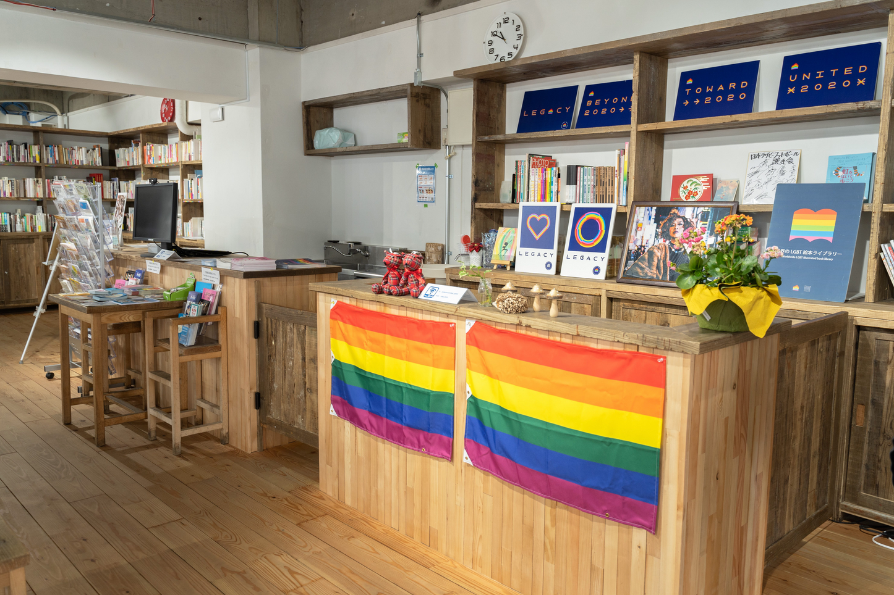

To LGBTQIA+ indie devs/zinesters in Tokyo...

Have you heard of [Pride House Tokyo Legacy?](https://pridehouse.jp/legacy/)

It opened in 2020 in preparation for the Tokyo Olympics/Paralympics, and unfortunately, didn't get a lot of use. I've been going to Pride House regularly, and not only is it centrally located in Shinjuku Gyoen, it's a quiet atmosphere where I can focus, AND it has...

* a table workspace for a group of 8
* individual tables for up to 12 people
* free wifi
* chargers and extension cords
* donation-based hot drinks like coffee, tea, and non-caffeine herb tea
* can bring in your own food and bento (garbage is take home)
* a library of Japanese LGBTQIA+ novels, comics and zines
* English and Japanese support (depends on the day)

### They are open for walk-ins/coworking during these times...

* **Sunday:** 13:00~19:00
* **Monday:** 13:00~19:00
* **Tuesday:** 13:00~19:00
* **Wednesday:** closed
* **Thursday:** closed
* **Friday:** 13:00~19:00
* **Saturday:** 13:00~19:00

### For people who live near Tokyo

The next time you want to go out for coworking, consider stopping by here and giving them a donation! They are funded by grants at the moment, but becoming sustainable through community support would mean a lot to them and to us—the community that lives here in Tokyo.

They have events in the evening for those who can't make it out in the daytime; RSVP's are sometimes required, so check out their Instagram or events page for more information.

[Map link](https://maps.app.goo.gl/43Y9Zg6358ZGHyCt7) | [Instagram](https://www.instagram.com/pridehousetokyo/) | [Events](https://pridehouse.jp/legacy/event/) | [Linktree](https://linktr.ee/pridehousetokyolegacy)

### For people who don't live near Tokyo

Share this information! And if you find yourself in Tokyo, stop by and make a donation.

_I have good friends who work at Pride House, so I am repping them as a fan and as someone who wants to see their friends continued to be employed by an LGBTQ-friendly org in Japan!_

---

### Related posts

* [The end of IWAKAN magazine](/blog/posts/2024-01-15-The-end-of-IWAKAN-Magazine/)
* [The Trans Tourists' Guide to Japan](/blog/posts/2024-05-19-Trans-Tourist-Guide-to-Japan/)
* [Rabbit Logic](/blog/posts/2024-12-16-Rabbit-Logic/)

See all posts tagged [LGBTQ+](/tags/lgbtq/).
