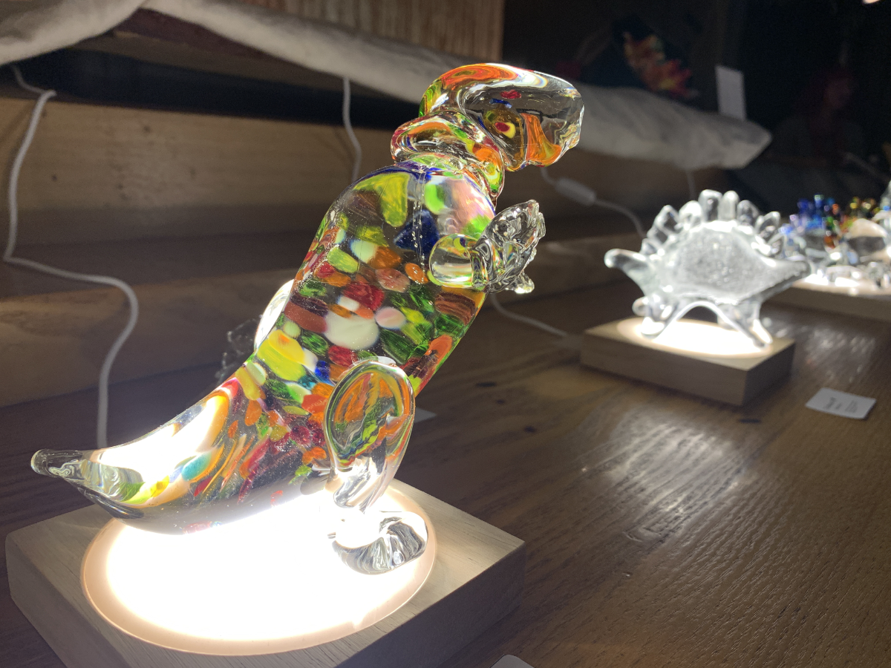
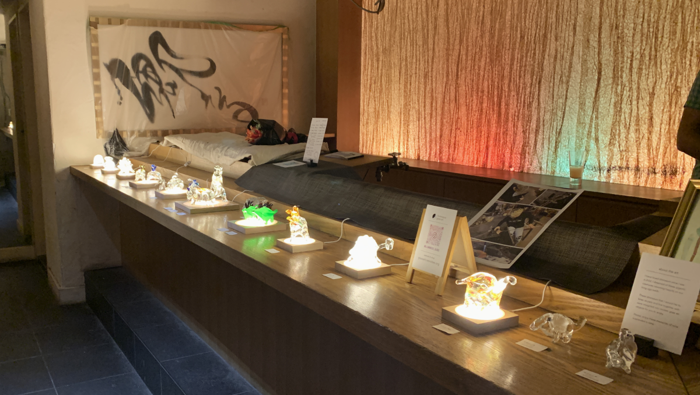
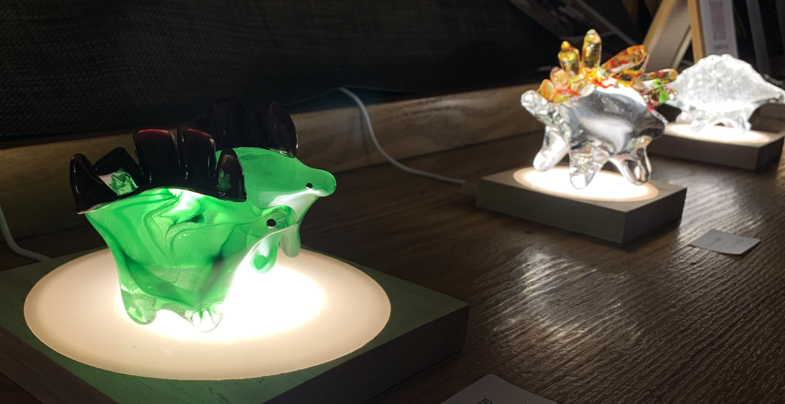

(English follows below.)

先月、六本木である[SARAU TOKYO](https://www.instagram.com/sarautokyo/)の2年記念日で、初めてのガラスアート展を開催しました。友人たち、そして応援に来てくれた皆ん、ありがとうございます。SARAU TOKYOとは、ダンスパーティー、アートギャレリー、ドラッグショーの楽しいミックスでした。

2020年から趣味として吹きガラスをずーとし続けました。浜田山のガラス工事である「ガラス体験」のきっかけで、吹きガラスを夢中になりました。15歳の頃に近くの美術館に展示されたチフーリ・デールさんの作品を見るのは好きでしたが、まさか自分がガラス彫像を作れるとは思っていませんでした。

展示の写真はこちらになります。スペースは元々のラウンジバーで、台で光をつけました。ユニークで、印象的なギャラリースペースです。

ガラスアートですと、光はとても重要ですので、自分のライトを持ってきました。恐竜は台の上で、輝いている見たいです！

楽しい経験でした。私を呼んでくれたSARAU TOKYOに感謝します!

次回はまだ決まってませんが、次の展示にお楽しみにしています。展示の最近情報は、ガラスアート専用のウェブサイト ([glassart.neocities.org](https://glassart.neocities.org)) かインスタグラムの[illuminesce\_glass](https://www.instagram.com/illuminesce_glass/)をフォローしてください。

また、お楽しみにしています！

---

# My first glass show at SARAU Tokyo

I recently had my first glass art show at [SARAU Tokyo's](https://www.instagram.com/sarautokyo/) 2nd Anniversary in Roppongi, Tokyo. Thank you to my friends and to everyone who came out to support me. It was a mix of a dance party, an art show, and a drag show. So many beautiful people doing beautiful art.

I started glassblowing as a pandemic hobby in 2020. My partner signed me and some friends up to do a beginner's glassblowing class in Hamadayama, and I was instantly hooked. I've loved looking at Dale Chihuly's glass work since I saw his exhibit in the Dallas Museum of Modern Art as a teenager, but never dreamed I could _make_ glass.

Here's some more photos of the show. The space was previously a lounge bar, lighted with small diases. It was a very unique space.

In showing glass art, lighting is very important. I used my own light sources, the diases, to light up the show. Look at how the dinosaurs sparkle underneath them! They really came alive.

It was a great experience and I had a fun time. Thank you to SARAU TOKYO for having me! To those I only got to speak to for a moment, I hope we have more time to chat soon.

I'm not sure when I'll be exhibiting next, but I am looking for new spaces. If you'd like the most up-to-date information, please bookmark my website at [glassart.neocities.org](https://glassart.neocities.org) and follow me on instagram at [illuminesce\_glass.](https://www.instagram.com/illuminesce_glass/)

Until next time!

