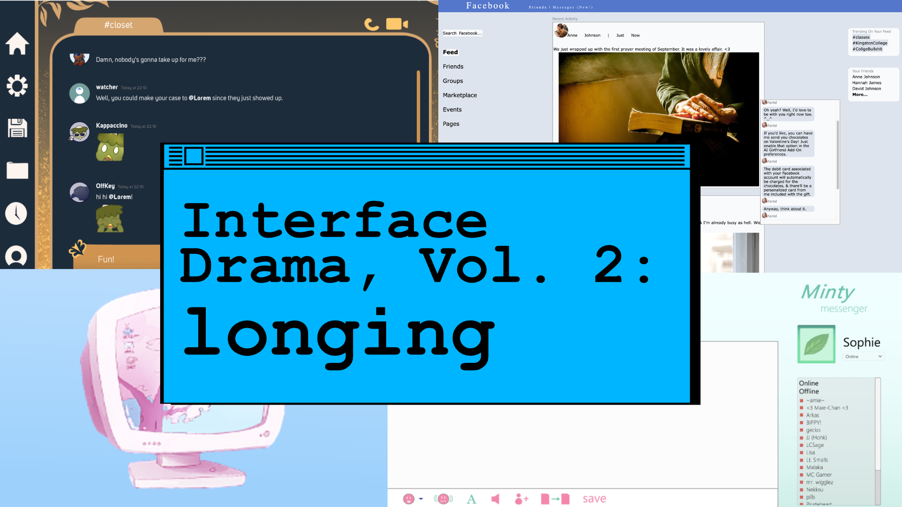
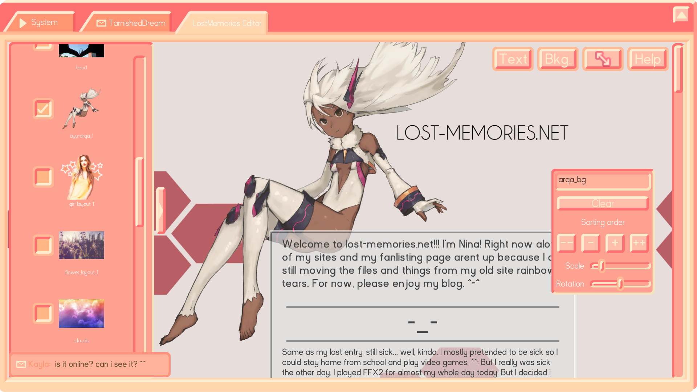
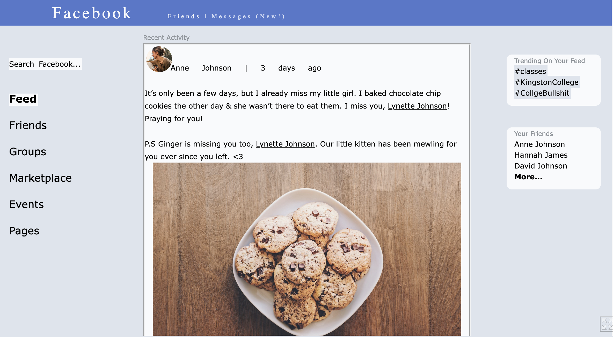
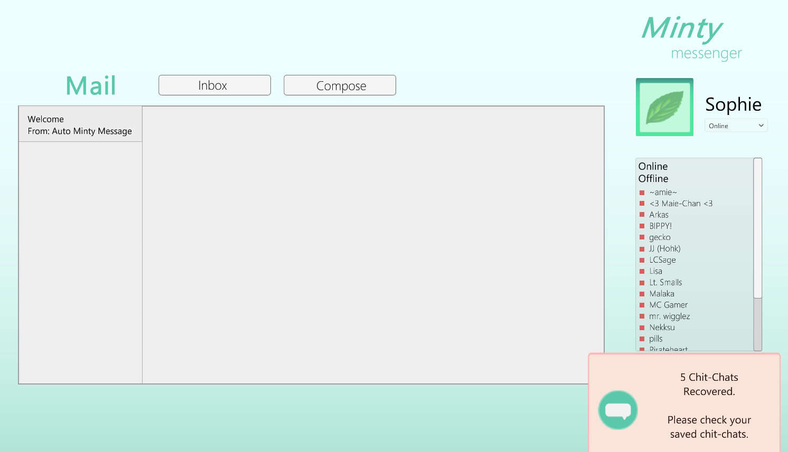
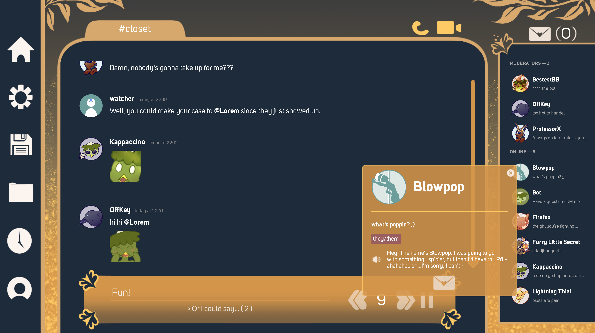

Welcome to Volume 02 of the Interface Drama Streaming Series, where we explore interface dramas by theme. Volume 02's theme was "longing." If you want to play more of these unique games, I made a list called [The Interface Drama Master List.](https://illuminesce.net/interface-drama)

Don't know what interface dramas are? [Check out Volume 01: INTRIGUE](/blog/posts/2024-04-18-Interface-Drama-Streaming-Vol1/) for more info.

## What is longing?

Longing is not just a feeling, but a location. In order to long for something, it must be far away or just out of reach of the player.

Interface, being a boundary _between_ two things, is a perfect metaphor to convey distance between the player and the object of their desire. Their desire could be someone they love, or used to love. For interface dramas in the mystery genre, perhaps the player desires the truth, or to unravel the mystery. Interface can obfuscate confessions; a person can hide behind their computer and say one thing ("Okay..."), but mean something different ("Please, don't go").

The following games feature longing in some way; longing to be wanted, to be accepted, to be loved, or to talk to someone who is long gone.

- [Lost Memories.net](https://starmaidgames.itch.io/lostmemoriesdotnet) by starmaid games
- [normal\_fantasies.exe](https://storysinger-presents.itch.io/normal-fantasies) by Storysinger
- [Dear Sophie](https://zerogue.itch.io/dear-sophie) by zerogue
- [Mythic Meetup](https://heartmoorstudios.itch.io/mythic-meetup) by Heartmoor Studios

Let's get started.

## Lost Memories.net

starmaid games produced another interface drama called Cibele in 2015, and Lost Memories.net (2016) feels like a spiritual successor. The player messages her friends while building her website, Lost Memories.net.

I have yet to see a Web 1.0 site creator as robust as _Lost Memories'_\--players can build their own sites through downloading images found in chat links, online and in the browser history. It truly is a time capsule to the 00's, in many ways.

**([play the game](https://starmaidgames.itch.io/lostmemoriesdotnet) | [follow starmaid games](https://starmaidgames.itch.io/))**

## normal_fantasies.exe

[I have already written at length on how much great story normal\_fantasies.exe packs into a short game.](/blog/posts/2023-10-27-I-have-to-talk-to-you-about-normalfantasies/) It touches on themes of what it felt like to be LGBTQIA+ in the mid 00's and how "new technology" can affect the LGBTQ+ community negatively, even if its intent is to help.

It is set in the mid 00's when Facebook was popular on college campuses. I won't spoil any more of the story; please play the game and review and comment. Though there are not complex interactions in the interface, it's a beautifully-told narrative.

**([play the game](https://storysinger-presents.itch.io/normal-fantasies) | [follow storysinger presents](https://storysinger-presents.itch.io/))**

## Dear Sophie

Dear Sophie also takes place within the mid-2000s on a now-defunct messenger called Minty Messenger. The interface was simply rendered and story was hard to follow. I kept wondering if there were critical parts of the story I was missing since the ending happened suddenly without lead-up.

The interface design, however, was quite nice. It was robust enough to suggest an old "AOL Instant Messenger" vibe but with a better color palette. The dev knew what kind of gamefeel they wanted. There's a lot of potential in this game.

**([play the game](https://zerogue.itch.io/dear-sophie) | [follow zerogue](https://twitter.com/zerouge))**

## Mythic Meetup

Mythic Meetup is in a similar style as [Blooming Panic](https://robobarbie.itch.io/blooming-panic)--you, the protagonist, join a "Discord" server filled with love interests to romance. But there's one critical twist--the love interests are queer mythical creatures.

The game is fully voice-acted and the character animations are subtle and nice. The game starts _in media res_ of some argument; truly, it has the overwhelming experience of _not knowing what the hell is going on but wanting to know anyway._

There is a trend of these newer interface dramas to feature both interface for the interactable parts and visual novel elements via "video chat," which I think is a nice adaptation to newer chat technology. Interface dramas don't need to happen in the early 00's for them to be interface dramas. I'm looking forward to playing more of this!

**([play the game](https://heartmoorstudios.itch.io/mythic-meetup) | [follow Heartmoor Studios](https://linktr.ee/heartmoorstudios))**

These games ranged from cute to bittersweet to simply lovely. It's impressive to see the kind of narrative range interface dramas can have overall.

You can check out the full VOD [here on Twitch.](https://www.twitch.tv/videos/2127302764)

Tune in this week at [@itsilluminesce on Twitch](https://www.twitch.tv/itsilluminesce) on Saturday, April 27th at 9AM JST for the next installment of [interface dramas, volume 3: UNCANNY!](/blog/posts/2024-05-11-Interface-Drama-Streaming-Vol3/)

## One last request

I like to monetarily support the devs who make these games, but that means each of these streaming sessions costs money. If you like these series and want me to continue making more, please [consider donating on my Ko-Fi](https://ko-fi.com/illuminesce).

Thank you for your time, and we'll see you again this week!

---

### Related Posts

- [Abstracting away horror with UNCANNY interface dramas](/blog/posts/2024-05-11-Interface-Drama-Streaming-Vol3/)
- [Exploring Intrigue with Interface Dramas](/blog/posts/2024-04-22-Interface-Drama-Streaming-Vol1/)
- [The Genre of Interface Dramas, Fiction, Visual Novels and Epistolary Games](/blog/posts/2023-08-22-Interface-Drama/)

See all posts tagged [Interface Drama](/tags/interface-drama/).
