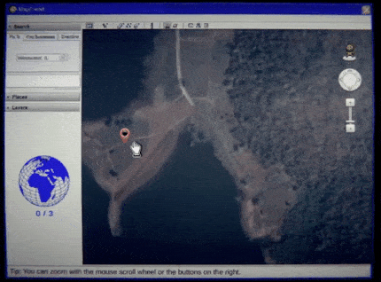

Welcome to Volume 03 of the Interface Drama Streaming Series, where we explore interface dramas by theme. Volume 03's theme was "UNCANNY." This is one of my favorite kind of interface drama, and I'm looking forward to telling you more about them. If you want to play more of these unique games, I made a list called [The Interface Drama Master List.](https://illuminesce.net/interface-drama)

Don't know what interface dramas are? [Check out Volume 01: INTRIGUE](/blog/posts/2024-04-18-Interface-Drama-Streaming-Vol1/) for more info.

## Abstracting away horror

I didn't want to buy an Apple computer for a long time. Though my former roommate in college was a Mac fan, hers would throw errors where the only solutions were "contact the manufacturer" or "take it to an Apple store," none of which could be solved alone.

I worried if I got an error like that, it would mean instead of fixing it myself like I did with my PC, I would have to take a bus down to the Apple Store on my day off and wait in line for a "genius" to see me. Who would do that if they could fix it themselves?

This "hiding" the inner workings of computers is something called _abstraction_ in UX design. Instead of telling someone that line 32 suffered a fatal error, which is helpful to the developer but not the user, we attempt to make an experience as smooth and frictionless as possible.

However, some errors cannot be prevented. Abstract too much and you end up with my former roommate's Mac--the user doesn't know what's going on, and the only way to solve it is by relying on the manufacturer.

There's something scary about abstraction, you know?

Something lurking...underneath the surface of these bits and bytes, unseen to you. Everything is okay. But from time to time it rises; in a strange chat, an indescipherable error message, a glyph you can't read. Only the G̷̡̧̨̼͔̝̼̯̳͇̳̭̐̏̉͋̑̀̋͛̃̀͋̏͐͋̚̕Ȩ̷̛͙̯̖̞̣̞̬̠̻̊͂͗̏̀̂͊̋͋͋Ṇ̴̛̺̫͔̹̹̘̜̎̏̄́͋͘̚͝I̶̜̰̬̫̟̪̩̥̤̎͛̑̓̕͘͝Ṳ̸̡̩̩̬̏̂̈́̀̊̃͒̒Ṥ̵̤̭͕͉̭͜E̴̜̻̬̪͕͔̯̝͑̃͌̑͗́̾͒̾̑̃́̂͂̇S̵̛͓̞̣͍̥͒͛̊̅̈́̆̂̈̀̌ know what it means.

And, you, dear reader, are not one of them. Shh, everything will be just

[⌌Ⓕ̙⌏⌌Ⓘ̙⌏⌌Ⓝ̙⌏⌌Ⓔ̙⌏⌌.̙⌏](https://forms.gle/C9bjzCqChXt2Ao5aA)

---

In April we played a series of games on the UNCANNY theme. Interface dramas, in my opinion, are well-suited for this.  
The games we played were:

- [Home Safety Hotline](https://nightsignalentertainment.itch.io/home-safety-hotline) by Night Signal Entertainment
- [last seen online by qwook](https://qwook.itch.io/last-seen-online)-   [Human Errors](https://ifdb.org/viewgame?id=14oexa2wyym73glu) by Katherine Morayati
- [MAPFRIEND](https://papercookies.itch.io/mapfriend) by papercookies

Let's get started.

## Home Safety Hotline

Home Safety Hotline is an analog horror inspired telephone operator simulator where you answer incoming callers' questions about what's inside their home. It features a call center interface interspersed with strange 90's VHS-level educational videos.

After I did a 30 minute playthrough on-stream, I spent the evening finishing it up. It has such a great progression from diagnosing everyday pests such as rats to...more horrific things. One of my favorite interfaces is the way the ending progresses slowly and gradually until it eventually sneaks up on you. I won't spoil the game; but it's a fun game and only 2~3 hours long.

**([play the game](https://nightsignalentertainment.itch.io/home-safety-hotline) | [follow Night Signal Entertainment](https://nightsignalentertainment.itch.io/))**

## last seen online

last seen online is a psychological horror game based on early Flash games. I too, played early Flash games like [MOTAS](https://flashpointproject.github.io/flashpoint-database/search/#5a02f47c-0f4c-4fb3-bf28-1d26538cdd36) (needs Flashpoint to run) and [赤いの部屋](https://en.wikipedia.org/wiki/Red_Room_Curse); their obtuseness and lack of guides lends themselves to puzzling over them of hours.

The puzzles were brilliant; I don't often find myself saying, "aha!" when solving puzzles; I easily get frustrated but the game provides just enough context to make them interesting.

I mentioned before about abstraction; some of the puzzles in this game rely on abstraction to solve them. Tip: It's not just a music player; it's a hint. It's about a ~20 minute playthrough, and so enjoyable.

**([play the game](https://qwook.itch.io/last-seen-online) | [follow qwook](https://qwook.itch.io/))**

## Human Errors

A contractor assigned to handle bug reports for a wearable mood-regulation device becomes unwitting witness to trauma and crime.

Something about being a support tech features heavily in uncanny interface dramas; being removed from the horror makes it more horrible. As you read through your "tickets" you slowly find out more about the product you're troubleshooting for; and trust me, it's not good.

**([play the game](../../kmorayati/human-errors.html) | [follow Katherine Morayati](https://x.com/morayati))**

## MAPFRIEND

This was the first interface drama I've seen utilizing a map-based interface. From a technological standpoint, I was really impressed at the gameplay; clicking on a scene would bring you to a 3D rendition of deserted parking lots, deserts, the middle of the ocean. It's a great concept.

My one gripe about this is that after playing the game twice, I still couldn't understand the story. There wasn't as much there as I wanted; and given the way the gameplay was, it had great potential.

I think though, this is a testament to the game; is that I _wanted more_ from it. I'm looking forward to papercookies' next game, [No Players Online](https://papercookies.itch.io/no-players-online).

_(Sensory Warning for MAPFRIEND: for sound-sensitive people, the game gets suddenly loud at the end.)_

**([play the game](https://papercookies.itch.io/mapfriend) | [follow papercookies](https://papercookies.itch.io))**

There's a lot more of uncanny interface dramas than these, so I'd suggest you check them out on the [list!](https://illuminesce.net/interface-drama) I also love the SIMULACRA series if you haven't checked it out.

Tune in this week at [@itsilluminesce on Twitch](https://www.twitch.tv/itsilluminesce) on Friday, May 24th at 9AM JST for the next installment of interface dramas, **volume 4: Surveillance**!

## One last request

If you like what I do, [consider donating to my Ko-Fi](https://ko-fi.com/illuminesce). Just $5 goes a long way for me to keep doing this. It's a good motivation that people like the stuff I'm making and are interested in seeing more.

Thank you for your time, and we'll see you this Friday!

([UX Research Reports](https://forms.gle/C9bjzCqChXt2Ao5aA) was made by me.)

---

### Related posts

- [Exploring Intrigue with Interface Dramas](/blog/posts/2024-04-22-Interface-Drama-Streaming-Vol1/)
- [Interface as Longing](/blog/posts/2024-05-11-Interface-Drama-Streaming-Vol2/)
- [The Genre of Interface Dramas, Fiction, Visual Novels and Epistolary Games](/blog/posts/2023-08-22-Interface-Drama/)

See all posts tagged [Interface Drama](/tags/interface-drama/).
