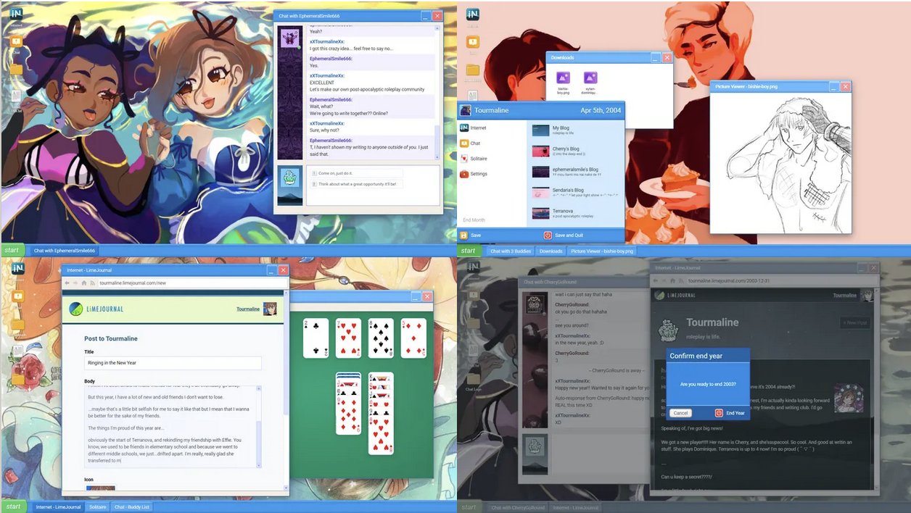

_This post originally appeared on [Kyle Labriola's](https://blueberrylemonade.pika.page/) blog [Indie Games of Cohost](https://cohost.org/IndieGamesofCohost)._

_I liked the questions so much, I felt they deserved to be archived on this blog. Kyle, thank you for having me and for starting Indie Games of Cohost. I found some really cool game devs from your work._

With INDIE INTERVIEWS, I talk to the game developers hanging here on Cohost to learn more about new games you might love.

Today, a chat with **@illuminesce** about the fast-growing genre of [interface dramas.](https://illuminesce.net/interface-drama)

You can find Terranova on Steam. You can also find Terranova, Terranova Side Stories, and the rest of CJ's games over on itch.io.

### Introduce yourself for everyone here on Cohost! Who are you?

I’m CJ. I’m a nonbinary masc (they/them) queer artist and dev. I also co-founded Studio Terranova, a tiny indie game cooperative. Folks know me on cohost as **@illuminesce.**

I worked in software design for 10 years and recently made the shift to contract work to make space for game dev. Since I spend the bulk of my time in the digital realm, I’m currently cultivating hobbies that are more physical in nature. I recently took up glassblowing.

### Is there a project you're working on currently?

~~Terranova Side Stories~~Tomodachi 8in1, which are small, 5-minute interface dramas built in PICO-8. Many of the stories are about making friends and reconnecting online in the early 00’s. They star the main characters of Terranova.

We just released a new story this Friday on itch. [Check it out!](https://illuminesce.itch.io/terranova-side-stories)

### How did you find yourself first getting into game development?

At first, I considered myself more of an artist or zinester than a developer. I kept company with a lot of developers because they’re fun, nerdy people.

When your best friends are devs, sometimes you’ll throw out a stupid idea. Then two weeks pass and your friend confesses, “I couldn’t stop thinking about our conversation. So I spent the weekend building a prototype…” That’s how I got into game dev. My friends liked my stupid ideas and kept showing me how cool they would look as games. I’m lucky to have friends like that.

The first games I developed were in 2005 at the Game Creation Society in Carnegie Mellon. I started participating in Global Game Jam in 2013 and made it my yearly ritual to make a game every year. During this time I denied I was a game dev, but kept producing games with different friends.

In 2020, I started organizing a Global Game Jam site in Tokyo, then in 2022, I released with my co-dev mabbees our first game on Steam and [itch.io](http://itch.io/), [Terranova](https://playterranova.com/).

What changed my mind was reading [Anna Anthropy’s](https://w.itch.io/) book, [“Rise of the Videogame Zinesters.”](https://www.penguinrandomhouse.com/books/215174/rise-of-the-videogame-zinesters-by-anna-anthropy/) I thought I wasn’t a game dev because I didn’t see myself as an engineer. But I was designing, producing, and making art for games. Isn’t that what a game dev does?

So that’s how I was convinced to be a game dev (laughs). Nowadays, I do more coding, but my main role is still art, writing and design.

### I'd love to talk about interface dramas. First of all, how would you define what an interface drama is and what it does?

Interface dramas are games that use interface to tell stories.

“Interface” because the tools the player is using to interact with the game are GUI (graphical user interfaces) used in modern computing. They press a button to send a text, open an app, scroll through messages, fill out input fields or type in command lines to advance the story. The game itself appears to be software, whether it’s a desktop, a phone, a wiki or something else.

“Dramas” because unlike a linear novel, the story is revealed through non-linear discovery, in small pieces. I come from an art/theater background and the closest I can come to the way these games “feel” are theatrical experiences like Sleep No More.

Sleep No More is an immersive drama based on Macbeth. In it, you’re not in a theater; you’re not sitting down. You’re in a multi-room warehouse, physically running to follow actors from room to room and observe the story in bits and pieces. You decide what pieces of the story you see; and it’s up to you to connect the dots.

Interface dramas recreate user interfaces with the purpose of telling that non-linear story.

### In your opinion, what is the biggest challenge about writing an interface drama versus a game where characters are interacting in the same space with verbal dialogue? And on the other side...what is the biggest benefit of writing that type of story?

The biggest challenge in writing interface dramas is deciding how, and how much, story you’ll give to the player. Too much, and the player will be bogged down with too much reading. Too little, and the player will lose motivation to finish the game.

If you do it well, interface dramas read like an addicting thriller. Players will be invested in the characters as if they were their friends. They might try to figure out how to “break” the game. In some interface dramas, breaking the game and getting underneath the interface is encouraged. In this way, they can enjoy a multi-level story; one that involves what they can see, and one involves wondering about what they can’t see.

### Much like your own game Terranova, some interface dramas are meant to evoke technology from a particular era, like AOL Instant Messenger, 2000s-era forums, 90s-era chatrooms, things like that. For me, a large part of the appeal of playing these games is to revel in the nostalgia. It's really fun to jump back and live in my own childhood, or even in something slightly before my time. Especially because there are a lot of stories to tell from those communities that we don't see in film, TV, and literature. But it makes me wonder if that is inherent to the genre or not. Do you think it's possible to create, or play, one of those throwback games without it having a feeling of rose-tinted nostalgia for those eras?

Yes, I do.

There’s a few interface dramas that take the retro aesthetic and use it to tell speculative or alternate fiction. [normal_fantasies.exe](https://storysinger-presents.itch.io/normal-fantasies) uses a 2010 Facebook-era interface, but the story that is being told isn’t nostalgic; it’s of online harassment and the player’s relationship to their AI girlfriend.

Facebook has never had an AI girlfriend feature, but many people know how Facebook works and some used it in college. The interface serves the purpose of being both familiar and reminiscent of a certain time period—college—to tell an interesting story.

[Home Safety Hotline](https://nightsignalentertainment.itch.io/home-safety-hotline) has a 90’s VHS aesthetic. It’s part of a genre of horror games that has that “vibe.” The story likely could be told in another era, but there’s something fun and thrilling about experiencing a horror game in a time period where internet outages were frequent; in the game the outages add to the tension!

### Any advice for aspiring indie developers out there?

Video games are creative work. To do any creative work sustainably, you have to keep yourself mentally healthy. It’s not optional; it’s necessary for survival.

[**@Bigg’s**](https://www.bpgamesinc.com/blog/) advice—don’t put yourself in a position where you're relying on income from games—is a very good one. Not just adult games, but games in general don't take in stable revenue. It'll also take the financial pressure off of creating.

If you live in an area that has indie arcades and can meet players face to face, I recommend doing that. It’s encouraging to meet other people who find your game interesting or fun.

There’s a lot of things that can bog you down in game dev. The bulk of our sales come from online, specifically from Steam. Despite Steam’s clientele being 95% indies, their backend is not indie-friendly like itch. We love itch; working with Steam’s customer support has continually been frustrating and demotivating.

Terranova had a fair amount of mysterious bugs when it released. It took us the better half of six months to track them down and patch them. Sometimes there were bugs we didn’t know how to or didn’t have the resources to fix, and we had to disappoint our players. We’ve gotten great reviews and reviews that hated on the things we loved the most about the game.

If I’m stressed or feeling like shit, social media is not my friend; my phone is not my friend. It always seems to make whatever is bothering me worse, whether that be the fear that I’m not “doing enough” or a problem that I’m worried about will never be fixed in the game.

Unplug. Go for walks. Talk to friends in person. Ask for help. If you’re neurodiverse like me, find a dev schedule that works well with your brain, not against it. Read books on self compassion.

Get curious about what stresses you out and get specific. I find didactic journaling (writing down questions to myself and then answering them) helps me do this.

If anyone is interested in any specific strategies listed above, I’m happy to share in asks.

### Lastly, are there any indie games out there you've been playing recently? Any favorites to shout-out?

Two interface dramas!

One is [Desktop Explorer](https://recurringdream.itch.io/desktop-explorer), a game by Recurring Dream.

The player inherits a computer from their uncle, with a letter asking them to rebuild your uncle’s fading memories by using Desktop Explorer to unlock different files through puzzles.

It’s still in development, and the demo is up on itch. I would love to see the full game realized, so please wishlist them on Steam and send them some words of encouragement in comments.

Another is [A Date with Death by Two](https://twoandahalfstudios.itch.io/a-date-with-death) and a Half Studios.

It’s a romance interface drama where through some wild loophole, you’ve found out you’ve cheated death one too many times, and a strange app that you can’t delete is saying Death is coming for your soul. The visuals are stunning and the writing is hilarious.

  > Thanks so much for chatting, CJ! I've been enjoying Terranova a lot so far, and have also enjoyed a number of these types of games in the past, so it's cool to see that there's terminology to describe them now. For everyone else...find Terranova on Steam and all of CJ's games on itch.io! And follow them here on Cohost, @illuminesce!

_Follow [Kyle Labriola's](https://blueberrylemonade.pika.page/) blog on video games n' stuff here._
