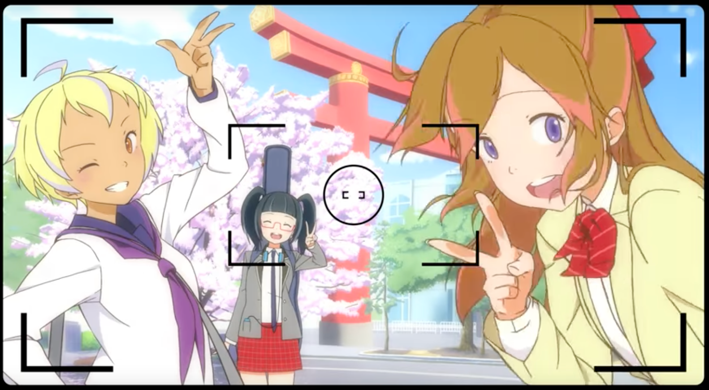
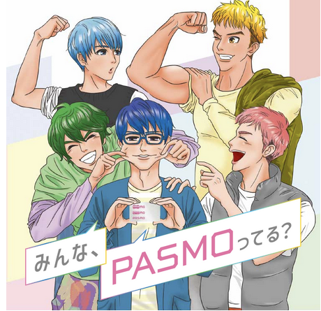
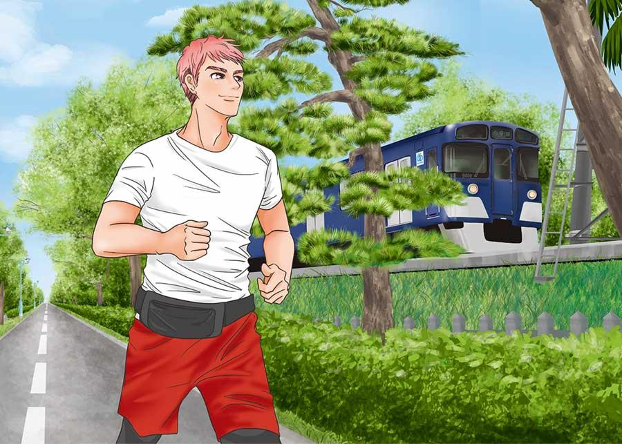
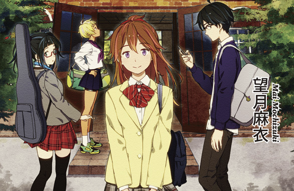
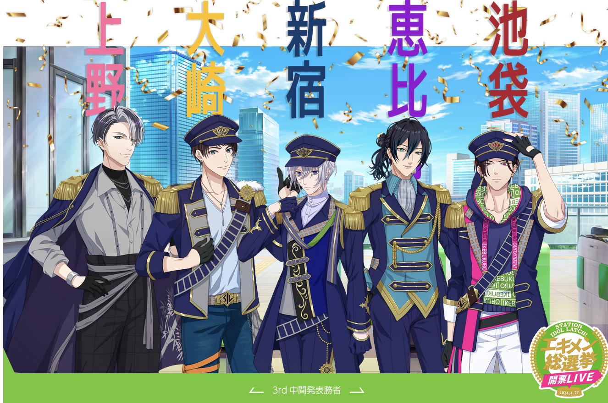
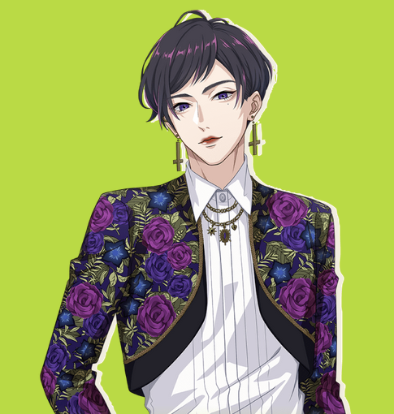

I live in Japan, and ride the trains almost every day.

My first encounter with railroad anthropomorphizations was on the Seibu railroad line; I would often see these colorful-haired guys hanging out in the station advertising how to use an IC card to tap in and out of the stations.

## The Seibu Boys

At first, I thought they were just anime characters used to advertise; then I pulled up the [Seibu website about them](https://www.seiburailway.jp/railways/tsukaitai/) and discovered not only were each of the colors indicative of what color Seibu line they were on, they also had stories. Someone drew them and took the time to give them stories, even though they are thinly veiled advertisements.

There's something deeply charming to me about railroad anthros. I know they are marketing gimmicks. But the characters somehow end up with the earnestness of an original character someone drew. Why go into so much detail over something that next to no one will look up? Because someone *loves* them, that's why. *I* love them.

They have Ace Attorney-style names, when their names refer to puns on their home stations, or puns for something about their personality.

Hashiru, the pink-haired Seibu boy, is named because *hashiru* means run, which can stand for people or for trains. So does he, as a hobby.

I can't look away. These little railroad anthros give me so much joy. The more time and energy that's invested in them, the more I love them.

## 地下鉄に乗るっ

I discovered railroad anthros in Kyoto, too. [地下鉄に乗るっ (English: Get on! Kyoto City Subway)](https://www.city.kyoto.lg.jp/kotsu/page/0000215552.html#character) is a project by the Kyoto Metropolitan Transportation Bureau that stars Uzumasa Moe, Matsuga Saki, and Ono Misa who are three girls that represent Uzumasa, Matsuga, and Ono Station areas, all stations on Kyoto trainlines.

Yes, they have backstories, relationships, and yes, they are childhood friends who go on adventures travelling on Kyoto trains. For me, this is peak warm and fuzzy territory.

They even made an anime opening for them.

<iframe width="560" height="315" src="https://www.youtube.com/embed/7RFB27WuBDA?si=2_BsbZrUaD2OtvSH" title="YouTube video player" frameborder="0" allow="accelerometer; autoplay; clipboard-write; encrypted-media; gyroscope; picture-in-picture; web-share" referrerpolicy="strict-origin-when-cross-origin" allowfullscreen></iframe>

I actually have a sticker of Saki on my laptop. I'm not a huge fan of random anime stickers; but if it's trains, that's a different story.

## STATION IDOL LATCH

The Yamanote Line is a circular line in Tokyo which usually is used to connect to other lines either going in or out of the city. It's not a line people typically ride "for fun," unless they are drunk.

Well, [STATION IDOL LATCH!](https://latch.jp/) will change that for you. Imagine—all thirty stations on the Yamanote Line, carefully rendered as handsome boy idols. [Kayama Rihito](https://latch.jp/member/JY02/) was the first station idol I encountered—I was at a doctor's appointment in Kanda Station and I asked myself, "why is this specific anime boy plastered all over the station?"

I was giddy with joy finding out that not only was Kayama an anthropomorphization of Kanda Station, but that there are boys for each of the stations—AND they have blood types, likes/dislikes and preferences like idols, AND are called エキメン (ekimen)、which is a play on 駅（eki）or "station" and イケメン (ikemen), or "handsome." Puns and railroad anthros. I can't. It's too perfect.

They also have songs, of course, which [their voice actors have performed live.](https://www.youtube.com/watch?v=zEUkaJ3XT84)

By the way, my current favorite station boy is Shin-Okubo. It's not only an excellent station with delicious Korean, Thai, Filipino and Ainu food, but Momose Shio is fashionable as hell.

## There's so much more

There's absolutely more railroad anthros out there. Do a search on pixiv (at your own risk) and you'll find tons of imaginings—most of them anthros of high speed rails, which are also very popular here in Japan.

I love these little anthros. They charm me, and brighten my day, especially when the train is crowded.

And I hope after reading this, they brighten yours, too.

---

### Related posts

- [Visiting the first boy's love exhibition in Japan: Part One](/blog/posts/2023-09-02-Visiting-the-First-Boys-Love-Exhibition-in-Japan/)
- [As a longtime dollfie fan](/blog/posts/2023-08-30-As-a-longtime-dollfie-fan/)
- [Let's talk about Shadow Hearts](/blog/posts/2023-07-03-Lets-talk-about-Shadow-Hearts/)

See all posts tagged [Fandom](/tags/fandom/).
