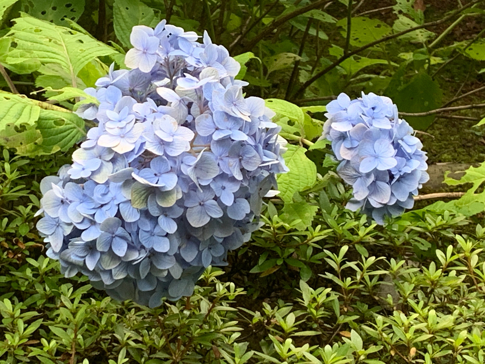

From 2023 to 2024 during the months of May-June, I took some cool pictures of Japanese hydrangea, also known as *ajisai* (紫陽花) and posted them on cohost.org. I'm archiving the *Ajisai Report* here for everyone's enjoyment.

---

## 2023, May - June

### May 27th

First ajisai of the season. They’ll get a lot bigger from now on, and I love seeing them bloom.

### June 12th

The ajisai are in full bloom 💜

### June 15th

Y’all, they are *poppin!* The last place I lived they were only deep-blue, so I’m amazed to see all the different colors this season!

### June 18th

I found some more blue ones today. They’re my favorite. I wish ajisai season would never end.

### June 21st

The ajisai today are a little smaller and a little less vibrant today. Ajisai season is coming to a close. I feel sad; but also thankful that I got to see and write about so many beautiful blooms.

The season’s not over yet, so I look forward to finding the ones that are still blooming and taking more photos.

### June 26th

Found some pastel ajisai as the season comes to a close.

Unintentionally I’ve documented some of the beautiful color changes these flowers go through from the months of May-June. I’m going to use these for reference for future art 💖

## 2024, June

### June 3rd

There’s a lot of overwhelming things in my life right now. Maybe yours, too. I like looking at ajisai. Maybe you would like it, too.

Also they change color based on the pH of the SOIL ISN’T THAT RAD AS HELL

LOOK AT THAT PURPLE! THAT MAGENTA! The ajisai were good last year, but damn they look super good this year. I really love the deep blues and purples.

### June 18th

This one I found by the road; it had just been misted and the fine water droplets were refreshing to look at in the growing heat of the summer.

### June 20th

These were the last ajisai I saw this year, but the most brilliant. I found them in Haneda Airport, donated by the Japan Ajisai Competition which breeds strange and brilliant types of ajisai. I was in the US for the end of June, so missed the ending of the season.

I've never seen this pink-green combination in the wild—this must be unique to carefully cultivated plants. They look like kaleidoscopes I could get lost in.

## In Conclusion

It's strange...my favorite flower used to be roses, as there were so many different types of them, with colors ranging from ecru to sunset. Now I'm wondering if ajisai are closing in as my favorite flower...
