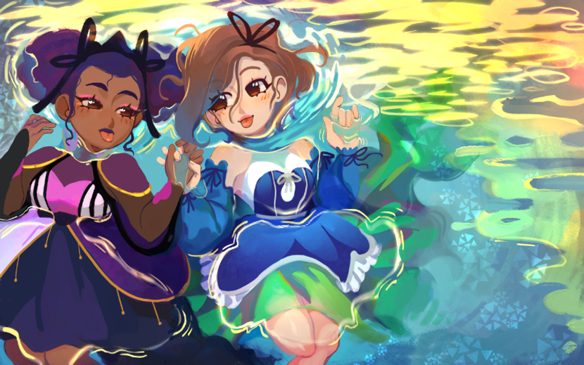

It's Juneteenth, so it seems like a good time to boost black artists. Here's some I've worked with (and others I really wanted to work with) that I can vouch for.

[Ceejinary](https://ceejinary.com/) did our promo art that you see for our game Terranova; I adore her art and she’s a dream to commission.

Here’s some other folks I can personally vouch for:

* [Sam Aburime](https://ko-fi.com/rainystudios)
* [Céli](https://pianta.carrd.co/)
* [Cyan Daly](https://www.cyleida.me/)
* [Ace Bundy](https://x.com/ThatOneNegraux)

Some artists I desperately wanted to commission but schedules ended up not working out.

* [Mars](https://www.marsoid.net/)
* [Abelle](https://x.com/abellehayford)

Some of these folks are actively looking for commissions, so if you have a project in mind, consider reaching out.
