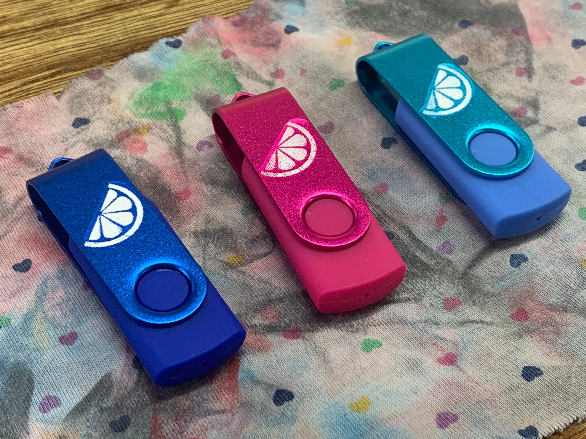

We’re getting prepped for [Tokyo Sandbox](https://www.tokyosandbox.com/terranova), so it was time to make another round of these little guys.

We sell these 4GB USBs with:

- a full copy of Terranova (EN)
- the demo version of Terranova (JP)
- full res wallpaper packs

You can [see the previous versions here](/blog/posts/2023-06-26-Terranova-USB.html) and purchase them on our [Ko-Fi shop](https://ko-fi.com/illuminesce) (limited supplies only).

---

Terranova is a nostalgic, text-based [interface drama](/blog/posts/2023-08-22-Interface-Drama/) about fangirls in the early 2000's on _LimeJournal_. Available on PC, Mac and Linux [here](https://playterranova.com/).
