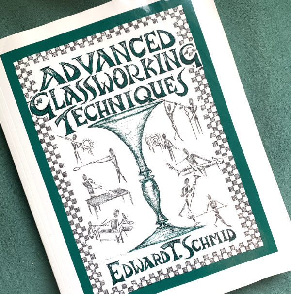
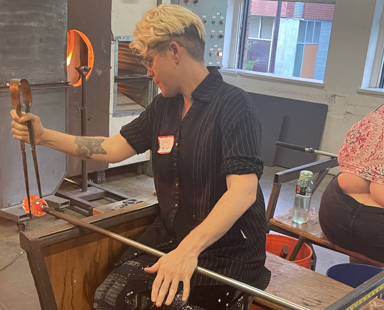

With the [Neo Twiny Jam](https://itch.io/jam/neo-twiny-jam) coming to a close, I'd like to write a quick post-mortem for my game [Keep Center](https://illuminesce.itch.io/keep-center). I'll cover things that went well, things that didn't, and what I learned.

Keep Center is a tiny game about glassblowing and failure. If you haven't played it, do it now!

[https://illuminesce.itch.io/keep-center](https://illuminesce.itch.io/keep-center)

Glassblowing has been a ~~hobby~~ obsession of mine since 2020. The first time I took the glass out of the furnace and it immediately dropped to the floor, I cursed. The first time a piece broke off in transferring to the punty I cried. The first time a piece broke right before I put it in the annealer I had to take a long walk to burn off steam. Throughout it all, my patient teacher said to me, _"Keep center."_

I hated those words at first. But over time, they became my mantra. In glass, failure is inevitable. The best we can do is keep center.

## Successes

I'm a recovering perfectionist, so Keep Center was an experiment in shortform storytelling and keeping things loose. In this, I think I exceeded my goals—I focused only on the most important sketches to illustrate the tools and process of glassblowing and didn't try to tweak the drawings more than a few minutes.

The animations were done in Procreate, exported to GIF, and embedded in Twine (Harlowe). Even though my process was loose, I ended up with what I'd consider to be a high-fidelity game.

The title font and the visual style was inspired by a technical book for glassblowing called [Advanced Glassworking Techniques](https://www.goodreads.com/book/show/2018503.Advanced_Glassworking_Techniques). The entire book is handwritten, which I thought was bold. What if the author messed up a letter? But, in true glassblower fashion, the book embraces loose sketches and mistakes.

## Challenges

The most challenging part of making this game was using the dataset: feature of Twine to make a feature that lets the game count how many designs the player has made. We wanted to know if someone made a flared vase, a flared cup, a round vase or a round cup, store that in an array, and give the player a number such as, "You made 1 out of 4 designs!"

It seemed like a little feature, but it turned out to be the most difficult part to code.

## Learnings

Overall, I learned a lot from this project, namely—

* how to use the dataset: and folded: features in Harlowe to save variables
* using cycle links and timed choices to force the player to make quick choices
* how to animate in Procreate and do the "line boil" style
* how to be loose and to make more missteaks

This project was reversed to me; the things I thought would be difficult to do (animating line boil) were easier than expected. I benefited from my prior knowledge of sketching designs for glass in Procreate to make the animations. The things I thought would be easy, like counting how many designs a player makes, were much harder...

Overall, I'm really happy with this game. It had a very clear focus, mood and style, and I'd like to use my own illustrations to do more games. I was self-conscious during the development of Terranova and only used my art to be used sparingly and uncredited; most of the marketing art for Terranova is someone else's art. I personally find my style to be good for designs and sketches; I struggle with my own perfectionism when I think about "polishing" a piece for games.

This was the first time I thought that perhaps my own style is enough to make games.

Thanks for reading my postmortem! If you have any questions, please comment below. I am happy to share my code with other devs.

Thank you to Autumn Chen and Manon for running the jam.

A special note to the kind folks who left comments and reviews; thank you for playing my game and taking the time to write. As a small-time creator, it motivates me to create more.

If you like this game, please consider [tipping me on Ko-Fi](https://ko-fi.com/illuminesce).

As always, thank you for your support!

CJ

---

See all posts tagged [Video Games](/tags/video-games/).
