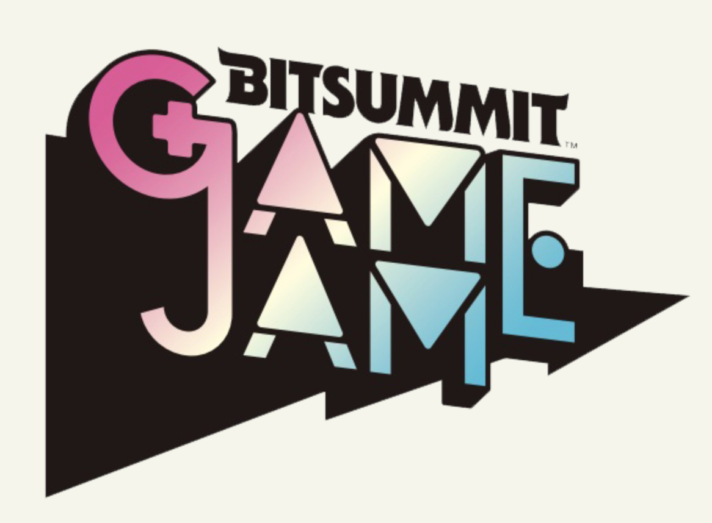

Every year, university students from all over Japan do a game jam where the top teams will be invited to booth at BitSummit, one of the largest indie game conferences in Kyoto.

Last month I was invited by the [International Professional University of Technology in Tokyo](https://www.iput.ac.jp/tokyo/) to go to a demo and give feedback, and today I got to see the students present at BitSummit.

Some of the games are really innovative; [Desktop Exorcism](https://bitsummit-gamejam.itch.io/desktop-exorcism) is an interface drama where, to stop a virus from infiltrating your computer you must “exorcise” it through dragging and dropping windowed programs on top of them. [It’s what’s for dinner!](https://bitsummit-gamejam.itch.io/tyorisaretenarumonoka), did a complete 180 from the last time I saw them; they made a coop game where you play as an apple that is made muscular through the power of his fallen veggie friends.

All the students did a great job; you can see all of their work at the link below.

[**Bitsummit Game Jam on itch.io**](https://bitsummit-gamejam.itch.io/)
