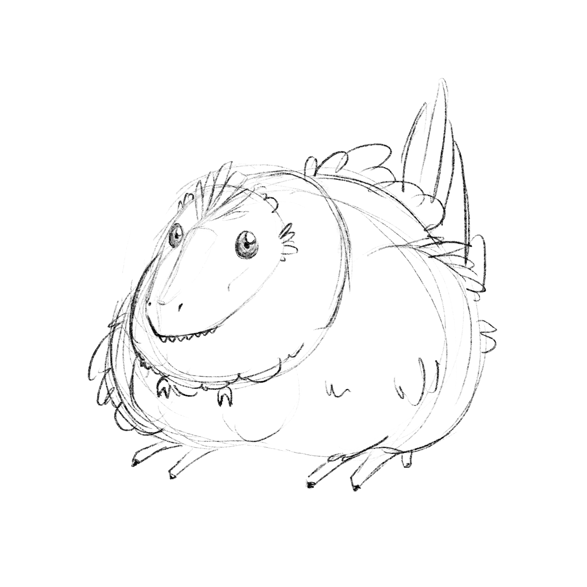
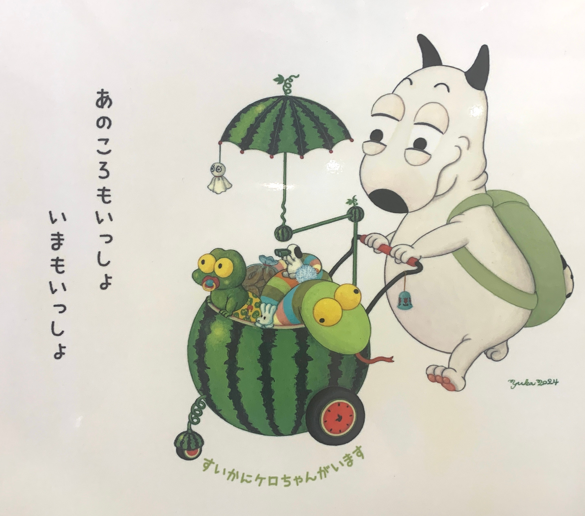

## It's my birthday! Send me asks

In which people ask me questions, and I post answers here.

Send me asks about...

* game design or UX design
* dinosaurs
* making art
* where to find cool queer places in Japan

Or share a cool story about you feeling euphoric, a cool leaf you found on your walk, whatever made you smile in the past week. I might post some up here!

---

### A dinosaur that changed my perspective

_What dinosaur has changed the most in how you perceive it over your life?_

> Anonymous

As someone who grew up in North America, [_Spinosaurus_](https://www.britannica.com/animal/Spinosaurus) was not the first dinosaur that came to mind when I thought about "famous dinosaurs." Triceratops, Stegosaurus, Tyrannosaurus Rex all come to mind.

It is one of the largest carnivores, yes; but in North America we already have a dinosaur with a sail—a _Dimetrodon_. Spinosaurus couldn't compete with its popularity. When I was a kid, I almost never saw Spinosaurus toys--unless they were in Natural History Museums.

However, after living in Japan I have realized Spinosaurus is hugely popular here. Imagine my surprise when I found Spinosaurus t-shirts, mugs, and hats. Look at this!

[A spinosaurus keychain!](https://minne.com/items/24779377?query_id=b2160a2c-f052-4170-a0f1-e98e895492da)

[A picture book dedicated to spinosaurus!](https://www.kinnohoshi.co.jp/search/info.php?isbn=9784323074061)

Its popularity surged when in [2020 it was discovered to have a "swimming tail" used for swimming, where we previously thought it just dwelled on land.](https://www.nationalgeographic.com/science/article/first-spinosaurus-tail-found-confirms-dinosaur-was-swimming)

How cool is that!!

I took some time responding to your ask because I wanted to dig up an old illustration of Spinosaurus I did—wearing a party hat (circa 2014). I'd like to think that Spinosaurus loves to party. And now, as of 2020, I know they like to party underwater, too.

---

### The most touchable dino

_What dino would you most want to touch?_

> [@meitsme](https://bsky.app/profile/alucula.bsky.social)

I picture a fat little microraptor like this.

This, I think, is the most touchable dino.

---

### Host/Hostess Bars in Japan

_As a person who has been into anime but actually knows very little about Japan, I once read somewhere that host/hostess clubs have really taken over bars. I was curious if this is true at all, and if so, is this just a straight people thing, or is this change in dynamic affecting queer bars as well?_

> [@camfusedly](https://www.tumblr.com/camfusedly)

I'll answer this with a caveat: I can only answer from the perspective of someone who has lived in Tokyo for a while, who is not culturally Japanese and has never been to a host club/hostess club. I have, however, been out regularly to Ni-chome, the most popular gay district in Tokyo as well as other gay spaces outside.

In general, I've only heard stories of my straight male friends getting propositioned on dating apps by girls who ended up wanting them to come to their hostess club/cabaret bar and scam them of an upwards of ~10万 (about $660 USD) on drinks; none of my queer friends have had this experience to my knowledge.

For the most part, gay/lesbian/queer bars here haven't been pushed out economically by host/hostess clubs, but...

There are some people who do _recruiting_ for hostess/host bars at the most popular gay/queer bars. A very attractive person will buy you a drink, ask you if you want to meet his/her friends. Their "friends" are usually with some kind of crime organization.

Typically they'll target Japanese folks, regardless of gender, and foreign women, especially if they can exploit vulnerabilities like recent job loss or homelessness due to lack of approval from the family, i.e. things experienced in the queer community here moreso than the straight community.

Japan has a human trafficking problem, and is [according to a report in July 2022 is ranked as Tier 2](https://www.state.gov/wp-content/uploads/2022/04/337308-2022-TIP-REPORT-inaccessible.pdf) - as in, has yet to comply fully with the Trafficking in Person's minimum requirements to stop human trafficking. It's a very convenient waypoint to other parts of Asia-Pacific that have no regulations on human trafficking.

Does that mean you should be watching your back if you go out to bars? Not particularly, but being aware of what recruiters look like and what they ask for -- and keep in mind, the conversations are usually very casual -- will go a long way to keeping safe. And more broadly, folks here who live in Japan lobbying for Japan to comply with human trafficking regulations.

Now, as far as I know there are no LGBTQ-specific anti-trafficking organizations, but there are nonprofit shelters and advocates like [ZOE Japan](https://www.eng.gozoe.jp/) that vows to end child trafficking. If anyone has any orgs to share, please do!

I know the subject matter got dark, though personally I find this kind of thing very helpful to share to the broader community, since most information out there is 1) in Japanese, not English and 2) not commonly shared as trafficking is considered a "silent" societal problem and shameful. But there are orgs out there doing work to help victims.

---

### Some good greens

_お誕生日おめでとうございます！_

_have you seen any good greens lately that excite you?_

> [@wavebeem](https://www.wavebeem.com/)

ありがとうございます！

It has to be this incredible advertisement(?) I found while shopping.

It features:

* a dog super high on some kind of green
* wearing a green backpack
* pushing a pram made out of a green watermelon
* filled with a green baby frog, a green snake, and what appears to be a tiny rabbit and a dog with binoculars

Featuring the text:
> _We were together back then._
> _I'm with you now._

And:
_Inside the watermelon is a little froggy_

---

### How often do you get an idea?

_How often do you get an idea for something you want to draw?_

> Anonymous

Thank you for asking!

Way too many times for me to execute. I tend to write them down, but then sometimes forget the context, so I find notes like these:

**Roachella**

_A tiny roach, legs a-waving_

_Could be scribbly_

_Could be cute_

---

And that's it! Thank you for the asks, everyone. These were fun questions to answer.
