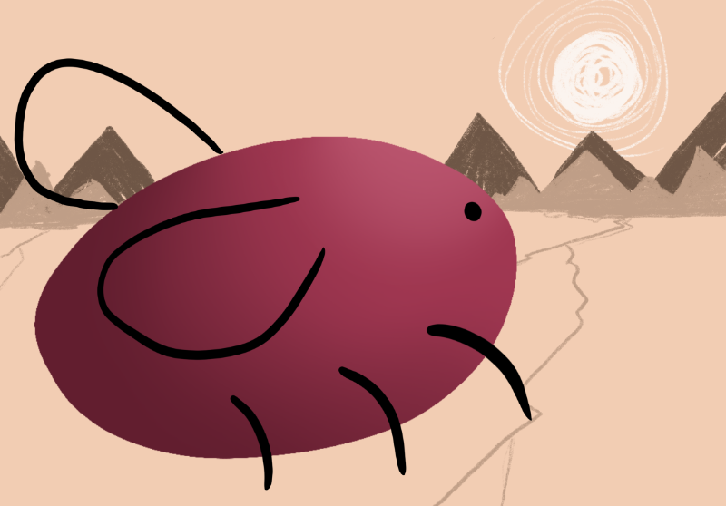

I've really loved my time on cohost.

At the end of 2024, the community site cohost, after a few years of operation, is closing down.

I was never too attached to Tumblr or Twitter, but I love cohost very much. Lots of people here seem to share similar ideas around _online degrowth._ _Degrowth_ as it pertains to economics is a critique on capitalism. Simply put, focus on economic growth causes ecological damage and is unnecessary to human wellness.

_Online degrowth,_ whether that's through personal sites, smallweb, indieweb, the Fediverse—seems to be picking up similar criticisms of the sheer amount of capitalist garbage that gets in between us.

Some of us are artists, tired of the constant pressure to have an _audience_ or produce _content_ that drives us to be miserable while hanging desperately on to tips, monthly subscribers and GoFundMe campaigns to cover basic expenses.

Some of us are alternative folks online who are tired of being so reachable in this online age we want to disconnect—but doing so means we'll be socially alone, because we're the only person we know in our town who is queer/trans/furry/kinky/poly/etc.

_Screw the numbers, fuck the algorithm, **I want to actually connect.**_

And connect I have. In fact, here's some connections I made on cohost that made a difference in my—and other people's lives.

-   Thanks to [@ldx](https://adamledoux.net/blog/), I learned about [bitsy](https://bitsy.org/). I made a paper template for people to hand-draw their own sprites and and [co-built a bitsy game with the 35+ participants of our GGJ Tokyo site.](https://illuminesce.itch.io/hello-world)
-   I also made a bitsy game for [my best friend's birthday](https://illuminesce.net/games/happy-birthday-calli) to tell them how much I love them.
-   Also thanks to [@ldx](https://adamledoux.net/blog/), [@Internet-Janitor, the creator of Decker,](http://beyondloom.com/) and [@liananana, the creator of Narrat](https://buttondown.com/narrat), I learned about indie engines and did a showcase of bitsy, Narrat and Decker. I built a little tarot-reading Decker prototype that's still unpublished. [You can see the showcase on YouTube.](https://youtu.be/ZWLdPJwJabw?si=XJMljMMxoAyTr1Su)
-   Thanks to [@highimpactsex](https://mimidoshima.neocities.org/main/)'s review, I played and cried my eyes out playing 1000x RESIST. It sparked some very tearful and heartfelt conversations between mabbees and I on the Hong Kong riots, our own families and personal generational trauma.
-   Thanks to [@melinoe](https://gamedev.lgbt/@melinoe), they connected me with some other queer indie game cooperatives and got their advice for starting Studio Terranova.
-   Thanks to [@renkotsuban](https://renkotsuban.com/), I was introduced to so many great games from Japanese devs—and got in trouble with our rabbits when I started clapping along to their Nice Gear Games livestream.
-   Thanks to [@whatnames](https://whatnames.itch.io/) and Game Dev Galaxy, I not only found out about an [all transmasc dating sim](https://whatnames.itch.io/good-lord), I learned about the Neo-Twiny Jam and [made a little game about glassblowing](https://illuminesce.itch.io/keep-center).
-   When I made the [Interface Drama Master List](https://illuminesce.net/interface-drama) I only knew what had been inside my own head. It was thanks to [@morayati](https://www.katherinemorayati.com/) and [@ianmichael](http://ianmichaelwaddell.ca/) I got some more long-term perspectives on interactive fiction and how it has played in this space for longer than I realized. Anytime someone sent me an ask about interface dramas, it inspires me to keep working on the list.
-   Thanks to [@wavebeem](https://www.wavebeem.com/), [@MeItsMe](https://bsky.app/profile/alucula.bsky.social) and everyone who sent me asks on my birthday. Over my birthday I was negotiating a very contentious client contract, and thinking about literally anything else helped me relax.
-   Thanks to [@geometric](https://buttondown.com/allstationsbeyond) who let me play their Playdate at an event, mabbees bought me one for my birthday. I fucking love this console. I take it everywhere. And I'm planning on building something in Pulp soon.

To everyone above, and many others, thank you. You inspired me, gave me different ways of looking at the world, and enriched my life. I hope I could do the same for you.

Not everyone has had the same life-enriching experiences. Thinking about this has got me thinking about what the next version of cohost might be...and how we can prevent it from becoming the echo chamber we escaped from.

In [@alyaza's](https://alyaza.neocities.org/) post [Cohost So White: A Comprehensive Record of the Matters of Race on Cohost.org,](https://cohost.org/alyaza/post/7305042-cohost-so-white-a-c) they catalogue cohost users dismissing racial discourse like this:

_“well it's not technically accurate so it's not really a problem (so stop talking about it)”_

We're not done with conversations about race—in fact, I don't think we've even properly touched it as a community.

To bring it back to degrowth, degrowth is coupled with anti-colonialist and feminist movements. Many institutions have dismissed the idea of shifting from valuing individual wealth and comfort to community care and collective action as a personal attack or attack on progress. _"We've industrialized and cured so many illnesses,"_ the argument goes, _"why would you criticize something that brought so much goodness to others?"_

From “The Future is Degrowth,”

_"Any criticism of the present is equated to the dismissal of the advances we have made. 'If you don't like it, go live somewhere else.' This argument is the last resort of those who aim to preserve the status quo."_

I believe we _can_ reflect on the great parts of cohost and not shy away from the fact this site that preserved a white and ableist status quo that caused many people of color to shy away or leave the community. Avoiding these conversations has no place in the online future I wish to be a part of.

I hope it is a bright one. One that makes space for community AND collective action. One that allows for discussion and conflict, and nuance and love.

Thanks again to everyone who I've had the pleasure of meeting on cohost, even if you're going offline to live off the grid with your witch boifriend and never come back online. For those of you who are online, link me your websites/blogs, and your itch.io pages.

Shine on you crazy diamonds.

Yours truly,  
CJ
