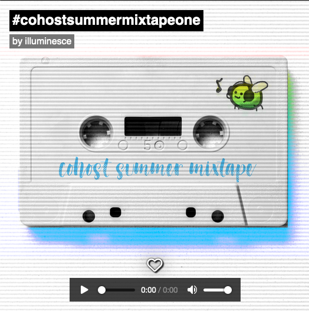
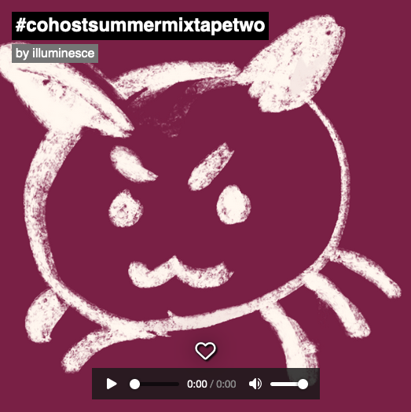
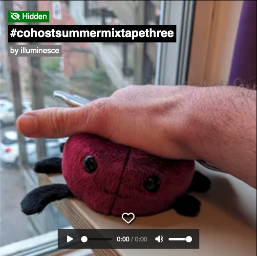
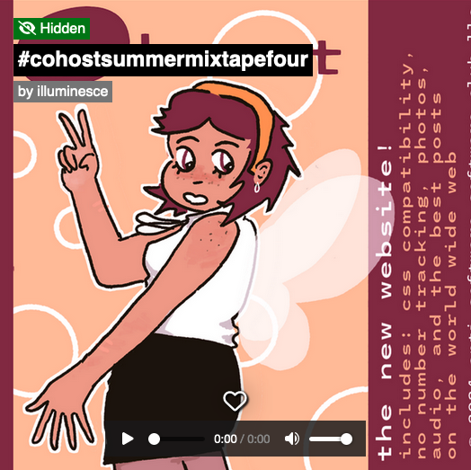
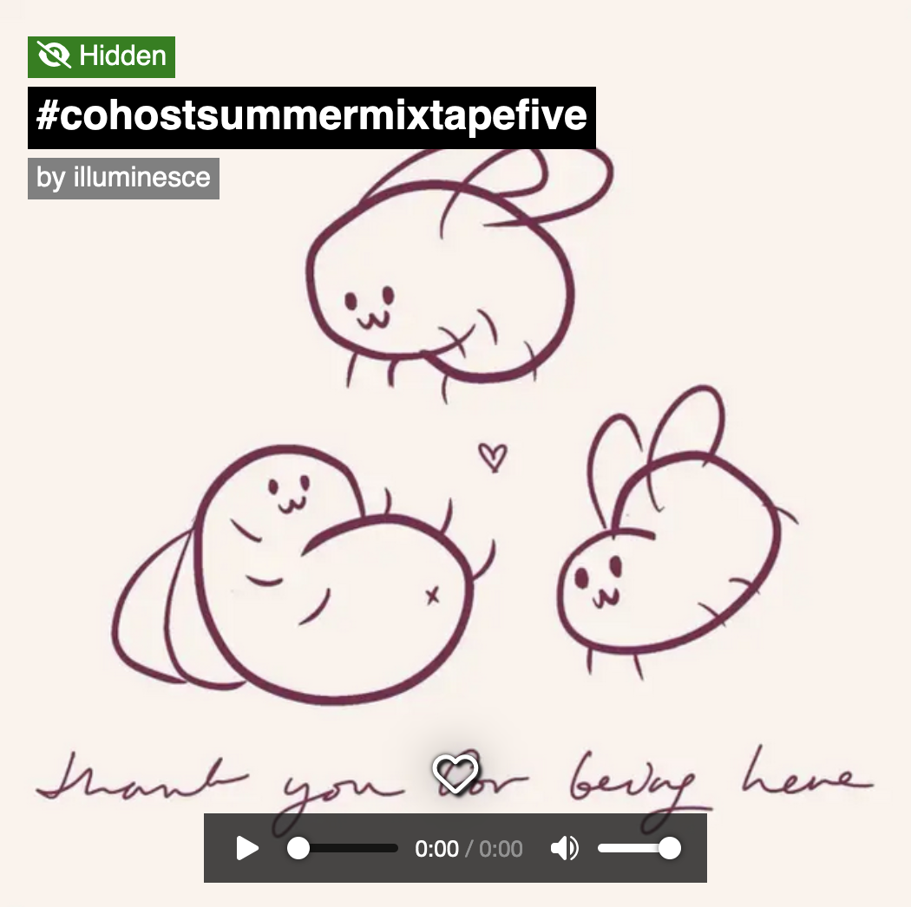
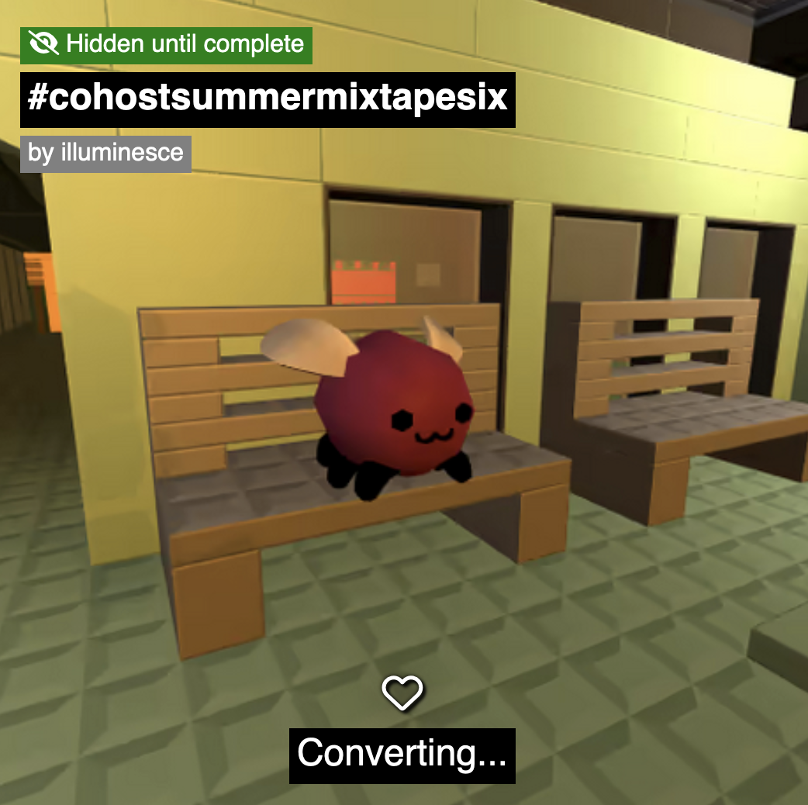
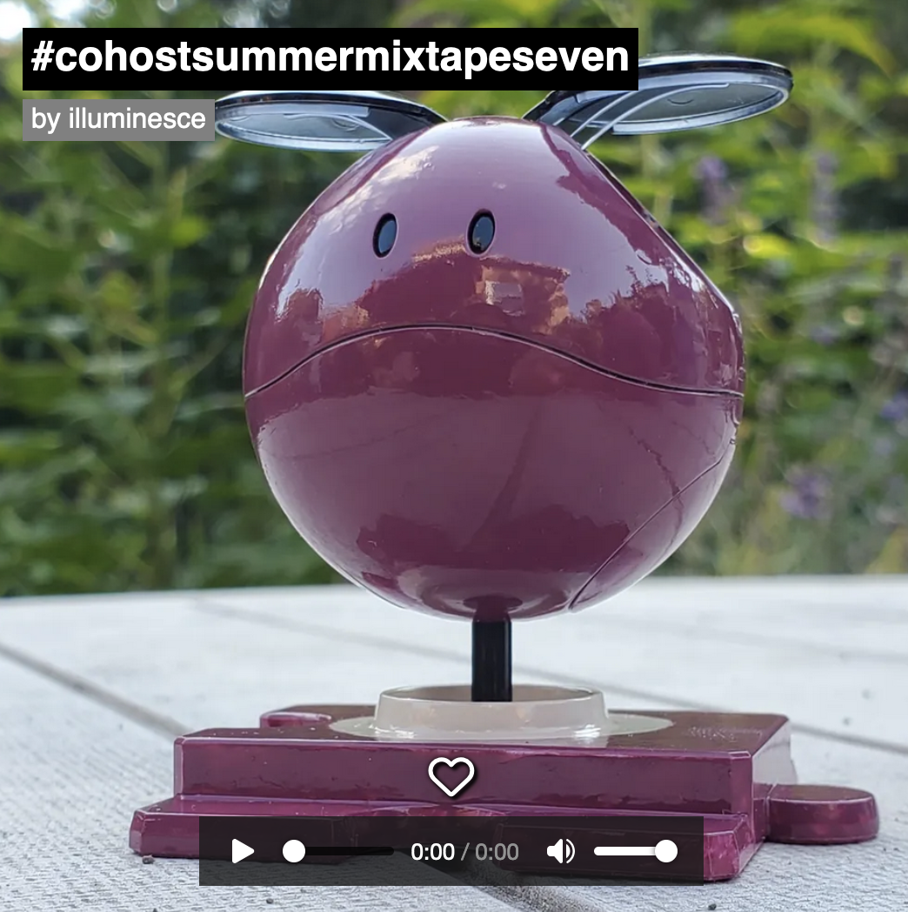
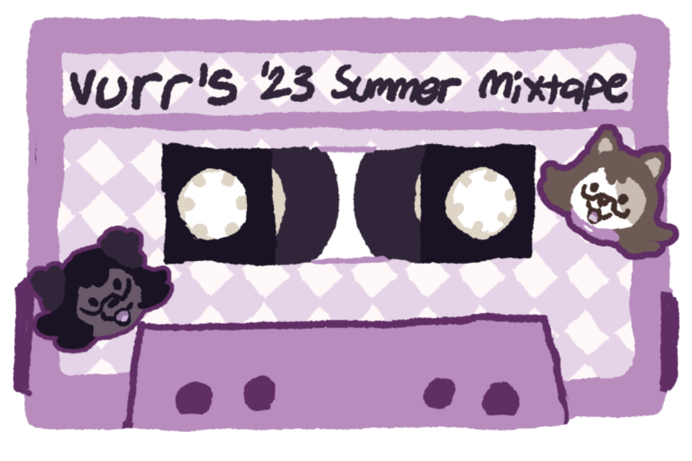
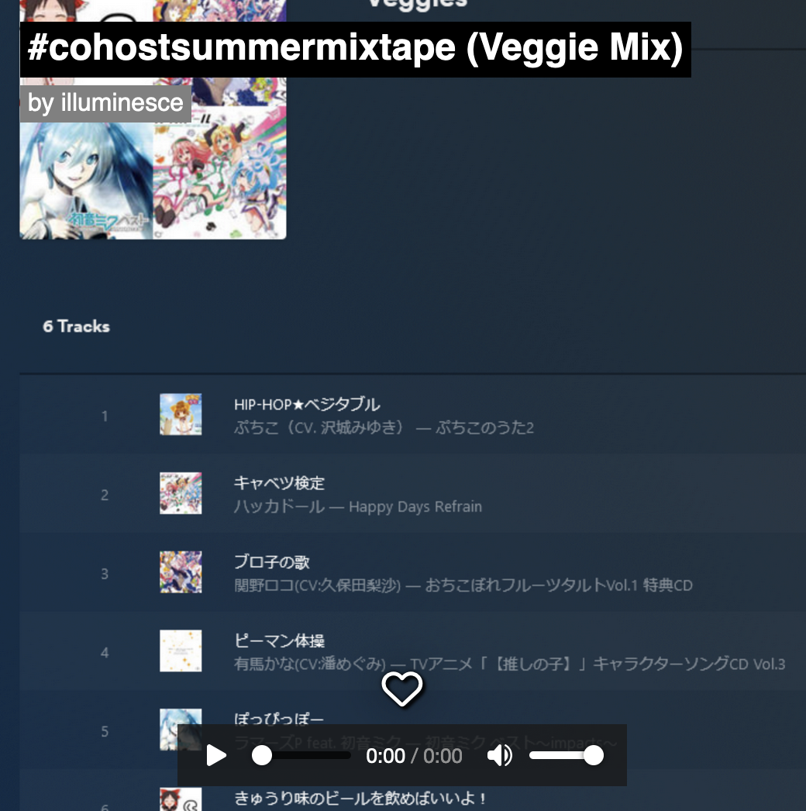

_This blog post was originally posted on cohost on July 5th, 2023. Because folks so willingly and generously commented and contributed to building out recommended songs, I am preserving both the post and archives of the posts here on my blog._

_If you want to continue adding to the mixtape, share this post. Add some of your favorite songs in the comments._

# Original post

I miss getting summer music recommendations. Before Spotify or Pandora, my friends would send me what they were listening to. That's how I discovered a lot of cool artists I'd never otherwise listen to.

For the summer months, I thought this might be a cool community thing to do.

What do you say? Wanna make a mixtape together?

## how to participate

-   post a song; link to the artist's soundcloud/bandcamp/website so that folks can listen and support.
-   single songs ok! playlists ok!
-   bookmark and listen to folks' music
-   if you think this is cool, share it

Send over some jams, please!

[All the mixtapes are available here on my mixtape garden.](https://mixtapegarden.com/user/illuminesce)

* * *

# Recommendations

<h2><a href="https://mixtapegarden.com/fghSupM4" target="_blank">#cohostsummmermixtapeone</a></h2>
<em>Contributors: @illuminesce, @ygpa, @LysergZeroz, and @fwetzin. <a href="https://illuminesce.net">Photocomp by me.</a></em>

<strong>Track list:</strong>
<ul><li>Lemonade - Zamir</li><li>NANI?! - Zamir</li><li>Another Reuben, George! - Guitar Fight From Fooly Cooly</li><li>John the Baptist - Dizraeli, DownLow @ Nathan Feddo</li><li>Nelward - FizzPop</li><li>Chime - Lucie,Too</li><li>Close to Me - Paolo Di Nicolantonio</li></ul>

**Bonus track: UTS - MC Wakava (added by @LyzergZeroz)**  
<iframe width="80%" height="120" scrolling="no" frameborder="no" allow="autoplay" src="https://w.soundcloud.com/player/?url=https%3A//api.soundcloud.com/tracks/213237803&amp;color=%23ff5500&amp;auto_play=false&amp;hide_related=false&amp;show_comments=true&amp;show_user=true&amp;show_reposts=false&amp;show_teaser=true&amp;visual=true"></iframe>

<a href="https://soundcloud.com/mcwakava" title="MC Wakava" target="_blank" style="color: #cccccc; text-decoration: none;">MC Wakava</a> · <a href="https://soundcloud.com/mcwakava/uts" title="UTS" target="_blank" style="color: #cccccc; text-decoration: none;">UTS</a>

* * *

<h2><a href="https://mixtapegarden.com/ckQS7VE5" target="_blank">#cohostsummermixtapetwo</a></h2>
<em>Contributors: @fwetzin, @illuminesce, @morayati. <a href="https://fireflygrotto.net/" target="_blank">Art by @phantom-firefly.</a></em>

<strong>Track list:</strong>
<ul><li>Don-T Wanna Stop (Groove Committee) - Jeremy Sylvester</li><li>Everything's Alright - What Goes Up</li><li>Highway - Colleen Green</li><li>Sugar - Stretch Princess</li><li>Mono Prix - Nina Hynes</li><li>Percolator - Charly Bliss</li><li>Pink Lite - Sir Babygirl</li></ul>

**Bonus, adjacent summer tracks with explanation added by @morayati:**

-   Full sun, ironically. Shining, spiteful stuff like Palmdale's ["Here Comes the Summer."](https://www.youtube.com/watch?v=eWUyLZ10Eko) Souls' ["Expensive"](https://www.youtube.com/watch?v=EygPWn5GKq0).
-   Full sun, making you sunsick. Maybe like Shut Up Stella's ["Light It Up."](https://www.youtube.com/watch?v=GOO5NuoNMo8) A lot of Colleen Green's music falls here: songs like ["Posi Vibes"](https://www.youtube.com/watch?v=dvIiemvD1IY) beam hard and purposefully on their surface, hoping no one look past it. Summer as faking it until you make it.
-   "Highway" takes that quintessential summer mood of racing down the highway, friends in tow, perhaps toward an amusement park or water park or beach or some other nostalgic or idyllic getaway, and says that honestly, it sucks. Her delivery on this is sotto-voce, channeling the kind of unbothered cool that perhaps disguises a great deal of internal bothering. There's a subtext to "I don't like it when you take the highway / it just goes on and on and on," giving a distinct impression that things are not being said -- things that likely sound like ["Someone Else"](https://www.youtube.com/watch?v=vQWoOqnMM_Q) or ["Deeper Than Love."](https://www.youtube.com/watch?v=acyeKYS3ucA) You'd think a song called "Highway" would be about driving so fast you outrun those things; this one's about languishing in them and calling it relaxation. Which is also a summer mood.

* * *

<h2><a href="https://mixtapegarden.com/GkuHg7wn" target="_blank">#cohostsummermixtapethree</a></h2>
<em>Contributors: @shadsy, @five, @tastywindex. <a href="https://www.etsy.com/shop/MousetoothCreations" target="_blank">Eggbug plush by @mousetooth.</a></em>

<strong>Track list:</strong>
<ul><li>Local Radio - Bad Moves</li><li>Cape Henlopen - Bad Moves</li><li>Party with the Kids Who Want To Party With You - Bad Moves</li><li>Subways - The Avalanches</li><li>"yes! yes! a thousand times yes!" - Home is Where</li><li>Tribute to Doug Willis - DJ STEAW</li><li>TNT - Tortoise</li></ul>

**Bonus track: Around - Steel City Dance Discs Vol 6 (added by @tastywindex)**  
<iframe style="border: 0; width: 100%; height: 120px;" src="https://bandcamp.com/EmbeddedPlayer/album=535437776/size=large/bgcol=ffffff/linkcol=0687f5/tracklist=false/artwork=small/track=4281819133/transparent=true/" seamless=""><a href="https://loods.bandcamp.com/album/steel-city-dance-discs-volume-6">Steel City Dance Discs Volume 6 by Loods</a></iframe>

* * *

<h2><a href="https://mixtapegarden.com/qetgXvH5" target="_blank">#cohostsummermixtapefour</a></h2>
<em>Contributors: @tastywindex, @LostReach, @DennysDiner. <a href="https://ahcoffeebeans.itch.io/" target="_blank">Intern Secretary Eggbug by @ahcoffeebeans.</a></em>

<strong>Track list:</strong>
<ul><li>All Nations - Tetris Effect</li><li>お先に失礼します- HANABIE</li><li>ゆーれいずみー - Reol</li><li>Pedi - Baby Tate</li><li>Her - Megan Thee Stallion</li><li>Sodom &amp; Gomorrah - Dorian Electra</li><li>Effigy - Banner Pilot</li></ul>

**Bonus track: It's Not A Man Abandons Post by SLOUCH (added by @DennysDiner)**  
<iframe style="border: 0; width: 100%; height: 42px;" src="https://bandcamp.com/EmbeddedPlayer/album=2741602825/size=small/bgcol=ffffff/linkcol=0687f5/track=1961968630/transparent=true/" seamless=""><a href="https://slouch14.bandcamp.com/album/its-not-a-man-abandons-post">It&#39;s Not a Man Abandons Post by SLOUCH</a></iframe>

* * *

<h2><a href="https://mixtapegarden.com/cQBYU3dV" target="_blank">#cohostsummermixtapefive</a></h2>
<em>Contributors: @illuminesce, @MxSelfDestruct. Eggbug drawing by <a href="https://x.com/AerialShading" target="_blank">@aidan</a>.</em>

<strong>Track list:</strong>
<ul><li>Kami uta 神歌 - Kagrra</li><li>Ayashi no Hikari 怪しの光 - Kagrra,</li><li>Shuuen no Kisetsu 終焉の季節 - Kagrra,</li><li>天樂 Tengaku - WAGAKKI Band</li><li>Earth Angel (Androgynous Mind) - Death Grips</li><li>The Way Out Is Through - NIN</li><li>War Monger - After The Bombs</li></ul>

* * *

<h2><a href="https://mixtapegarden.com/jxgKPNPo" target="_blank">#cohostsummermixtapesix</a></h2>
<em>Contributors: @MxSelfDestruct, @goatsnail. Low-poly eggbug by <a href="https://b4v21.block.land/?a=viewFile&amp;id=3240" target="_blank">@ConsoleSkunk</a>.</em>

<strong>Track list:</strong>
<ul><li>Chu Ishikawa - MG (MEGATRON)</li><li>Download - Sigesang</li><li>Alex Brandon - Foregone Destruction</li><li>Home - NIN</li><li>Re: - Home Security</li><li>Ingrid Schroeder, Peshay - Paint You Blue (After Hours Mix)</li><li>Lenzman &amp; Redeyes - Busters</li></ul>

**Bonus Track: Tropical Heat by VROMM (added by @goatsnail)**  
<iframe style="border: 0; width: 100%; height: 120px;" src="https://bandcamp.com/EmbeddedPlayer/album=2920394766/size=large/bgcol=ffffff/linkcol=0687f5/tracklist=false/artwork=small/track=819222897/transparent=true/" seamless=""><a href="https://vromm.bandcamp.com/album/vromm-bees">VROMM - Bees by VROMM</a></iframe>

* * *

<h2><a href="https://mixtapegarden.com/6CqsBsxP" target="_blank">#cohostsummermixtapeseven</a></h2>
<em>Contributors: @goatsnail, @vurren. Eggbug prototype by <a href="https://mastodon.social/@twoai" target="_blank">@TwoAi</a>.</em>

<strong>Track list:</strong>
<ul><li>Coco Bryce - Ma Bae Be Luv</li><li>La Luz - San Fernando Shadow Blues</li><li>The Future Sound of London - Long Green Field</li><li>THELMA - Identity Shift</li><li>Tripeo - Untitled #4</li><li>OOIOO - moss trumpeter</li><li>Olivia Meower - Hotline Heaven</li></ul>

**Bonus Track: Tarolin - Bloody Disco Party Jukebox (added by @vurren)**  
<iframe style="border: 0; width: 100%; height: 120px;" src="https://bandcamp.com/EmbeddedPlayer/album=3134257625/size=large/bgcol=ffffff/linkcol=0687f5/tracklist=false/artwork=small/track=2414661414/transparent=true/" seamless=""><a href="https://suckpuck.com/album/swinging-200">Swinging 200 by TAROLIN</a></iframe>

* * *

<h2><a href="https://mixtapegarden.com/3HUdJazv" target="_blank">#cohostsummermixtapeeight (Vurr's Mix)</a></h2>
<em>Contributors: @vurren. Mixtape illustration by <a href="https://shrike.club/@vurren" target="_blank">@vurren</a>.</em>

<strong>Track list:</strong>
<ul><li>theSpackster - spoiler!</li><li>jarvas - haruhi</li><li>NANORAY - DESKTOP BUDDY</li><li>vertigoaway - yeonalsnov [rainsdeaf cut]</li><li>MAILPUP - HARDER DADDY</li><li>EGGPRIEST - RUBBER DUCK DIMENSION</li><li>Gynx &amp; Evenghost - GUCCI MACHINE</li></ul>

* * *

<h2><a href="https://mixtapegarden.com/iR2K4YDK" target="_blank">#cohostsummermixtape (Veggie Mix)</a></h2>
<em>Contributors: @bitto. Screenshot by <a href="https://kirakiratter.com/@bitbybyte" target="_blank">@bitto</a>.</em>

<strong>Track list:</strong>
<ul><li>HIP-HOP★ベジタブル (hip-hop vegetable)</li><li>キャベツ検定 (cabbage test)</li><li>ブロ子の歌 (broco's song)</li><li>ピーマン体操 (bell pepper exercises)</li><li>ぽっぴっぽー (popipo)</li><li>きゅうり味のビールを飲めばいいよ！(wouldn't cucumber-flavored beer be nice to drink!)</li><li>ごぼうのうた - 小島よしお the burdock root song (Bonus track added because mixtape garden only allows setlists that are seven songs long and also it's silly)</li></ul>

**Final bonus track: [Divina - Sunshine in Your Eyes](https://www.youtube.com/watch?v=DTx-YqdAzOA&feature=youtu.be) added by @Saltbearer**

* * *

Thanks to everyone who took the time to share their songs. While I was archiving, it was great to go over these songs again and give them a listen.

If you want to continue adding to the mixtape, share this post. Add some of your favorites in the comments below.
