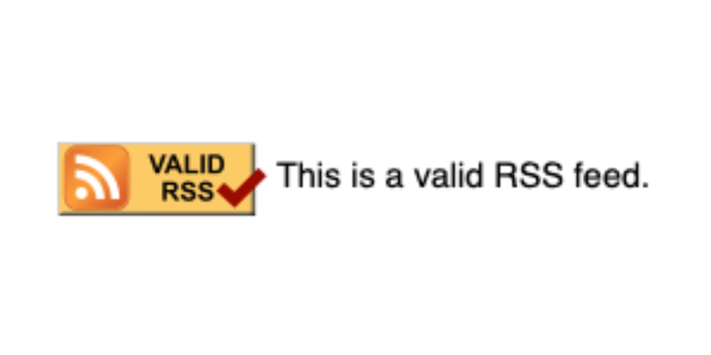

When I first started this blog in 2021, I was getting back into coding and was a DIY fan. Do everything yourself! Hack it together!

Which is great in theory.

The first website I made on neocities I coded by hand; it was fun and quirky and gave my friends headaches [because it had a flickering background](https://web.archive.org/web/20211116040748/https://illuminesce.neocities.org/). As someone who cares a lot about accessibility, it was more important to me to not cause my friends pain than it was for me to have a retro-looking site.

So I overhauled it.

Hooked it up to GitHub and gave it fancy versioning.

I grabbed [Zonelets](https://zonelets.net/) for my blog and first, Disqus, then, [Ayano's neocities comment widget](https://virtualobserver.moe/ayano/comment-widget), and finally settled on [Cusdis](https://cusdis.com/), an open-source comment widget that has a moderator dashboard and a bot that messages me when someone comments on a page. (Go ahead, leave a comment!)

Zonelets doesn't have tagging, so I implemented [3legged's tagging system for zonelets](https://3legged.neocities.org/journal/posts/2023-03-12-Creating-A-Zonelets-Tagging-System) so people could browse by topic.

I didn't know how to make an RSS, so I looked at best practices and did it by hand. All my blog articles had no thumbnails, so I learned about meta tags and did them by hand.

All of this "by hand" coding means my blog isn't that optimized. My code is messy. There were some posts that had the old comments widget on it; some with Cusdis. My RSS feed wasn't "up to standard."

Thanks, RSS validator. I feel validated.

I'm pretty impressed with how far I've gotten with this version of the site. I don't consider myself a "developer" of sorts, and yet, I've been able to do a lot of things I didn't think I was capabale of. It's nice to feel a small sense of satisfaction in knowing you've come a long way even from a few years back.

I fixed the inconsistencies in commenting, started adding images to my RSS as well as my link previews, and made some comments in the code that will make it easier for me to find things next time.

If you find something that doesn't work quite right, email me at **cj@studioterranova.net**. Keep in mind, it's mostly hand-coded.

I hope I can [migrate this blog to Eleventy](https://renkotsuban.neocities.org/posts/2023-11-15-Migrating-to-Eleventy) in the future—it should make uploading blogs and putting them on the main page easier.

Here's to small victories.
