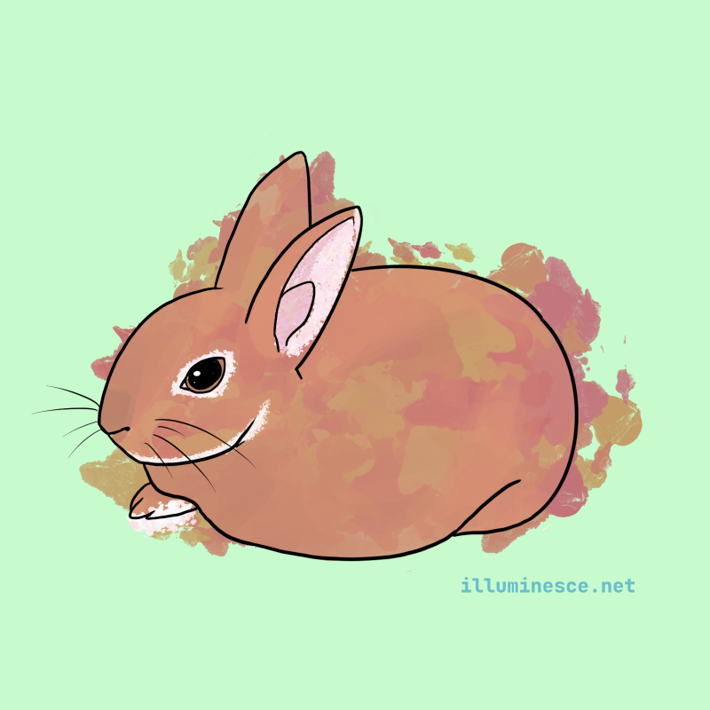
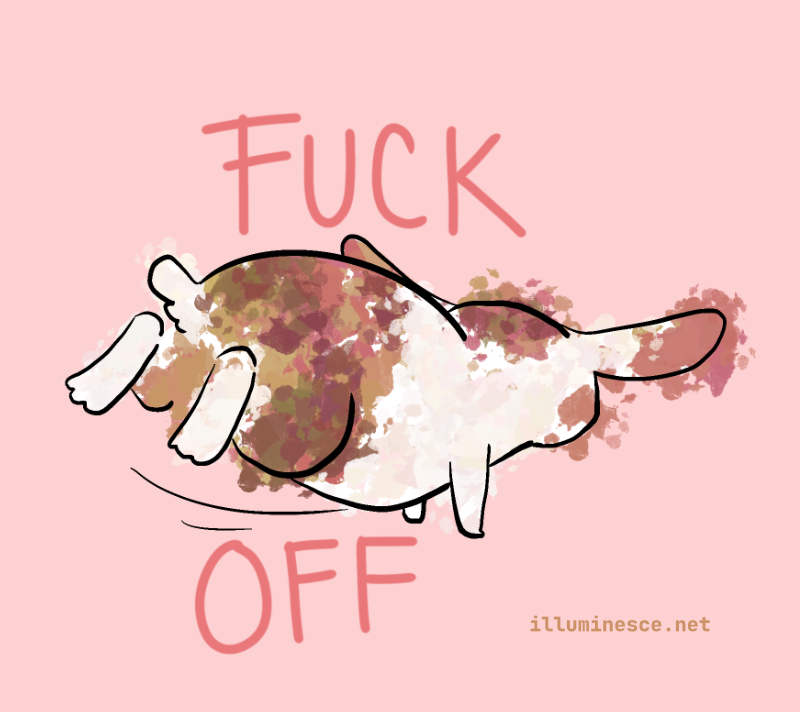
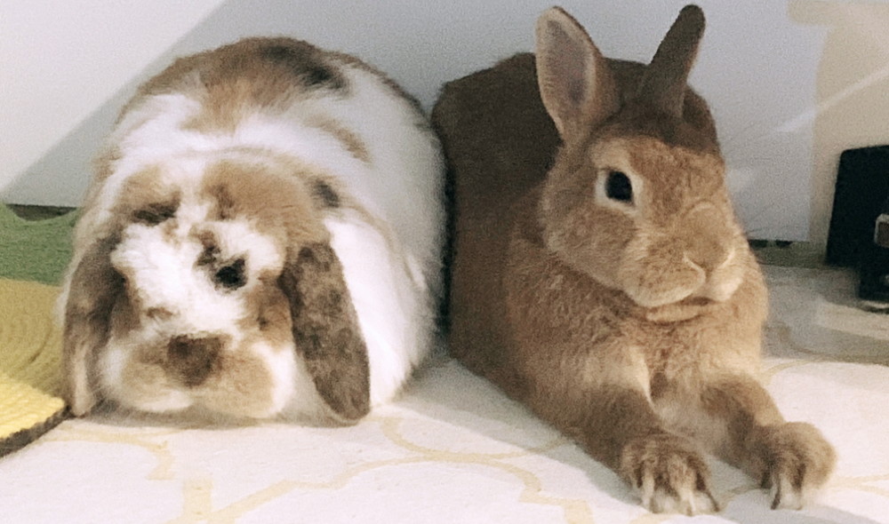
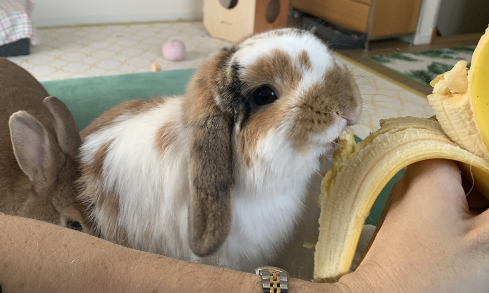
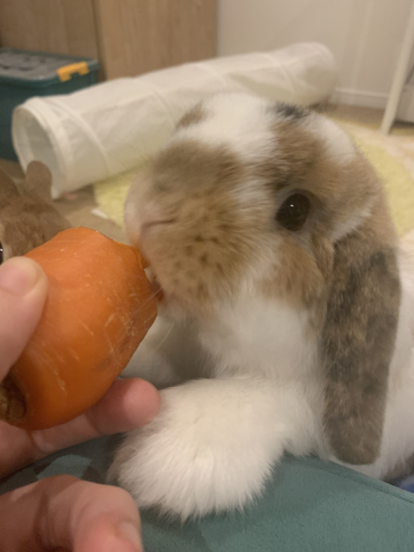

In literature, rabbits are commonly portrayed as victims; weak prey to the large, dark forces surrounding them. They are often killed, maimed and eaten to prove a point: *only the strongest survive. The weak will be sacrificed.*

However, rabbits are some of the most resilient species on earth—despite their lot, they inevitably survive inhospitable conditions.

Why?

We have two domestic rabbits at home—Ada and Hershel. They are not wild; though Ada was abandoned, neither would not survive outside. They are, however, very fun to observe. This year since I've been working frequently from home, I've been observing them on my breaks.

They often squabble over food, loafing places, and other things that don't make sense to a mere human observer. Hershel will throw a fit if I let him smell my hands, and Ada often will steal Hershel's food to the point of escalating into fights. They have *big* emotions and opinions, but generally settle back into a neutral state of peace and comfort. They're the most emotionally turbulent *and* also resilient creatures I've seen.

How does an animal that appears so fragile both physically and emotionally be so resilient? In what feels like an emotionally turbulent time in my own life, perhaps I'd do well to understand that resilience.

I've noticed three pieces of logic that these two follow. We'll call this "rabbit logic." They're, I believe, the active ingredients for forgiveness between two people.

1. neither is doing **active harm** to the other
2. they are not **actively harming** themselves
3. there are opportunities to have **repeat interactions**

## 1. Active Harm To Others

*Active harm* means when one rabbit is in the same place as the other rabbit, there is no escalating behaviors. When rabbits don't like each other, they lunge or nip at each other. With people, that looks *direct aggression* — shoving, punching, violence. Sometimes rabbits are petty and do things like flick their feet, which is *passive aggression.* Flicking the feet is the rabbit equivalent of saying, "fuck you" and flouncing away. If that seems extreme, get this—if Hershel doesn't like the way my hand smells, he'll run away and flick his feet at me.

Maybe "the way my hand smells" is an escalation, but I'd argue I didn't do anything. Hershel disagrees. I did something *very bad* to displease him.

If either party escalates or, and this is important—*perceives* that the other is escalating, it will be next to impossible to forgive.

Thankfully, I don't take most of the rabbits' escalations personally, but what about with people? Sometimes it can be hard to parse out what is an escalation versus what another person sees as a normal.

## 2. Active Harm To Yourself

*Active harm to yourself* is when, no action is happening but the rabbit perceives danger. Rabbits have a strong prey drive, so they are on alert for any warning signs of predators. They don't show stress outwardly, though if you're a careful observer, you can see signs. Nose tightened, breathing increases, nose wiggles at top-speed—that's a stressed bunny.

Perhaps the other person isn't actively escalating, but due to previous bad experiences with that person, I could interpret their presence as dangerous and have a stress response.

As someone who comes with their own traumas, recognizing *active harm to myself* was one of the hardest things for me to do.

I'm a pretty trusting person. So often I have allowed my own boundaries to be crossed and then I found myself moving in an extreme *opposite* direction where I saw danger and malice in everything.

Unlike myself, however, the rabbits have a surprisingly short memory. I admire that they don't spend too much energy being anxious when there was no danger present. If they did, they'd be spending precious energy that could be spent eating, having sex, and their favorite activity, loafing.

I too would rather spend my precious time on this earth loafing.

## 3. Opportunities for Repeat Interactions

The final key to emotional resilience in rabbits, I observed, is having repeat neutral or positive interactions. Despite their strong prey instinct, they are deeply curious and *very* motivated by food, especially bananas.

This proves a great boon to repairing relationships. Let's take the example of Hershel, who doesn't like my smelly hands. Even if I wash my hands, he may not interact with me because he's still emotionally processing how much he *hated* my smell. But if I offer him a banana...

Rabbits are simple like this.

Humans, I reasoned, would be more complex than rabbits, but this is not so. If I too, enjoy good food and a warm, comfortable couch or bed, how can anyone else? I don't think we are above or below the small pleasures of life.

Eventually, after we interacted for a while and Hershel sees that I don't mean harm; in fact, I come bringing bananas—Hershel will forgive me.

That caused me to think back to my own relationships. There were some relationships that morphed into something unexpected or disappointing. Some ended in apologies. Others there was nothing to apologize for. We both had hurt feelings.

How can I apologize for my smelly hands when I don't think my own hands smell? Are my hands the problem? Am *I* the problem? Are *they* the problem?

Zooming out, I realized that finding the core issue between us and trying to fix it mattered less than acknowledging the disconnect and the emotions caused by that and moving forward with whatever our relationship was now. Can I love a rabbit who is absolutely repulsed by my hand smells? Can he love me?

I think so. I hope so.

Though Ada should take accountability for stealing Hershel's snacks. That feels like a willful escalation.

For people, I think the importance here is *frequency* and *quality.* If my interactions are too infrequent, or I'm dulling the pain by doomscrolling, spacing out, or ignoring the person's presence, I might be focused more on avoiding pain than I am healing.

And in this modern world, the larger my community is, the less I see myself able to have repeat interactions. The concept of *socially blocking or boycotting* someone is common amongst my friend circles, meaning if there is a person someone is bad terms with, they will avoid them, sometimes permanently. In some communities this may be possible, but in Tokyo, communities are surprisingly small. It is very hard to not run into another person at events.

## Why Forgive At All?

We've talked about forgiveness on a one-on-one level—let's zoom out to our communities.

Last year, [I wrote about how frustrated and angry I was about the Tokyo Trans March being canceled due to in-fighting in the trans community.](/posts/2023-11-16-Tokyo-Trans-March-2023.html)

This was partially because of recent drama—but the additional context is that I volunteered in 2022 and was privy to petty behaviour between staff and volunteers that changed my experience of the overall community. People who I previously looked up to made comments in which they seemed to look down on volunteers. Volunteers, instead of talking it out, went to Twitter to publicly denounce staff. It was a mess.

I was angry at the volunteers and at the staff—at the entire community, really—for letting an incident that seemed so muddled in confusion to topple a rally that was desperately needed in Japan. It wasn't fair.

Reflecting back on it, I could have had far more empathy. I personally have issues with people arguing in front of me. It causes me pain that feels like I jammed a knitting needle into my ear. It's severe, extreme, and extremely uncomfortable. My breathing quickens, I look for exits, and want to flee. It has gotten better over the years, but when I experience it the pain feels fresh.

It's partially a trauma response, but also a reaction that was taught to me as someone who grew up in mostly white communities. We don't argue, we suppress until it blows up into something violent. It doesn't allow for a plurality of solutions or to linger in discomfort. It not something I like about myself.

But also that meant I was judging myself for feeling that way. I concluded that I was doing *active harm to myself.*

I was the stressed rabbit.

I found that temporarily pausing interactions and taking time to get therapy, practice self-compassion and journal helped me process my own feelings of anger, disappointment and sadness.

I started focusing on the small things I liked about our community rather than letting any triggered emotions I have overtake the general pleasant feeling I was having. Over time, I paid attention less to managing my own emotions to leaning into the positive things happening around us—and that positivity rubbed off. I met cool queer folks, went to cool queer events, enjoyed myself.

Some people I liked; others were petty—but that's the community. I'm not here to befriend everyone; I'm here to hold space for them and to support them how I can.

They give me life. And the longer I interact with the queer community here, the more I realize these kinds of interactions are inevitable. We're sensitive rabbits that have big and strong opinions about things—but also have been hurt before.

And you know what? There was a successful event this year.

For the people in the US who are dreading next year and all of the racist, transphobic and anti-immigrant policies. For the people who have heard calls from inside their community to "get to know your neighbor" but have no clue how to since we haven't spoken--or know our neighbors.

This is where I believe rabbit logic applies.

There's simply no way to block a person in real life. We will, as communities, inevitably have conflict amongst ourselves. Forgiveness is a necessary tactic to cultivate human relationships, however flawed they are, into something that is community.

The internet has been good at broadcasting social issues from a minority to a majority, but it fails at conflict de-escalation. Most of the content I see posted online by my local queer communities doesn't invite discussion—it makes an announcement, a declaration that states a fact or an opinion, rather than encourages discussion. Discussion happens in-person, at events. The more we interact online in the community, the more our interactions become declarations into a void, where we have no control over how they are seen or used.

Forgiveness is a neccessary part of resilience and resistance. I think it is what makes rabbits so strong. They forgive. They are vulnerable, and soft. They fight if they need to. They run and hide if they need to.

I want to be resilient *and* vulnerable. I want to be a bit more like the rabbits.

Laying on the ground, they come up to sniff me. Hershel is reluctant, but Ada nudges him on to claim their prize—the carrot in my smelly hands.

