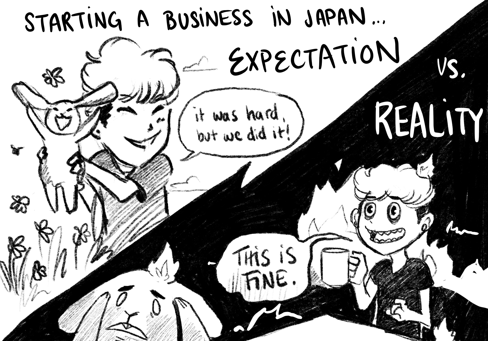

## 2024 was the year of Studio Terranova

My partner, Matt, and I started a business in Japan. Matt has worked freelance since we’ve moved here. I was the one responsible for making sure we stayed here legally through my visa. This meant I didn’t have much of a choice—work visas were mostly for 正社員 (full-time employees).

In 2021, I was granted permanent residency, which opened up my options. I started planning for the future I wanted, which was to own our own studio. And in 2024, we made that happen.

Our dream for Studio Terranova is:

- a small, **cooperatively-owned** studio
- a **financially stable** entity that has no management—it pays direct to the people who do the work
- **collaborate with clients** on design & dev work as our main income
- **make video games** that highlight LGBTQ+ stories as something to grow

*Our new, slick business cards, designed by our friend [Jenn Piatkowski](https://www.creative-curls.com/).*

Starting a business was one thing; getting it financially stable was another. Structuring it so that it can be cooperatively-owned was yet another. There are some cooperatively-owned video game companies in the UK; in Japan, I know of one person who has a cooperatively owned software business outside of us.

Even after watching dozens of YouTube videos and reading hundreds of articles, navigating each bureaucratic process was like a dungeon without a map.

And yet. We have a business that financially supports both of us.

I am deeply thankful to our clients who partnered with us this year—and to those partnering with us in the coming year for helping us achieve this.

Thank you.

We still have a ways to go to put all the infrastructure in we need to function as a cooperative. But after nervously looking around to make sure all our t’s are crossed and our i’s dotted, now seems like a good time to humbly celebrate our current situation.

## 2024 was the year of mistakes

We did not effortlessly dive into this.

Although we received some support, it seemed like almost every mistake that we could make we did.

Forms were filed incorrectly. Important phone calls were missed that cost us time and money. There were some days when we dove into our pool of work, we immediately plunged into the water; but most days we tumbled down the ladder, hitting every rung on the way down.

*Drawing by me, inspired by [KC Green's](https://www.kcgportfolio.site/) "This is Fine" dog.*

I am thankful these mistakes didn’t cost us our business, and I am grateful for the patience of the 税務署 officials who explained, once again to the fearful and wide-eyed foreigner on the other side of the desk what forms we had failed to fill out properly and what information they needed.

## 2024 was the year of inspiration

We went to a *lot* of inspiring places.

I went to the Corning Museum of Glass—the holy grail of glassblowing and got to watch my family do a glassblowing experience together.

I hiked what I thought was a four-hour trail and ended up being a seven-hour trail—in the middle of summer with friends. We were so thirsty at the end, we raided a nearby vending machine for Pocari Sweat.

We took a three day weekend dive in Oshima and befriended a frogfish. Our family visited us. We walked the angular halls of the Miho Museum, an impressive art museum in the mountains of Shiga built by the famous architect I.M. Pei.

mabbees, a friend and I visited a sign-language café, and did our best attempt at both ASL and 手話 with the patrons. Watching each of our faces light up in recognition when we figured out what the other was trying to say was a pure distillation of human joy.

[Cohost](https://cohost.org/rc/welcome), an alternative social media site, went read-only in October. mabbees organized a meetup and we met new friends.

Each adventure we went on came with new inspirations for a blog post or a game. These never came to fruition, because…

## 2024 was the year of neglect

I jokingly referred to Studio Terranova as “our baby” as it needed round-the-clock care. It didn’t matter if it was the weekend or the evening; if there was an issue, it needed taking care of immediately, because the consequences were usually financial or legal.

This was manageable when I didn’t have active client work; when I did, my planned working days for our video games were eaten up by either tending to the accounting, taxes, or HR side of the business or sleeping because I was too exhausted to think.

That meant everything in my personal life was on hold. I planned to challenge National Novel Writing Month in November, spoke with our 税理士 (tax lawyer) about end-of-the year taxes and promptly decided against it.

Even though I gave it my best effort, since July I have been too focused on non-video game work to finish Tomodachi 8in1 like we planned.

We did, however, release these this year:

- The first five installments of [Tomodachi 8in1](https://illuminesce.itch.io/tomodachi-8in1), a PICO-8 pixel arcade
- [Keep Center](https://illuminesce.itch.io/keep-center), a tiny game about glassblowing
- A prototype version of [The Frontier](https://illuminesce.itch.io/the-frontier), a point-and-click adventure game about the aftermath of capitalism

*A still from our prototype for **The Frontier.** Drawn by me.*

Despite the abundance of inspiration, the blocker was always time and energy.

And honestly, I set my sights *far* too ambitious in terms of game-making for our first year. Hell, we actually *released* some games. Even though I didn't feel like it was enoguh in the moment, it feels "enough" now.

When I saw my friends, they’d usually greet me with a, “CJ! I haven’t seen you in ages!” and I’d nod and flop down on their sofa.

Tired was my 2024 mood.

Watching the results from the 2024 election numbed me. I had nothing else to feel or to give beyond exhaustion. I wish I had more, but I was empty.

I have, however, had the pleasure of working with some translators who are translating our game Terranova. I hope we can do these works justice and release Terranova in multiple languages.

## 2024 was the year of […]

What frame shall I use to look at this year?

Shall I use the one of **accomplishment**? I did co-create a business. It is surviving, for now, and in 2025, we will make it stronger.

The one of **mistakes**? I’ve lost count of how many times I’ve fucked up and said “sorry.” At this point, I’ve lost any shame I have. In 2025 I will be at my most shameless.

The one of **inspiration**? Nature has proven her ability to heal me. Long, wandering walks have been my solace this year. I want to continue this practice in 2025.

Or the one of **neglect**? With no time or energy to reflect on either my mistakes or inspiration, I’ve been creatively blocked. I want 2025 to be the year to reflect and unleash that potential.

I don’t think there’s one “right” frame to look at this year. It has been all of these things. It has been *a year.*

This year was intense. And beautiful. And terrifying. And heartwarming. And unsatisfying. And humbling.

Thanks to everyone who supported me this year.

Looking forward to 2025.

If you don't already follow Studio Terranova's newsletter, we release a once-a-month roundup of mine and mabbees' blogs as well as our progress on our video games.

[Click here to join.](https://buttondown.com/studioterranova)

### Here’s some resources that have inspired me this year

- [How to Set up a Worker’s Cooperative](https://toolkit.radicalroutes.org.uk/wiki/Main_Page) - Radical Routes Housing Cooperative. On some of the more technical steps of setting up a cooperative.
- [Your Music, Your People](https://sive.rs/m) - Derek Sivers. Derek continues to be one of the kindest, most considerate entrepreneurs I know. I strive to be genuine and compassionate like him.
- [The Tragic Optimist’s Guide To Surviving Capitalistic Nihilism](https://youtu.be/LBUHBfFSa4I?si=igEXMIAaEkXaB_SW) by Dasia Sade. This video essay was the panacea to my US politics doomscrolling. Perhaps it will be yours, too.

あけましておめでとうございます！

*Happy New Year! Drawing by me.*

---

Terranova is a nostalgic, text-based [interface drama](/blog/posts/2023-08-22-Interface-Drama/) about fangirls in the early 2000's on *LimeJournal*. Available on PC, Mac and Linux [here](https://playterranova.com/).
