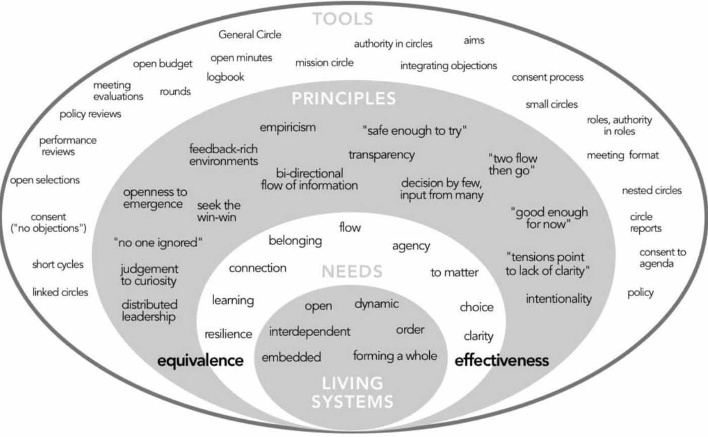
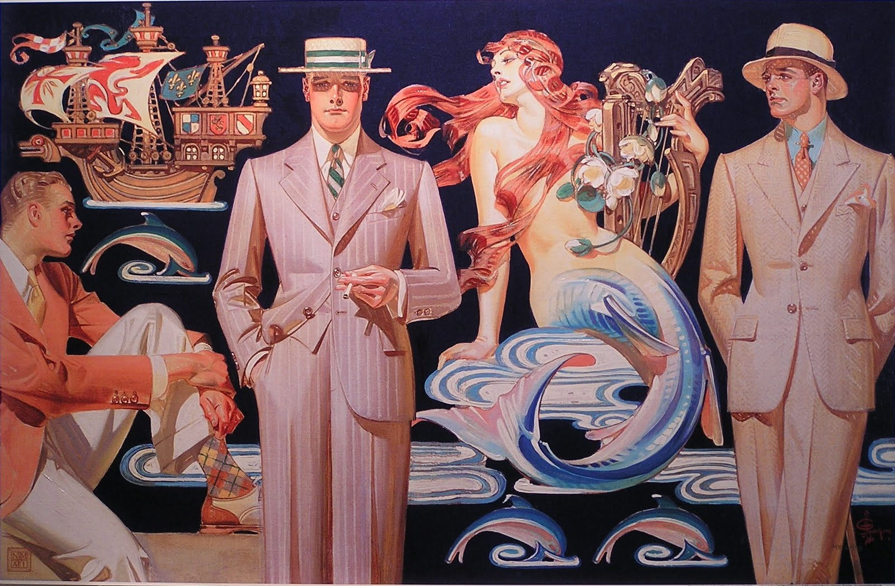

Around the time the Twitter purchase, my friend and I would share daily news about Elon Musk. We both grew up in the Web 1.0. days, so watching the drama was a throwback to the Encyclopedia Dramatica days.

I am not above watching drama unfold from the sidelines. I meta-analyse old fandom drama, whether it be about [MsScribe on LiveJournal](/blog/posts/2023-06-18-An-Unauthorized-Fan-Treatise/) or [yaoi discourse in the boy's love genre](/blog/posts/2023-09-30-Visiting-the-First-Boys-Love-Exhibition-in-Japan/) for fun. I have a guilty relationship with it— I like being the one writing it down, but have no desire to be at the center.

I read Nicky Flowers' blog ["I am tired of hearing about the richest man on the planet"](https://nickyflowers.com/blog/2025/post_010325) about how no matter what Elon does next, it will be the same thing, over and over again.

I agree.

It's tiring, it's not inspiring. It was fun for me at some point, but now that some portion of tech and political discourse is centered around him, I've started to avoid it. At some point following him around "for laughs" will simply be following him around, and I don't wish to follow.

So here's my New Year's resolution: stop reading about Elon Musk and instead read about other things. Here's a couple of things I'm reading about:

## Collective action

I have been an organizer for many years, and inevitably, power and agency collects at the top of the organization. It is not uncommon for community organizers to be overworked and burnt out.

In fact, I've ended up dissolving communities like [Hexagon UX Tokyo](https://goodpatch.com/blog/ux-diversity-inclusive-culture) because I personally couldn't continue. We couldn't find someone willing to take on the massive amount of work it takes to be a lead organizer, so the community just...ended. I wanted to find something more sustainable and long-lasting.

[Collective Power](https://www.sociocracyforall.org/collective-power/) and [Many Voices, One Song](https://www.sociocracyforall.org/many-voices-one-song-2/) by Ted Rau and Jerry Koch-Gonzalez write about shifting power from "one tired person at the top" to more democratically governed organization that is both transparent about the work it does and aims to share the executive power across many.

## Degrowth

My colleague is studying degrowth, and I've been inspired by the premise of it. Degrowth is the idea that the wealth of an economy should not equal how much it grows year over year—it should be about a variety of factors, one being health, wellness and ability to live a life reasonably. It offers an alternative to capitalism and a provocation; can we imagine a world that has a post-growth economy?

I was recommended Jason Hickel's [Less is More](https://www.jasonhickel.org/less-is-more) and am working my way through it.

## JC Leyendecker

Unrelated to these two, but Leyendecker is a gay commercial artist whose light and shadow patterns I find very striking and inspiring. He was the idol of Norman Rockwell, and Rockwell's style was seen at the time as derivative of Leyendecker's.

Leyendecker's color theory is so eye-catching and his lines so angular and strong—his work reads like an American version of Alphonse Mucha and the art noveau style.

I've been practicing my own art, trying to study how Leyendecker crafted his figures and poses. It's been fun to figure out.

---

If you're interested, why not share with me what you'll be reading about this year? 

I'd love to hear it.

Many thanks to Nicky Flowers for the inspiration and to Emily, Sam, Crystal and mabbees for the great conversation today that kicked off this post.
