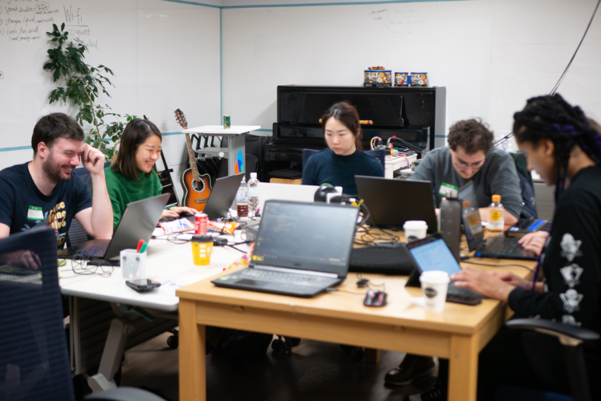

*All photo credits to [Shane Brown](https://www.instagram.com/xenoliving/).*

If this is your first time reading my blog—hello, and welcome. I'm CJ; I'm the site organizer of [Let's Games! Tokyo](https://globalgamejam.org/jam-sites/2025/lets-games-tokyo) which started in 2020.

This year was, in my opinion, one of the best jams Let's Games! has hosted. We had an even mix of Japanese speakers and English speakers. Half of our participants were first-timers. To each and every one of you who participated, thank you. You contributed to the joy and energy that we all felt at the end of the jam. I hope to see you in 2026!

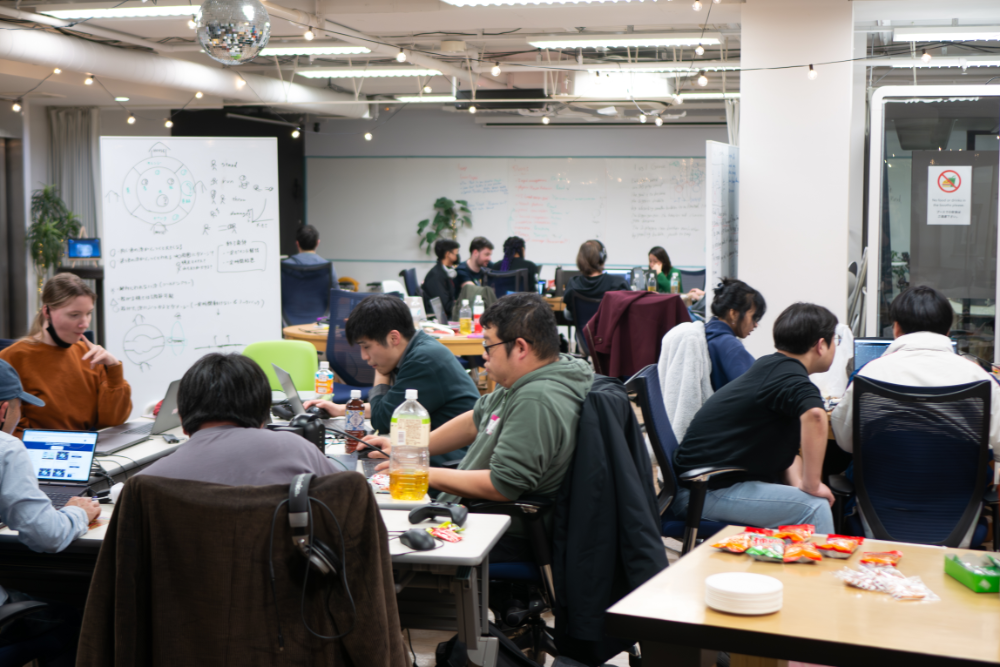

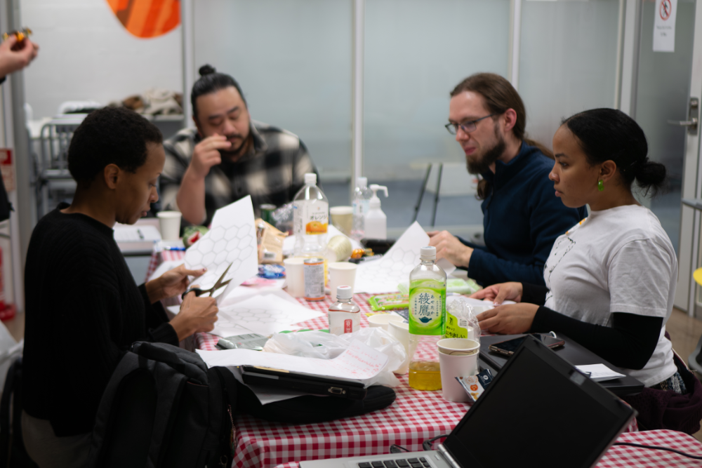

The theme this year was *Bubble.* We had 44 participants and 11 games: 2 Unreal, 4 Unity, 1 Godot, 1 PICO-8, 1 Ren'Py, 1 JavaScript, and 1 board game.

Check out the games here.

([**Our games**](https://globalgamejam.org/group/11760/games) | [**Our game demos**](https://youtu.be/AeCsmMABGh0?si=5g5StKrreTvT3Y7g))

---

### Bubble Dream

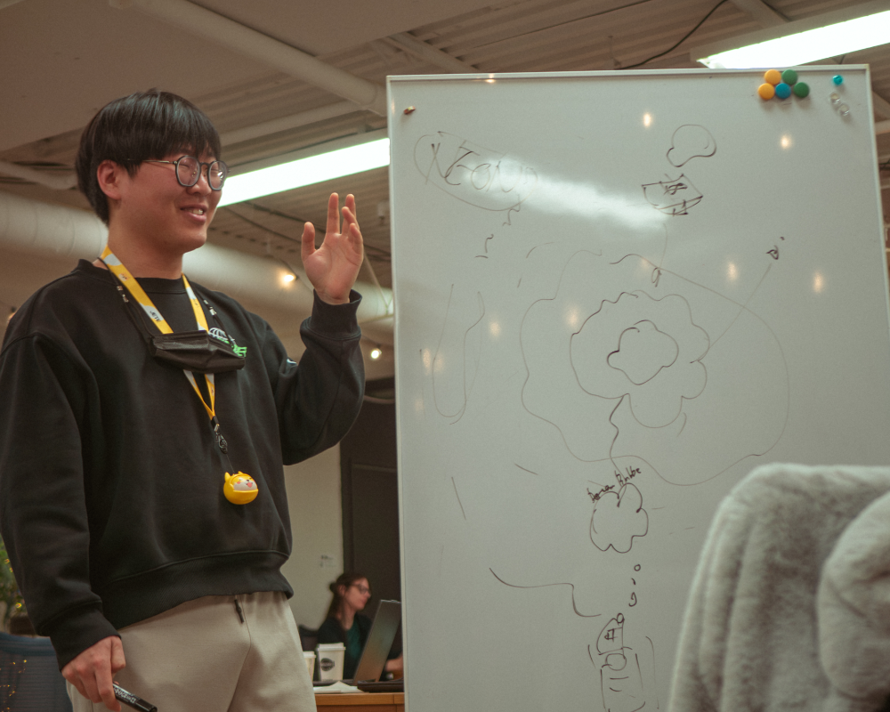

This mobile-friendly game features a hungry bubble with an endless stomach in a dream, eating all the obstacles it can endure.

**Engine:** Unity

([**Play it on mobile here.**](https://globalgamejam.org/games/2025/bubble-dream-6))

---

### Bubble Butt

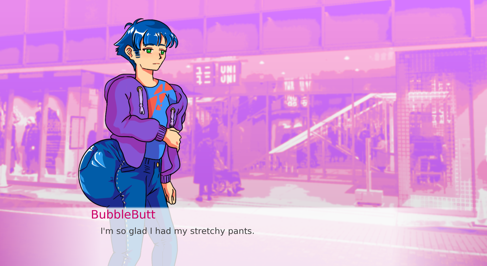

A game about self-acceptance and big butts. Take control of a bountifully cursed protagonist as they navigate a world filled peril and problems as they search for purpose and self-love. Make impactful choices and guide our cheeked up hero to save the world... and themselves. *This game contains at least 80% butt puns.

**Engine:** Ren'Py

([**Playable for Windows, Mac and Linux.**](https://illuminesce.itch.io/bubble-butt))

---

### Escape from Bubble Island

Play as 1 of 4 animal characters trying to escape a sinking sky island. Collect bubbles to grow the wings of your boat to fly away before the island falls out of the sky. The bigger the bubble, the more points you can bring back to your zone. Throw bubbles to damage and stun your opponents. Only 1 can escape Bubble Island!

**Engine:** Unity

([**Check out the repo on GitHub.**](https://github.com/TakuHackathons/BubbleOverflow))

---

### Bubble Boss 2

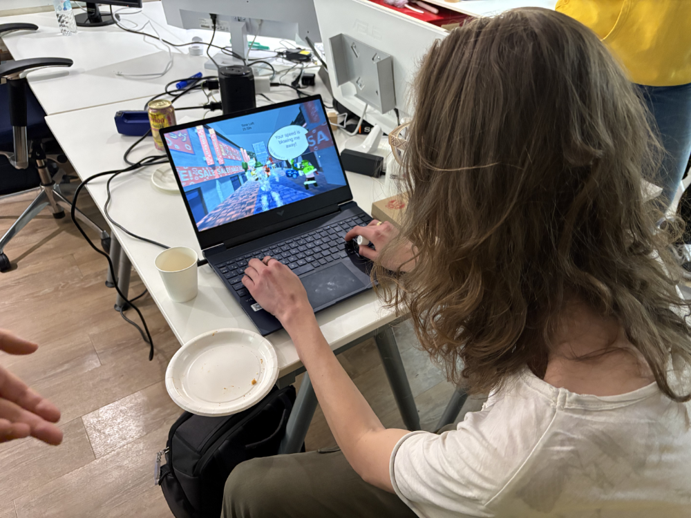

Bubble Boss wakes up and is late to his meeting with Panafoamic! Running out the house, the trains are out of commission. There's no other way, he has to run to make it or he'll get fired from Toshibubble!

**Engine:** Unity

([**Playable on Windows, Mac and Linux**](https://globalgamejam.org/games/2025/bubble-boss-2))

---

### Uwa-Teiru (浮いてる)

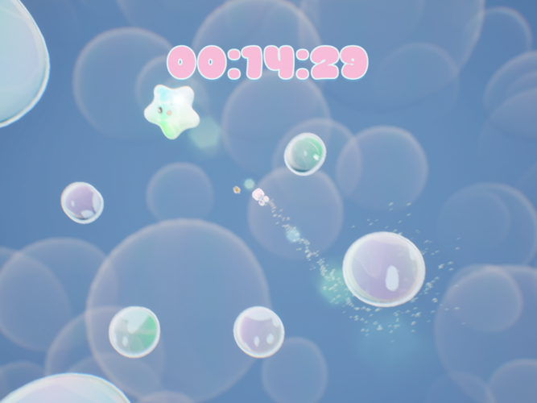

A chill platformer where play as Bubble Cat as she jumps and slides along bubbles to reach a bubble star and achieve her bubble dreams!

**Engine:** Unreal Engine

([**Playable on Windows**](https://globalgamejam.org/games/2025/fuiteru-uwa-teiru-6))

---

### Kingdom of Quack

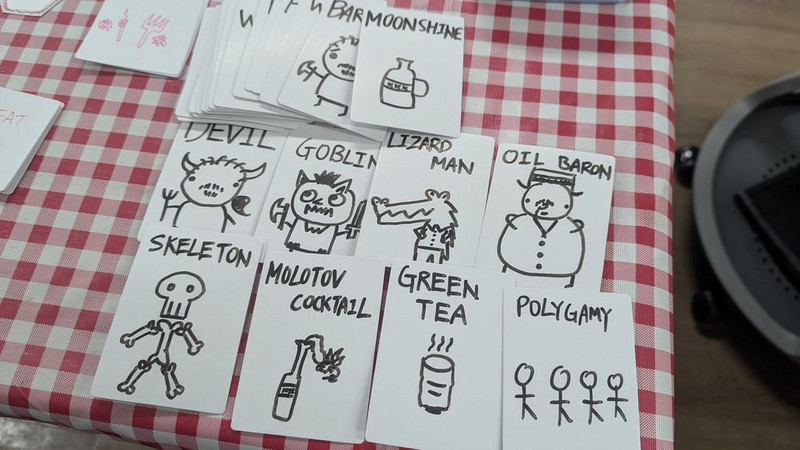

Welcome to MiFF, where the only thing that matters is your social bubble! The citizens are always looking for a new "it"-person to give their loyalty (even if only for just a few minutes). Say, you look arrogant enough to be the next Drewan Teat! Grow your following and maybe you'll find yourself with an invitation to come live in the Kingdom of Quack, the bubbliest, cess-iest pool of only the most influential people in all of Miff! Choose your social persona and rise to the top by tricking --er, persuading--others to go along with your solutions to current world events. (Unfortunately, the dog always dies...)

**Type:** Board game

([**Download the rulebook here.**](https://globalgamejam.org/games/2025/kingdom-quack-0))

---

### チャン ピオン パン! Champion-pan!

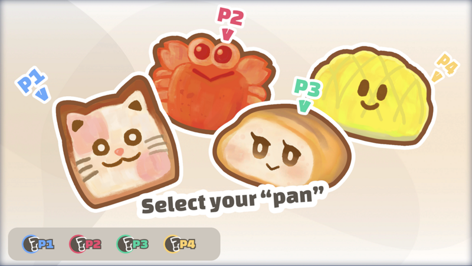

4 breads compete to be the champion. Can you be the first to catch the crown? In this 4 players competitive game, chose your pan character and be the first to catch the crown. Bubbles are a fragile thing, beware of the fall!

**Engine:** Unity

([**Playable on Windows, Mac and Web**](https://globalgamejam.org/games/2025/champion-pan-5))

---

### Bubble to bubble a bubble?

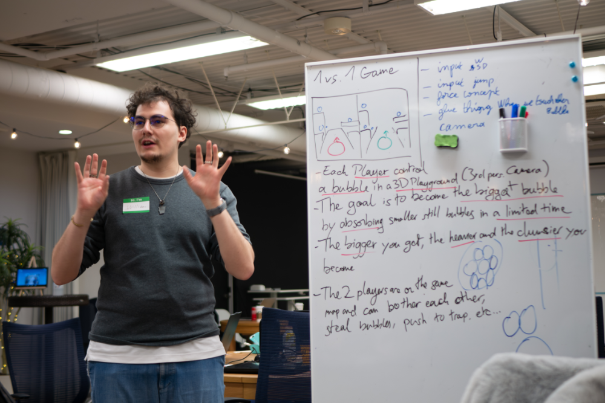

The game is about to harvest the biggest quantity of bubbles within a limited time. The physics and few traps are here to disturb you. How many bubbles will you catch.

**Engine:** Unreal Engine

([**Playable on Windows.**](https://globalgamejam.org/games/2025/bubble-ultimate-battle-middleearth-5))

---

### Bubble Rumble

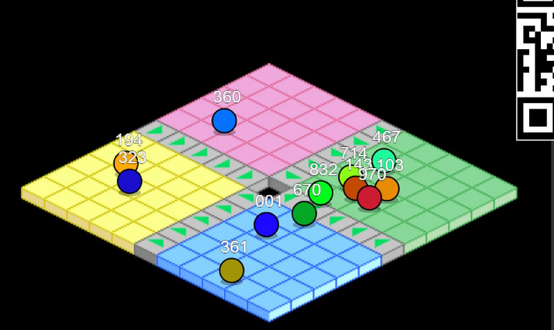

Massively multiplayer arena brawl. You're in one of those inflatable bubble suits. Try to push your opponents through the open pit in the arena. Use your smartphone as a controller.

**Engine:** Web languages (JavaScript)

([**Play it on web at bubblerumble.fun**](https://bubblerumble.fun))

---

### What is it like to be a bubble?

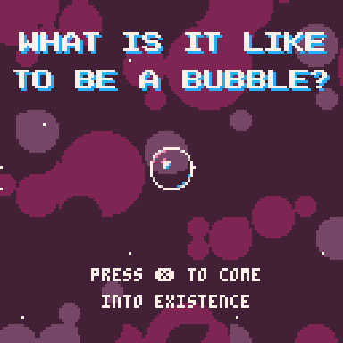

A meta-interrogation of the physiological patterns, intra-structural semantics, and conscious fabrics of nothingness pockets.

With BULLET HELL ACTION🔥🔥🔥

**Engine:** PICO-8

([**Play it on itch.io**](https://mabbees.itch.io/what-is-it-like-to-be-a-bubble))

---

### Bubble's Chance in HELL

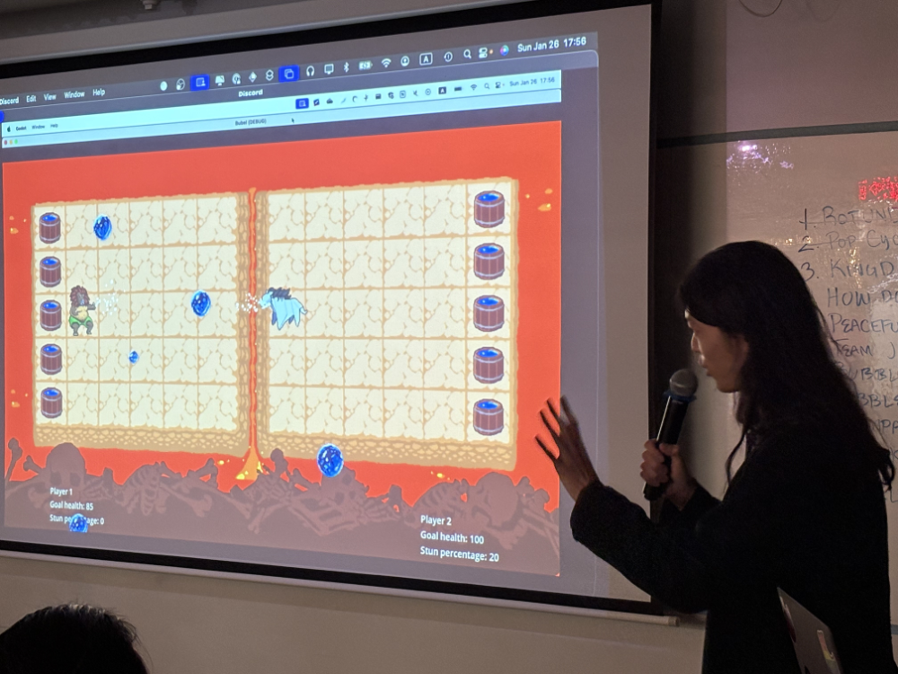

A mixture of base defence and volleyball, choose your champion to defend against the unholiest of weapons… bubbles!

([**Play on itch.io**](https://jaysc.itch.io/bubbles-chance-in-hell))

---

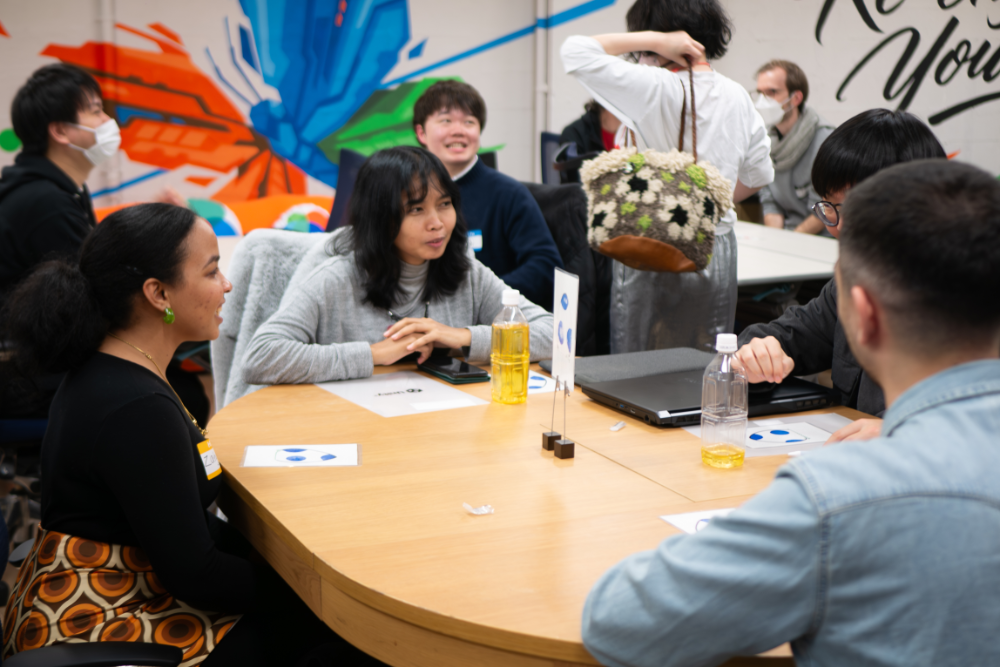

Huge thanks to Code Chrysalis for letting us use their space. This year, they had some great accommodations for sound engineers, like recording booths, so a lot of our games had sound! And thank you to Unity for sending us folders and pens for all the jammers. We appreciate your support.

At the site, I heard Japanese, English, French and Korean being spoken within the teams. About a third of our site were native Japanese speakers—a majority were bilingual speakers and a smaller percentage English-only. It truly was an international environment.

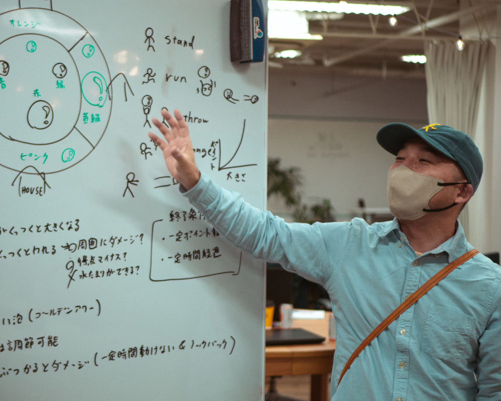

Several folks asked me how I made this environment: although I may have set the intention and we co-organizers may have designed it, the participants who showed up and are willing to have fun are the ones who ultimately make it.

I intend to publish a longer document on the design of the jam, if only to help other organizers make their own jams more multilingually friendly, more inclusive of beginners, and hopefully more fun overall.

## Let's Games! Tokyo Polish Party

As an extension of our event, we are hosting a polish party (not Polish!) on March 1st for teams to brush up their games and re-demo them in a casual atmosphere. Venue is currently TBD. Admission is free to Let's Games! Tokyo 2025 participants. We'll let you know more details on our Discord and newsletter.

([**Check out our newsletter here.**](https://buttondown.com/ggjtokyo))

---

## The Future of the Site

I want this cool space to continue.

At the moment, I'm so involved in the organization that if I get sick, there might not *be* a jam. I'm thankful I haven't, but going forward I don't know if I'll always be that lucky.

So I'm asking anyone who has been a part of the jam before...would you consider volunteering? Or even step up to co-organize with me next year? I'll teach you what I know.

Next year's jam dates will be **January 30th-February 1st 2026.** Mark your calendars! And reach out to me at **illuminesce (@) pm.me** if you're interested in volunteering. I'll add you to our Discord.

To each and every one of you—congratulations. You made a game! Whether it was weird, rough, or experimental, you made it.

Pat yourself on the back.

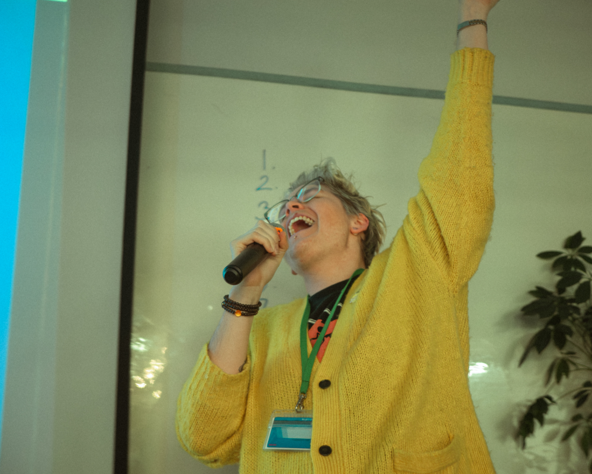
