([English version is here.](/blog/posts/2025-01-29-GGJ25))

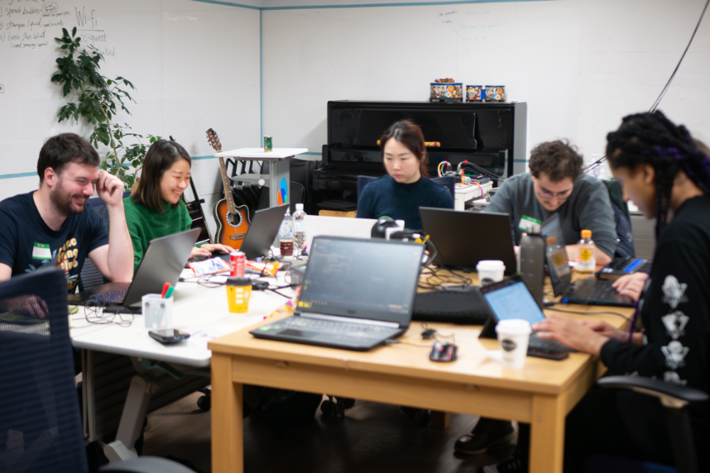

*写真提供： [ブラウン・シェーンさん](https://www.instagram.com/xenoliving/).*

はじめまして、またはお久しぶりです！✨

私は[「Let’s Games! Tokyo」](https://globalgamejam.org/jam-sites/2025/lets-games-tokyo)の運営をしているCJ（シージェ）です。このサイトは2020年に開始しまして、もうあっという間に5年間になりました。

([**2024年のLet's Games! Tokyoのアフターレポートはこちら。**](/blog/posts/2024-02-07-GGJ24-Report-JP))

日本人も、海外の方も、皆さんが楽しくにゲームが開発できるの雰囲気を目指しています。

参加してくださった皆さん、本当にありがとうございます！

数字的に、日本人と海外の方の割合は30%/70%になり、主の方がバイリンガルです。あるいは、三つ、四つの言語が喋られる方もありました！そして、参加者の半分がジャム初体験でした。

皆さんのおかげで、最後にはあのエネルギーとワクワク感が生まれました。
2026年もまたお会いできることを願っています！🎮✨

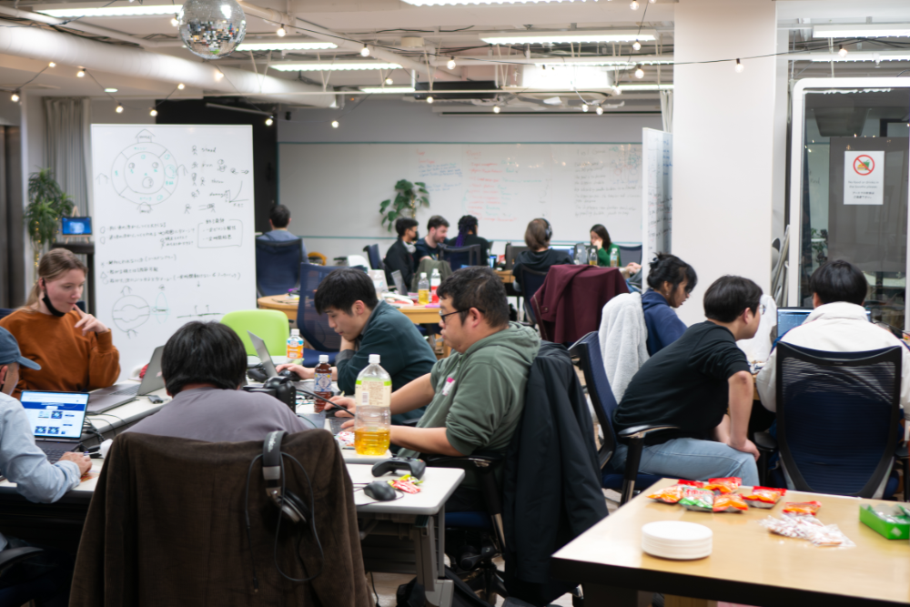

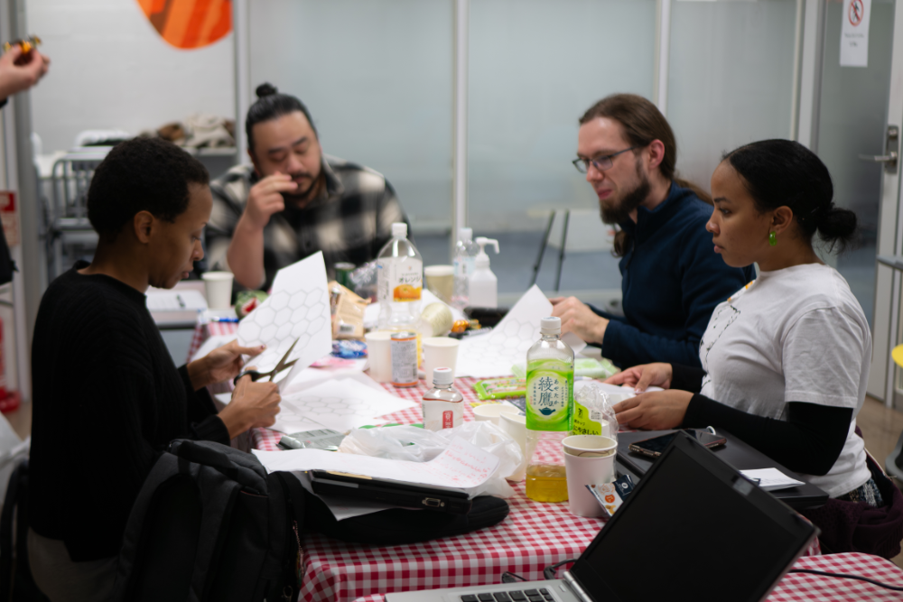

今年のテーマは「バブル」（泡）！ 参加者は44名、制作されたゲームは11本！

- Unreal Engine：2本
- Unity：4本
- Godot：1本
- PICO-8：1本
- Ren’Py：1本
- JavaScript：1本
- ボードゲーム：1本

ゲームはこちらからチェック！

([**Let's Games!東京のゲーム**](https://globalgamejam.org/group/11760/games) | [**ゲームデモの動画**](https://youtu.be/AeCsmMABGh0?si=5g5StKrreTvT3Y7g))

---

### Bubble Dream「バブルドリーム」

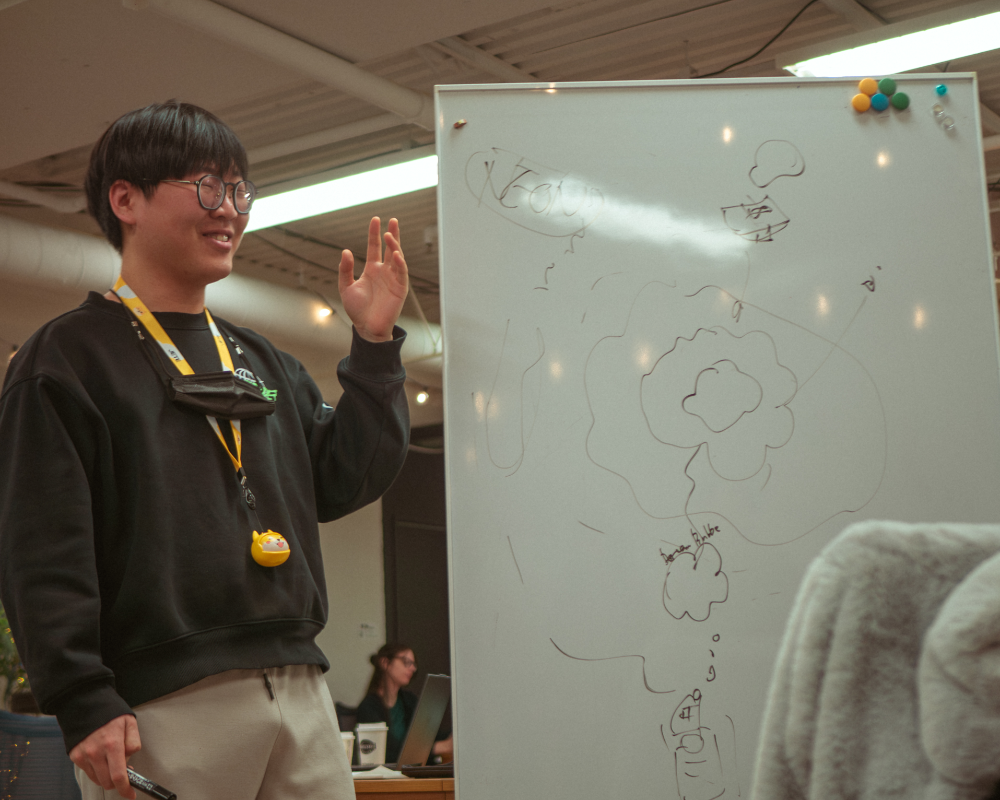

このモバイル向けゲームでは、夢の中で果てしなく食べ続ける“空腹のバブル”を操作します。

障害物を食べて食べて、、、どこまでいけるかな？

**エンジン:** Unity

([**モバイルでプレイはこちら**](https://globalgamejam.org/games/2025/bubble-dream-6))

---

### Bubble Butt「バブルバット」

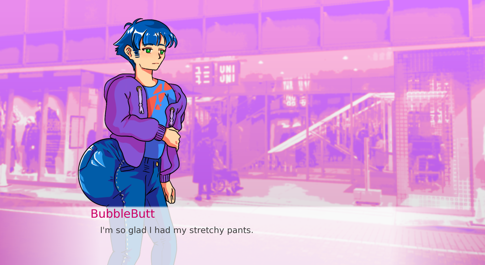

「自己愛」と「バブル・バット（大きなお尻）」がテーマ。呪われた（？）主人公を操作し、危険と困難に満ちた世界を駆け抜けながら、自分の存在意義と「自己愛」を見つけていきます。

選択次第で物語が変化し、世界と自分自身を救う冒険へ、、、！

※ 80%以上がお尻に関するダジャレでできています。 🍑

**エンジン:** Ren'Py

([**Windows / Mac / Linux でプレイ可能。**](https://illuminesce.itch.io/bubble-butt))

---

### Escape from Bubble Island「バブル島の脱出」

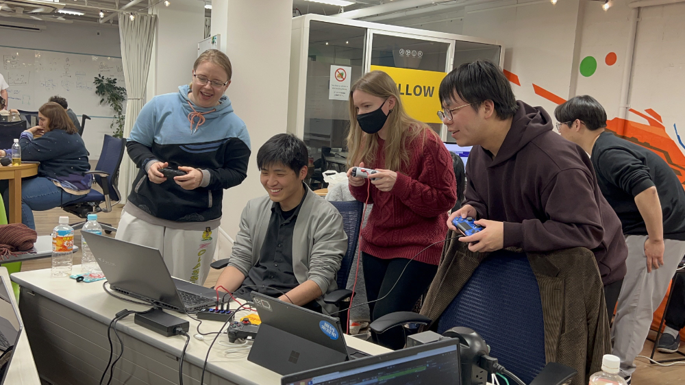

空に浮かぶ島が沈み始めた、、、！動物キャラ4体のうち1体を選び、脱出を目指そう！

バブルを集めてボートの羽を大きくし、島が落ちる前に飛び立て！大きなバブルほど、たくさんのポイントをゲットできるぞ。

バブルを投げて相手を攻撃＆スタンさせることも可能！

でも、脱出できるのはたった1人、、、！

**エンジン:** Unity

([**GitHubのリポジトリはこちら。**](https://github.com/TakuHackathons/BubbleOverflow))

---

### Bubble Boss 2「バブルボス２」

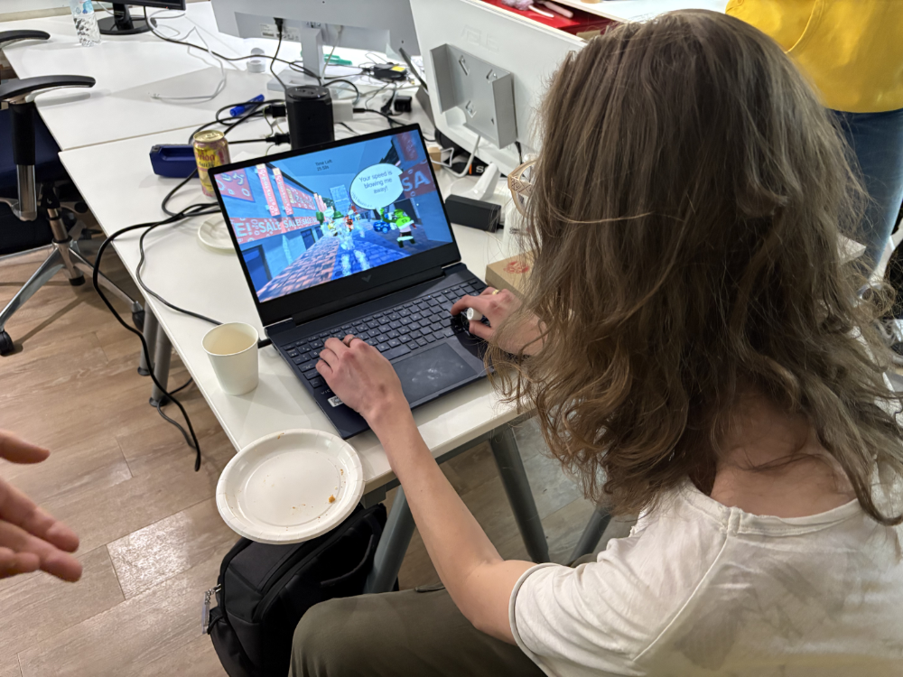

バブルボスが目を覚ますと、、、会議に遅刻しそう！慌てて家を飛び出すも、電車は運休中。
どうする？ 走るしかない…！ 💨間に合わなければ「トシバブル」社からクビにされてしまう、、、！！

**エンジン:** Unity

([**Windows / Mac / Linuxでプレイ可能。**](https://globalgamejam.org/games/2025/bubble-boss-2))

---

### Uwa-Teiru 「浮いてる」

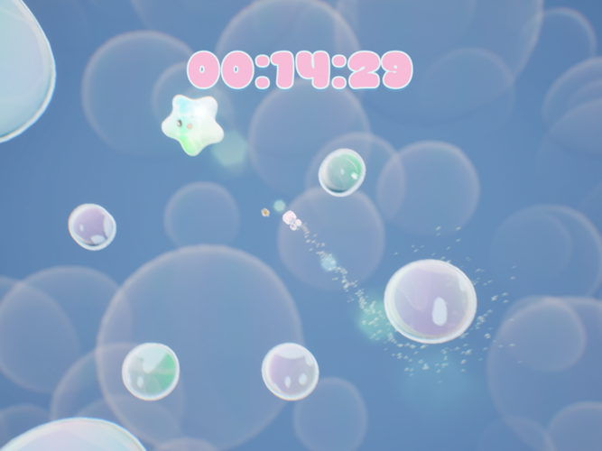

のんびり楽しめるプラットフォーマーゲーム！バブルの上をジャンプ＆スライドしながら、バブルスターを目指す可愛い「泡ねこ」。彼女のバブルな夢を叶えてあげよう！

**エンジン:** Unreal Engine

([**Windowsでプレイ可能。**](https://globalgamejam.org/games/2025/fuiteru-uwa-teiru-6))

---

### Kingdom of Quack「インチキ王国」

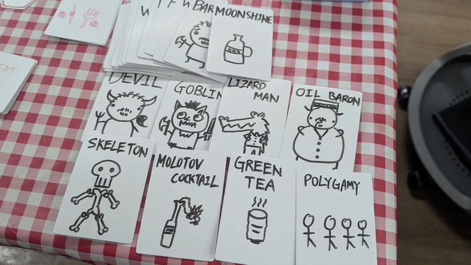

ようこそインチキ王国へ！ ここで最も重要なのは、、、 「ソーシャルバブル」です。市民たちは、常に新たな「カリスマ」を求めている。

自分の「ソーシャルペルソナ」を選び、他人を 騙、、、いや、説得しながら 世界の問題を解決しよう！

もしかすると、あの 「インチキ王国」 に招待されるかもしれない、、、

**種類:** ボードゲーム

([**ルールブックのダウンロードはこちら。**](https://globalgamejam.org/games/2025/kingdom-quack-0))

---

### チャン ピオン パン! Champion-pan!

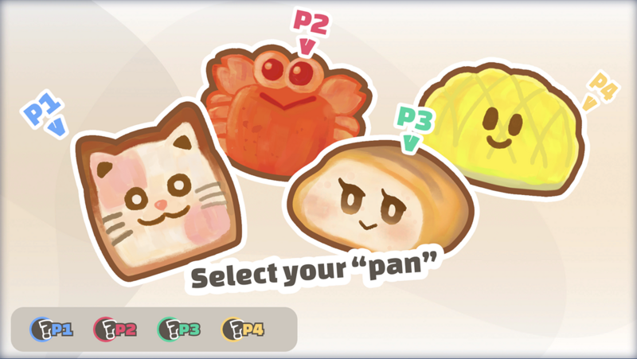

4つのパンがチャンピオンの座をかけて競い合うゲーム。あなたは誰よりも早く王冠を手にできるか？

4人対戦のこのゲームでは、お気に入りのパンを選び、王冠を目指して競争します。

バブルはとても壊れやすいもの。落ちないように注意して、、、！

**エンジン:** Unity

([**Windows / Mac / Web でプレイ可能。**](https://globalgamejam.org/games/2025/champion-pan-5))

---

### Bubble to bubble a bubble?「バブル・ツー・バブル・ア・バブル？」

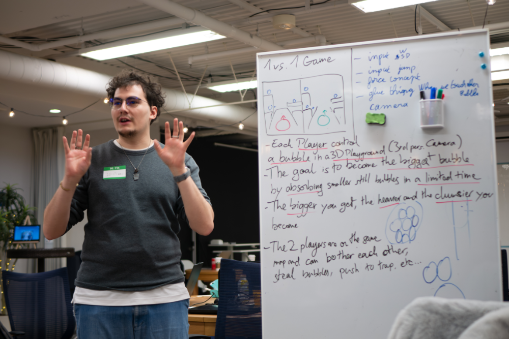

制限時間内にできるだけ多くのバブルを収穫するゲーム。物理演算や仕掛けがあなたの邪魔をするかも？

さて、どれだけのバブルを集められるでしょうか。

**エンジン:** Unreal Engine

([**Windows でプレイ可能。**](https://globalgamejam.org/games/2025/bubble-ultimate-battle-middleearth-5))

---

### Bubble Rumble「バブルランブル」

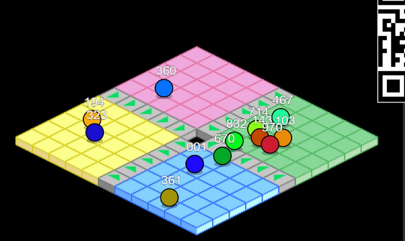

大量のプレイヤーが入り乱れるアリーナバトル！

あなたはあの「ふくらむバブルスーツ」を着て、対戦相手をアリーナの穴に押し出すのが目的です。

スマートフォンをコントローラーとして使用します。

**エンジン:** Web (JavaScript)

([**bubblerumble.funでプレイ**](https://bubblerumble.fun))

---

### What is it like to be a bubble?「バブルになったらどんな感じ？」

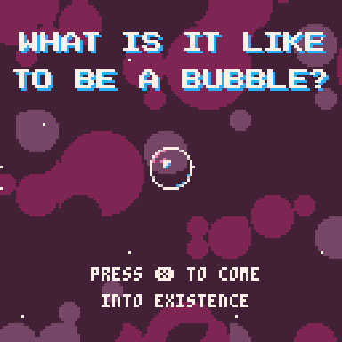

このゲームは、物理パターン、構造的意味論、意識の存在を探るメタ的な問いかけ。

そして、、、弾幕アクション🔥🔥🔥

**エンジン:** PICO-8

([**itch.ioでプレイ**](https://mabbees.itch.io/what-is-it-like-to-be-a-bubble))

---

### Bubble's Chance in HELL

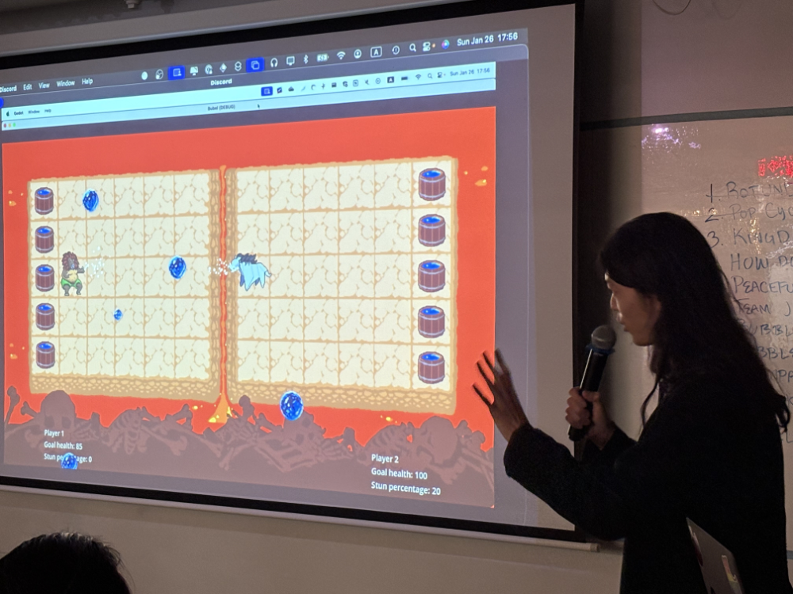

基地防衛 × バレーボール の融合！

最強のチャンピオンを選び、最も邪悪な武器、、、バブル から自分の陣地を守り抜け！

([**itch.ioでプレイ**](https://jaysc.itch.io/bubbles-chance-in-hell))

---

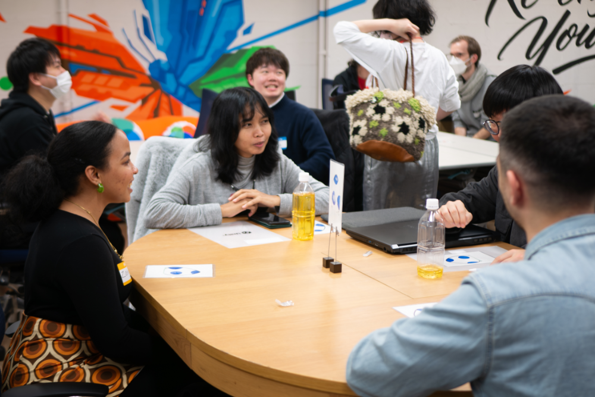

イベント開催にあたり、Code Chrysalis には素晴らしい会場を提供していただきました。特に今年は、録音ブースなどの設備が充実していたおかげで、多くのゲームにサウンドが実装されました。また、Unityからはフォルダやペンの提供も。

ご協力いただいた皆さん、本当にありがとうございます。

会場では 日本語、英語、フランス語、韓国語 が飛び交い、日本語ネイティブが約3分の1、バイリンガルが多数派、英語のみの参加者も少数ながらいました。まさに国際色豊かな環境でした。

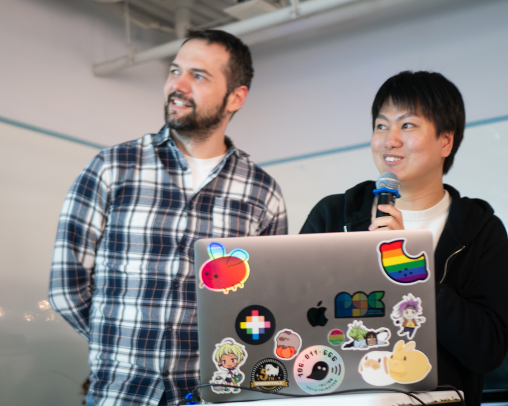

何人かの方に「どうやってこの環境を作ったの？」と聞かれました。確かに、私たち運営が意図を持ってデザインしましたが、

最終的にこの場を作り上げたのは**参加者の皆さん**です。楽しむ心を持ってこの場に来てくれたことが、何よりの成功要因でした。

このジャムの設計について、**より多言語対応に、初心者に優しく、そして楽しいイベントにするための記録**を
今後、他の運営者向けにまとめる予定です。

## Let's Games! Tokyo ポリッシュパーティー

イベントの延長として、3月1日 に「ポリッシュパーティー」を開催予定です。この日は、開発をさらにブラッシュアップし、カジュアルな雰囲気で再デモを行う日です。会場は現在調整中ですが、**Let's Games! Tokyo 2025の参加者は無料で参加可能**です。

詳細はDiscordやニュースレターでお知らせします。よろしくお願いいたします。

([**ニュースレター登録はこちら。**](https://buttondown.com/ggjtokyo))

---

## サイトの未来

この場を、これからも続けていきたいと思っています。

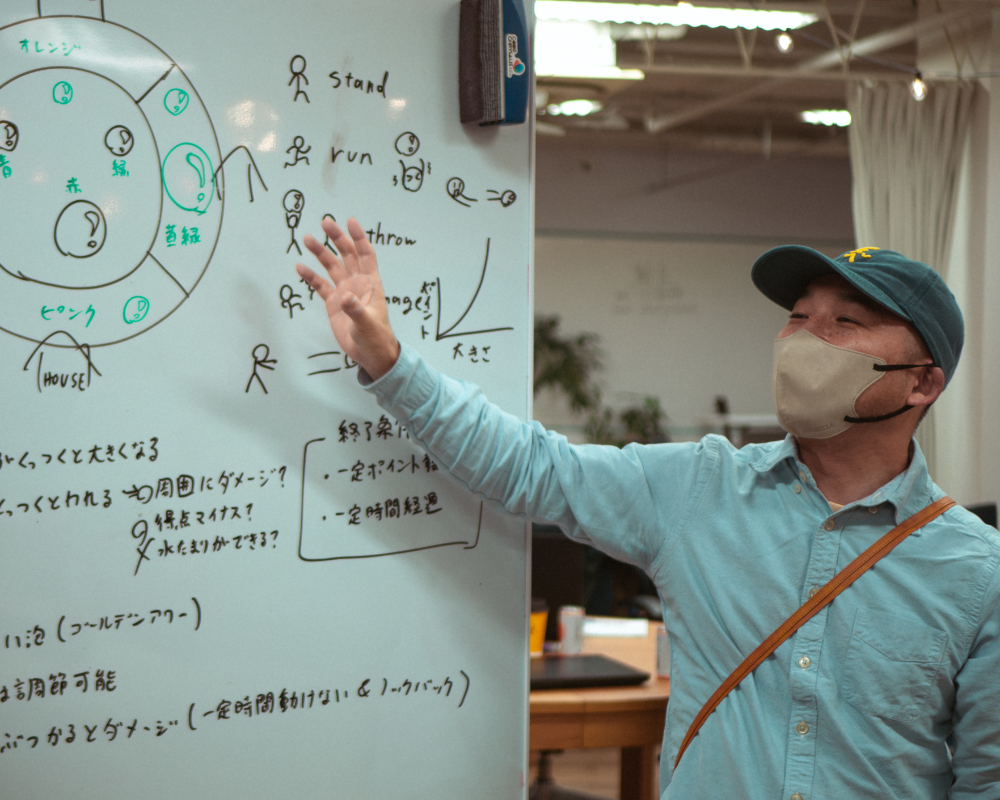

ただ、現状では私が運営の多くを担当しているため、もし私が体調を崩したら、、、その年のジャムが開催できなくなる可能性もあります。そういう心配がありますね。

幸い、これまでは問題なく進められましたが、今後もずっとそうでいられるとは限りません。

これまで参加した皆さんにお願いです！もし興味があれば、運営のボランティアを検討してみませんか？

あるいは、来年の共催者として運営に関わることも大歓迎です。オーガナイザーとして知っていることはお教えあげます。

次回のジャム開催日は**2026年1月30日〜2月1日**になります。

興味がある方は**illuminesce (@) pm.me**までご連絡ください。Discord に招待します。

最後に… 皆さん、おめでとうございます！

あなたはゲームを作りました。

それが 奇抜でも、未完成でも、実験的でも 、あなたが作ったのは紛れもなく「ゲーム」です。

自分を誇りに思ってくださいね。

また、会いましょう！

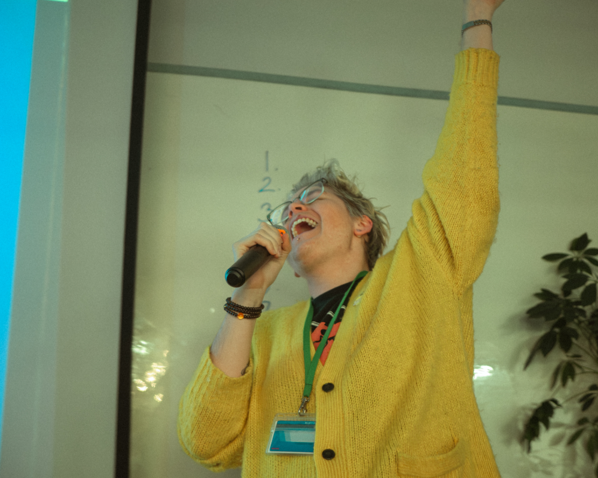

([**2024年のLet's Games! Tokyoのアフターレポートはこちら。**](/blog/posts/2024-02-07-GGJ24-Report-JP))
