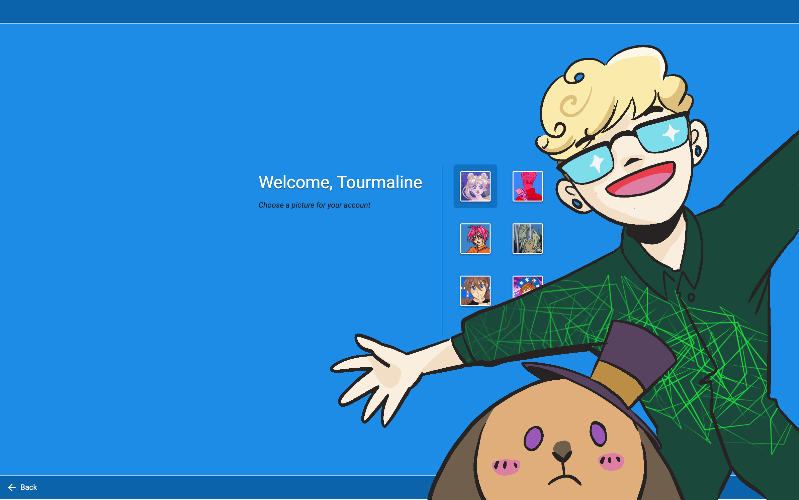

You might wonder why, as a gamedev, I don't post a lot of gamedev updates here.

Well, acutally...I have a terrible habit of posting things in different places and never relinking them. Around the time cohost closed, I started a [Studio Terranova newsletter](buttondown.com/studioterranova/), which I've been updating once a month. 

I talk about gamedev, what mabbees and I have cooking (a lot) and other updates.

[Here's the most recent February update](https://buttondown.com/studioterranova/archive/our-work-on-terranova/) on coming to COMITIA this month, organizing Let's Games! Tokyo and translating Terranova into three languages.

We have 10(!) subscribers, which I think is super neat. If you're already subscribed, thank you!

If you want to subscribe, here's the form.

[**Subscribe to the Studio Terranova Newsletter**](https://buttondown.com/studioterranova#subscribe-form)

I still will primarily use this blog to post on personal topics, interface dramas, and tech in general, but the newsletter is a quick overview on what's happening game-wise with our cooperative, Studio Terranova.

I'll try to cross-post more here, too. C:
