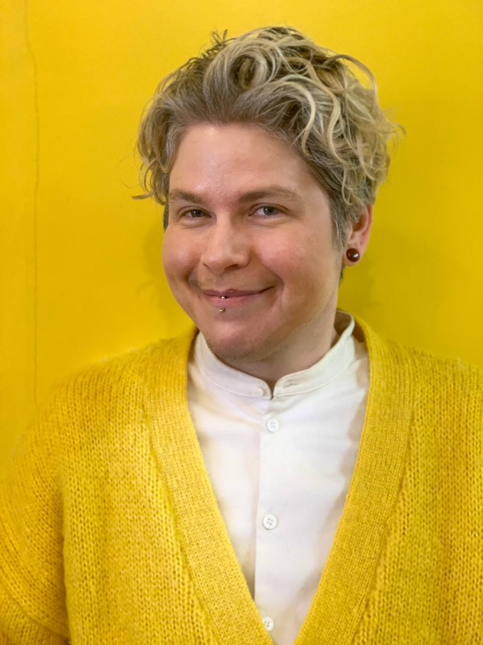

I’m having déja vu again.

“So you’re with a ***man*** now,” a woman from my LGBT support group repeats. “And you were dating a ***woman***.”

“Yeah. Can I still…attend?” The words feel dry, like cotton. I’m sixteen.

“Well, you’re on the other side now. I don’t think…we have a lot in common,” she says, slowly. It’s clear she doesn’t know how to directly say it, so my insecurities say it for her. *“I don’t believe you’re serious about this. About being **really gay**.”*

How ***real gay*** do I have to be to claim an identity?

I’ve wondered this, too, about being nonbinary and trans. Does ten months on T mean I can *really* claim being “male” or “male-like?” Do I even *want* it? The benefits are great, sure, but at the cost of emotional intimacy?

Well, worry not, because Trump has decided that for me.

I’m writing this after [Trump’s executive order](https://www.whitehouse.gov/presidential-actions/2025/01/defending-women-from-gender-ideology-extremism-and-restoring-biological-truth-to-the-federal-government/) declaring “the United States recognizes only two sexes” and mass confusion and fear around transgender, nonbinary and intersex folks’ ability to get their passports renewed with their correct gender designation.

Some trans folks who are getting their passports renewed have been forced to renew with the sex on their birth certificate, despite not presenting this way at all. Others are trapped in limbo, [with agencies holding or not issuing passports](https://www.vox.com/politics/399502/transgender-passports-lgbtq-trump-marco-rubio-travel-gender) despited proper procedures being followed.

From the above Vox article,

> *This fear is not theoretical. “Any time you need to show multiple forms of identification, and this is especially true when you are traveling abroad, you might be accused of fraud if there is a mismatch,” said ACLU attorney Aditi Fruitwala, who added she’s already spoken with a trans person who recently faced hostile questioning like this from a US passport officer.*
>

As someone who frequently travels abroad, reading this, it hit me—my ability to travel freely relies on whether the US government thinks I am real or not.

Am I real enough to get a US passport?

This time, I don’t waver. My insecurity doesn’t interrupt.

I *am* real.

This is about as real as I’ve felt in my own body in ages.

### Where’s the “tape your bro to the wall” energy?

I joked in [my previous update](/blog/posts/2024-07-09-Hormones-Retro) that perhaps testosterone would make me hyper and stupider. If anything, I think clearer; I’m calmer. I attribute this to the release of dysphoria’s grip on me and the privilege I’ve gained being perceived male(ish).

I wouldn’t say I *pass*—nor is passing the point. It does have its issues, though.

I’ve found myself reluctant to go in either the women’s toilet *or* the men’s toilet.

The women’s because I’ve been forcibly dragged out two times now from a well-meaning older lady who thinks I’m a stupid, foreign man.

The men’s because there are usually only two stalls and the average shit seems to average around twenty minutes.

Right now, gender neutral, single-stall toilets are a blessing.

### There’s been a lot of physical changes

T has been called a “second puberty” and it’s not far off.

My voice has become smoother and silkier and cracks when I’m excited. I’m doing some voice training, which involves me singing or humming a little every day. This is a nice habit; it lifts my spirits.

I have facial hair, but it’s the weird scraggly kind only a thirteen year old would be proud of. As a nonbinary person, I thought I’d hate the scruff, but it’s not bad. For now, I shave. Many thanks to my partner for teaching me the proper technique so I don’t get razor burn.

Fat redistribution has finally started. My neck, and my body in general, has gotten thicker. My muscles are far more noticeable now.

The body image I expected prior to starting T isn’t what I have now. Despite my expectations being different from reality I’m very pleased. I’ve gone through some weight swings from being fat to being unhealthily slim—now I actually *feel* and look healthy. When I was slimmer I used to worry about staying thin because the more weight I put on, the more feminine I looked. Now that my baseline is masc, I don’t panic if I gain a few kilos.

I’m pleased because for the first time I feel a certain warmth and ownership over my own body and its quirks. Like I want to take care of it.

### Joy is not a spoil for the victor

I’ve been on social media too much recently.

What’s happening in the States right now outrages and exhausts me. I can’t see a way out where it’s not going to torment and hurt me and the people I love. Some days I make dark jokes, some days I doomscroll.

But recently, I’ve been increasingly upset. At the news, yes—but at myself for allowing myself to be consumed by it. I said before I now want to take care of my body. That applies to my emotions as welll. I’ll be damned if I let myself be paralyzed or guilted into not experiencing day-to-day joy.

To quote [Judith Butler](https://www.theguardian.com/commentisfree/2025/feb/06/trump-sadism-judith-butler),

> Those who celebrate [Trump’s] defiance and sadism are as claimed by his logic as those who are paralyzed with outrage.

Perhaps it is time…to find passions of our own: the desire for a freedom equally shared; for an equality that makes good on democratic promises; to repair and regenerate the earth’s living processes; to accept and affirm the complexity of our embodied lives; to imagine a world in which government supports health and education for all, where we all live without fear, knowing that our interconnected lives are equally valuable.
>

Joy is not a spoil for the victor, nor something that must be permitted in order to be felt. In fact, joy can be resistance, and revolutionary.

I want to disconnect myself from this sadism and create spaces where our lives are equally valuable. Where government and infrastructure supports us, not neglects and scams us.

### Speaking of action

This is a reminder to you, reader, and to me, we can write a love letter to a trans person in Texas right now, through the [Transgender Education Network of Texas](https://www.transtexas.org/love-letters).

Lambda Legal fights legal battles for LGBTQ+ rights in the US, and we [can donate a gift](https://lambdalegal.org/ways-to-give/) (or if you’re flush with cash, attend an event).

And if you, dear reader, are in Tokyo…

- [namnam](https://lambdalegal.org/ways-to-give/) is a queer, anarchist space that has a mask policy for you to get together and organize with queer folks in person.
- [Pride House Tokyo](https://www.instagram.com/pridehousetokyo/?hl=en) is running events and needs your donations/support.
- [Blackbird Eatery](https://www.instagram.com/black_bird_tokyo/?hl=en) is a queer owned space with lots of cool events.
- [Queer Social Japan](https://www.instagram.com/queersocialjapan/) is an English-speaking casual queer hangout with open mic nights and board games

When I hear, “get close to your community” I don’t picture Twitter or Bluesky followers. I picture deep conversations, in person or on private Discord chats. I picture knocking on your neighbor’s door with snacks.

That’s what I’m looking forward to in the coming months—finding joy with people in spaces where they can exist as real people, not as a belief, or as an avatar or as a flattened version of themselves.

I’m not sure how to end this. In fact, this update doesn’t much feel like an ending, but rather a beginning.

A welcome, if you will. To a more real body, a more real experience of the world, and a growing wish and desire to take care of those precious things.

---

### Related Posts

- [I started hormones](/blog/posts/2024-01-16-I-started-hormones/)
- [Four months on testosterone](/blog/posts/2024-07-09-Hormones-Retro)

See all posts tagged [LGBTQ+](/tags/lgbtq/).
