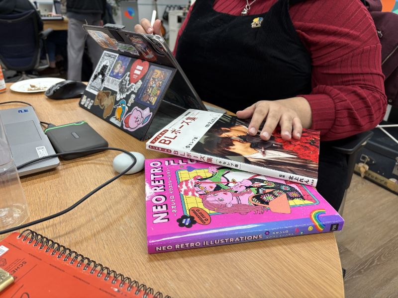

CJ here, the programmer for [Help! I was cursed with a Bubble Butt](https://illuminesce.itch.io/bubble-butt). Thank you for everyone who has played our game!

The game was made for this year's Global Game Jam at the [Let's Games! Tokyo site](/blog/posts/2025-01-29-GGJ25/) in Japan. The theme was "bubble." [**Ceren**](https://x.com/cerengunes) was the game designer and lead sprite artist, [**Kyle**](https://bsky.app/profile/mrkn1v3s.bsky.social) was our designer and lead writer, and I was the lead programmer and background/cutscene artist.

This week, when we showed the game at Tokyo Indies, someone asked me "how did you come up with this idea?"

I didn't. That credit goes to Kyle and Ceren.

I yelled to Kyle and Ceren, **"Butts!"** before getting pulled away (I was organizing the site)—they were the ones who riffed off each other and came up with the hilarious scenarios. Kyle wrote the script in a night.

We looked at a **lot** of ass-related content on Instagram. My algorithm has now been irreversibly peached. 🍑

We used Ren'Py, Procreate, Affinity Photo, Motiv Audio and Audacity to make the game and Discord/GDrive to share assets.

This was the first game I worked on as a lead programmer—it was a really fun role. I had programmed a few simple Ren'Py games before this, so I had a general idea of what I was getting myself into—and [**mabbees**](https://mabbees.itch.io/) has been a good teacher for showing me how to be a good programmer who takes risks and tries their best to implement the spirit of the game—not just literal features. "Just features" aren't fun, and games are supposed to be *fun*.

---

## Some learnings from Bubble Butt

These are some specific learnings for Ren'Py in particular—if you're working on a visual novel, these might be useful to you, too.

Ceren and I decided ahead of time the image and resolution size of both the cutscenes and the sprites, and made them as presets in Procreate. We tested the sizing out with some sketches first to make sure we got it right before moving into sprite creation. This saved us a lot of time later.

It was Kyle's first time making a game, so I sent him the "tutorial script" of the default Ren'Py script to help him visualize how the script would look in code.  Ren'Py's script is very "human readable"—it looks a bit like a movie script. When he sent me the script back, there were notes on when each of the characters' facial expressions should change, which was *immensely* helpful when implementing the script—I didn't have to think about anything, just copy/paste and reformat some of the spacing to fit the Python syntax.

The biggest difference between this game and my previous games was that I understood that Ren'Py's actual documentation is terrible to look at and rather to look on the [Lemmasoft Forums](https://lemmasoft.renai.us/forums/) or [/r/renpy](https://www.reddit.com/r/RenPy/) for help. If I wanted to know how to implement an if statement where it checks a variable, sees if it's above a number, and then takes the player to a certain section, and I went to the Ren'Py documentation on *Conditional Statements - If*, I would find this:

> *Ren'Py includes several statements that can alter control flow based on expression values. This is in addition to the jump, call and return statements, which transfer control unconditionally.*

How does this help me with my problem?

It's only when I successfully implemented multiple *if* statements that I understood this—this is an introduction to what an if statement is—and the fact it can jump to or call different sections, or end the game (return). In fact, it's not useful to my current query at all.

Ren'Py doesn't use .wav files. That one caused me some confusion for a while, but we fixed that with recoding the audio to .ogg.

The next Ren'Py game I'll be working on is brushing up the prototype version of [The Frontier](https://illuminesce.itch.io/the-frontier). I'm really looking forward to implementing more complex features there—in particular, mabbees and I have been poking around with Live2D to do subtle animations in the player sprites.

## In closing...

My teammates were great. Thank you Kyle and Ceren. In the future, we'd like to polish this a wee bit more; add a few sprites, maybe some new cutscenes and have this be a fun silly game for folks to play and stream.

And if you do stream it, please put a link in the comments below!

---

### Related Posts

- [Keep Center Postmortem](/blog/posts/2024-07-01-Keep-Center-Postmortem/)
- [GGJ 2025: After-Report](/blog/posts/2025-01-29-GGJ25)

See all posts tagged [Video Games](/tags/video-games/).
