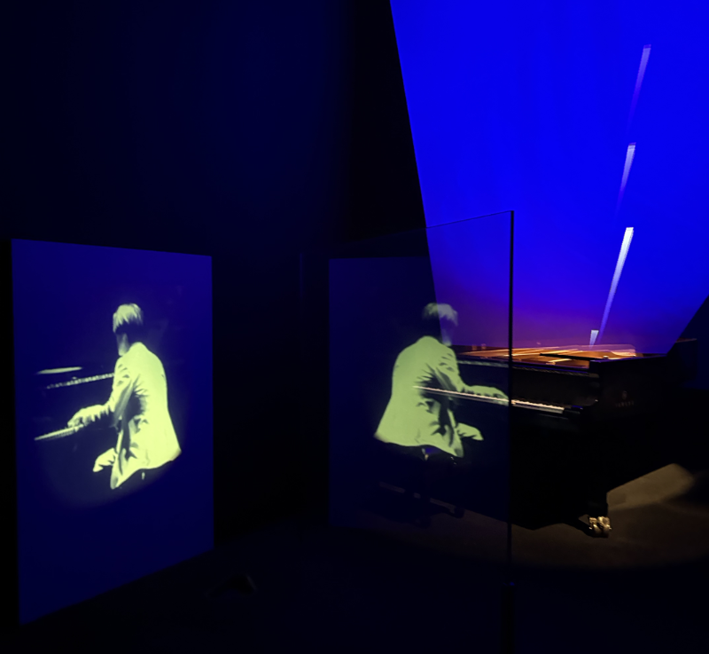

Last week, I saw [*seeing sound, hearing time*](https://www.mot-art-museum.jp/en/exhibitions/RS/), an interactive art and music exhibit dedicated to the late Ryuichi Sakamoto, a talented musician, collaborator and artist. This March marks the two-year anniversary of his passing after a long fight against cancer.

I cried when I heard the news. His music had a huge impact on my life.

*seeing sound, hearing time* was a movie played backward in slow motion. At the end of a long, dark hallway, a short, black and white film of an old man played. A pained look on his face, he dipped his gnarled, trembling hands in water, again and again. Ambient music flooded the room, punctuated by a synthesizer’s drawn-out wails. The moment my breath synced with the flow, the synth wailed and the hairs on the back of my neck would stand straight.

Unnerving, discordant, dark—standing pools of black-on-black punctuated only by drips and ripples.

「触らないで」A mother chided her son. “Don’t touch.”

He was reaching out to dip his fingers into darkness.

Suddenly—*plop!*

He drew his hand away. The group gathered around the piece as more drops *plip-plopped,* sending shuddering ripples across the surface. One us looked up—then the rest, trying to grasp what had happened.

It was raining. From the ceiling.

Or rather, a machine *attached to the ceiling* was slowly dripping water into the basin.

The sense of awe spread through our murmured whispers.

I first heard Ryuichi Sakamoto’s work when I was fifteen. I stumbled on it completely by accident. At the time, I was a teenager hopelessly obsessed with a *boy’s love* manga about rock stars that featured a *Sakuma Ryuichi*.

Searching Ryuichi’s name was how I found the real life rock star. The song was *Merry Christmas, Mr. Lawrence.*

When I first heard the tinkling of soft, careful piano keys, I imagined myself sitting in a candlelit window watching snow gently fall. The song was warm and comforting and wistful in a way that captured my heart.

Sakamoto’s music demanded my full attention as each note he played was a brushstroke in my mind. I was enrapt.

The exhibits didn’t just feature Sakamoto but the artists he’d worked with throughout his life. Each of the artwork had its own unique flavor—like Apichatpong Weerasethakul’s grainy video footage in [Durmiente / async](https://akeroydcollection.com/works/durmiente-and-async), a collaboration between him and Sakamoto. The sun sets and Tilda Swinton falls asleep, again and again.

Water, fog, and movement were strong themes throughout.

I noticed something about how the way smoke would curl at the top of a vessel, or the way the water would ripple across a surface would catch one person’s attention—then two—then three. A sense of awe  spread through the room.

We rounded the corner to Sakamoto’s personal inspirations. Kurt Vonnegut’s Slaughterhouse Five, Andrey Tarkovsky’s Solaris, Debussy and Cage. His personal notes were so succinct and powerful, written on neatly stacked notecards. “1975—Saw a movie today. Was like a photograph. Like a memory I had forgotten.”

“Wow,” my colleague said. I looked over to where he was pointing.

A map, stretching across a ten-meter wall, of all of the projects Sakamoto worked on and who he collaborated with. Nodes connected by spidery legs to nodes to nodes. Clusters indicated strong connections—the Yellow Magic Orchestra, David Bowie, various filmmakers. His work stretched across genres, inspiring artistic collective Dumb Type and visual kei band LUNA SEA.

The [Tohoku Youth Orchestra](https://tohoku-youth-orchestra.org/en/our_story), which he helped found in the wake of the Tohoku Earthquake for kids affected to continue to experience and express themselves through music. Two days after he passed, I read, the Youth Orchestra assembled for a celebration of his life.

He touched so many lives—not just my own.

The final room held a reproduction of Toshio Iwai’s and Sakamoto’s collaboration [Music Plays Images x Images Plays Music](https://webarchive.ars.electronica.art/en/archives/prix_archive/prix_projekt.asp%3FiProjectID=2494.html). A ghostly afterimage of Sakamoto is seated at the piano, gently caressing the keys. His projection is perfectly timed with the movements of a self-playing piano. It is as if Sakamoto is still in the room with us, entertaining us with a final concerto before the night’s end.

I wondered if Sakamoto, with his love of science fiction and experimental new technologies, imagined a kinder, gentler world than we presently can.

I didn’t know Ryuichi Sakamoto personally. He was likely, a flawed human than I give him credit for in this writing.

But I would like to live my life this way, as he did through this exhibit—to live on not only through my work, but through the lives of my talented collaborators. Imagining futures together that were bigger than the both of us. Giving kindness into the world not with the expectation that it would be returned in this lifetime, but that it would be paid forward. Again, and again, and again.

A wisened man dips his hands into the pool, and it ripples.

Infinitely ripples into the future.

I thought back to when I was fifteen and I played *Merry Christmas, Mr. Lawrence* on repeat, enrapt with my own mental picture of snow fall peacefully outside.

When I was a preteen, my aunt and uncle passed away very suddenly. When I was fourteen, my grandmother and grandfather passed within a week. Four family members, gone in such a short time. It was a huge shock. The joy had been sucked out and replaced with grief.

And I desperately wished someone to explain to me why kind people died. Back then, I had no way of asking about these sudden deaths that didn’t come off as naïvely cruel. I could only wish for the past to be returned. For my lost family members to be revived. Maybe then, the joy would, too.

But listening to this song… I knew if I were to turn around from the cold windowpane, the house inside would be empty, but warm. I couldn’t meet my family again. They were gone. But the house was inviting, and soon, it could be filled with laughter again. It helped me picture what that would look like in a time when things felt dark and empty.

Dark gives way to light. Light gives way to dark. Stillness to chaos, and back to stillness again. Ripples on the surface, skated by fingertips in fog.

I knew he was gone, too.

There was no one playing the piano. Nothing left but recordings and memories.

Nowhere else to go but forward.

So I stepped out of the exhibit, back into light.

---

### Related Posts

- [Remembering the Radical Roots of Interface](/blog/posts/2024-05-07-Radical-Roots-of-UI/)
- [2024 was the year of...](/blog/posts/2024-12-30-2024-Reflections/)

See all posts tagged [Design](/tags/design/).
