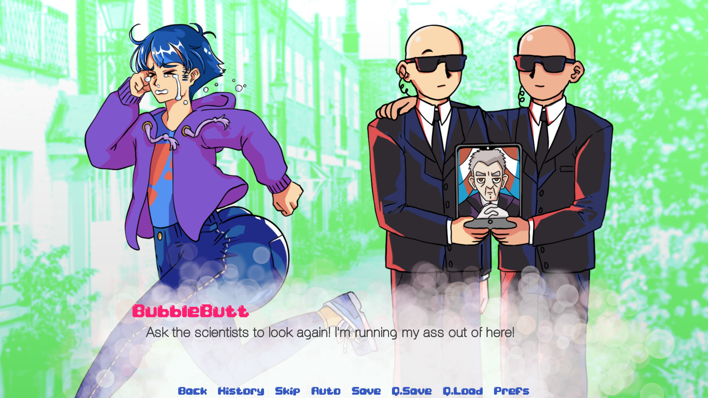

We didn't plan to put so much work and polish into this game. But in February, we saw how many people had downloaded the game and played it—and we thought—what the hell. If we're going to make a game about butts, better not do it *half-assed.*

## What's new in Bubble Butt 2.0?

🍑 All sprites have been completely redrawn and new poses added by Ceren

🍑 All-new cutscenes that puts your butt in the center of the action by CJ

🍑 New voice recordings by Kyle and CJ

🍑 New UI updates and overall color, audio and animation improvements

## Why is it $2.99 now?

We thought about it and decided that $1 per dev, split equally between the three of us was a reasonable price for a polished game with tons of butt puns that will make you and your friends laugh.

We all still laugh when we play this game, and we QA tested it!

$2.99 will also cover any future updates we have.

This was a group effort, and we're proud of it! We would love it if you supported us and our work.

Enjoy our cheeky game!

([**Buy it now for $2.99.**](https://illuminesce.itch.io/bubble-butt))

---

### Related Posts

- [Juicy Learnings from a Booty Game](/blog/posts/2025-02-20-BubbleButt-Postmortem/)

See all posts tagged [Video Games](/tags/video-games/).
