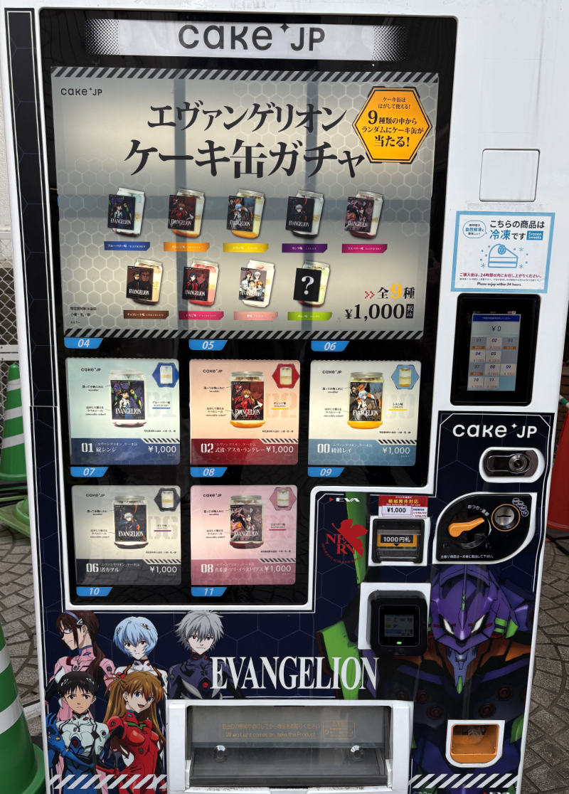
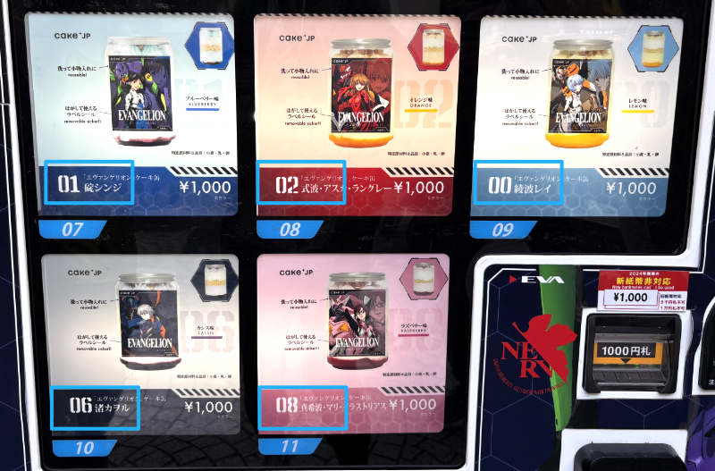
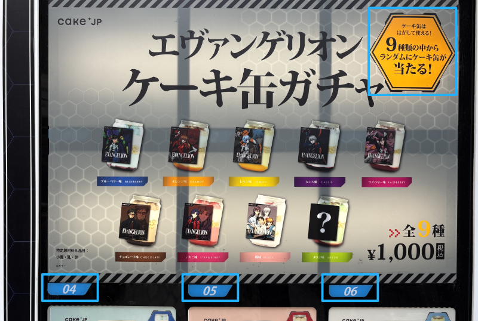
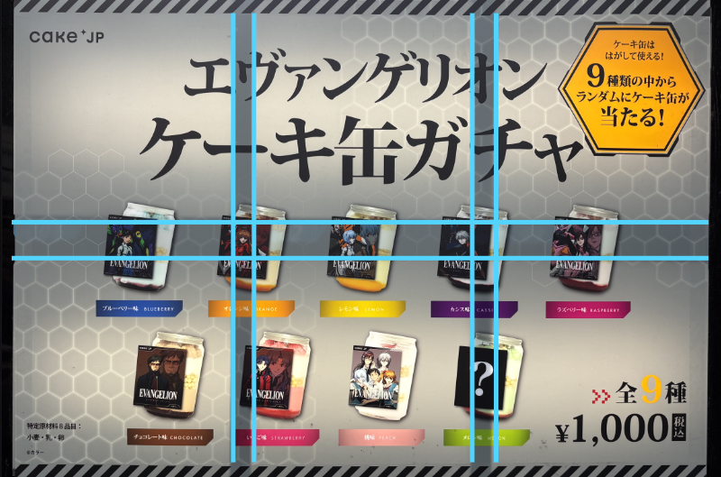
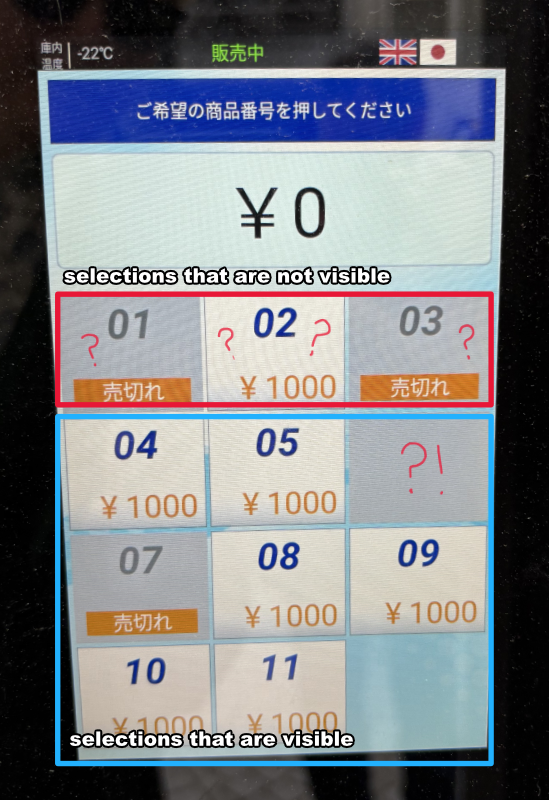

As I'm drafting another heavy blog post about de-escalation, conflict and abuse in niche communities, I thought folks would appreciate some levity.

Recently, I found a vending machine in Kichijoji that sells *Evangelion* cakes in jars. Well, cans, technically. It's a cake sealed in a hermetic chamber, much like Shinji himself.

It's one of the more unusual ones, like the natto, dashi, and [insect protein bar](https://semitama.jp/column/758/) vending machines. But that's not what troubled me, no.

Its information architecture was completely messed up!

## Wait...what?

[Information architecture](https://en.wikipedia.org/wiki/Information_architecture) is the structure and organization of various information such as headers, labels, and descriptions. It is commonly used to describe information in software or webistes. Have you ever wondered *why* a top-level navigation has the menu choices it has? Or why when you want to contact customer service, it's hidden underneath **My Page -> Account -> FAQS -> Customer Support?** The intentional organization of that information is information architecture, also known as IA.

Someone *clearly* wasn't thinking the design of this through. Why do I say that?

Let's take a closer look.

Zooming into the most colorful, and thus, most eye-catching part of the vending machine, we see the numbers 01, 02, 00, 06, and 08. I, as a fine purveyor of vending machine delicacies, know how to operate a vending machine - I look for a number for the product I want, and then I input that number. It took me a moment to realize that these numbers aren't selection numbers, they are the Evangelion *pilot* numbers. Shinji is 01, Asuka is 02, Rei is 00, and so on...

So those aren't the numbers we press to *select* the cakes, right? No. That would be 07 for Shinji, 08 for Asuka, 09 for Rei, 10 for Kaoru and 11 for Mari.

That's a bit confusing, but sure. So we can assume that selections 01~06 are for something else. Let's take a look at the second most eye-catching part of the vending machine, this large advertisement. It says there are, in total, nine designs. We previously saw five pilots before, so that means there are four extra designs we could get.

Below it are the numbers 04, 05, and 06, which is a total of *three* selections, not four.

Upon even *closer* inspection, the advertisement reads, "Get a random cake from 9 different designs!" So all three of these buttons are for a random cake jar, and the selections below are if you want a *specific* cake jar from the five pilots.

Poor Misato doesn't even get her own selector.

To recap, selections 04~06 will get you a random cake from nine designs, and selections 07~11 will get you a *specific* cake design. Selections 01~03 don't exist for some reason, even though all number systems typically start at 00 or 01 and I was expecting to be able to select something in that range.

Being a product designer, I inferred at this point that the reason why selections 01~03 didn't exist was because for some reason, the vending machine company's selections were non-customizeable. If you look behind the advertisement you can clearly see that this vending machine has slots for eleven products, and someone decided to take up six slots with this big advertisement that doesn't even stand out as much as the individual selections.

At this point, I thought this was very poorly designed, seeing as someone who *isn't* a product designer would perhaps not know that there is a constant negotiation between the visual designer and the hardware/function designer on how to display information on a physical object. Unlike in software where we can write a line of code to make a button, adding a button in hardware requires re-measuring re-tooling, and potentially re-prototyping which costs far more time and money than software.

I already thought the information architecture here was inscrutable, but oh, dear reader, I was not ready for what was next. Let's say I have figured out what cake I want (in my case, Kaoru's Cassis Cake) and wish to purchase that cake. I simply go over to the pin pad and enter my selecti---

?!!

01 and 03 are 売切れ, sold out, which...if you squint, makes sense. They cannot be selected, so logically I thought this meant the software of the vending machine only had two states -- "selling" and "sold out" -- so if I wanted to mark something as unavailable, I *might* mark it as "sold out."

But what happened to 06?! 

There's a blank spot where it should be. Does that mean there *is* an option to turn off selections, but the person who set up the machine decided to only turn off 06, which, by the way, according to the front of the machine *is a visible selection* and *not* 01~03, which are *not visible?*

Speaking of 01~03, according to this pin pad, there is a secret, unlabeled button, 02, which is not visible on the machine but *is selectable.* Nothing about this makes sense except for selections 07~11. I doubt selections 04, 05, and 02 will sell anything because no reasonable person would know what the hell they were getting.

## How would you redesign this?

Were I to redesign this vending machine, I would do so this way:

This not only utilizes the space that works within the bounds of the hardware, it also allows people to choose by either character or cake flavor. While Misato and Gendou may not be the most popular characters in Evangelion, in cake form, [strawberry and chocolate are some of the most popular cake flavors](https://ranking.net/rankings/best-western-confectioneries).

I gave Shinji, Rei and Asuka two selections, since they are the most visible characters from Evangelion and are likely to sell out more than the other pilots.

Should people be interested in a "lottery" for a chance to win the peach or the melon cake, they still can, though at the bottom since most people will choose to get favorite character over the *possibility* of getting their favorite character. This is, admittedly a hypothesis of mine - so this would need to be tested.

I could also set all selections to a random cake selection, and this would also be passable. In addition to the singular characters, there is still peach cake (of all five pilots) and a mysterious character melon cake. The surprise of the peach and the melon cake *might* be enough to draw people to chance the lottery.

---

### Information architecture is neat

Information architecture helps us make informed decisions about our day to day lives, such as, in a very specific scenario selecting our favorite character's cake jar from a vending machine. It's something I can't stop thinking about when I'm encountering information - asking why things are organized in the way they are.

I'd like to have a word with those cake.jp designers.

---

### Related Posts

- [Book Recommendations for UX Designers](/blog/posts/2023-09-12-UX-Book-Reccs/)
- [Thoughts on the Patreon Rebrand](/blog/posts/2023-10-05-Patreon-Rebrand/)

See all posts tagged [Design](/tags/design/).
