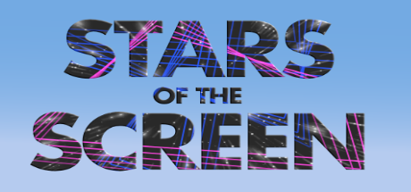

Hello everyone! It’s CJ.

After a many-months hiatus, the Interface Drama Master List [has been updated again](https://illuminesce.net/interface-drama)! In 2024 mabbees and I founded [Studio Terranova](https://studioterranova.net/), a design + games cooperative, and that consumed the majority of my time. Please check the newly added **"most recent"** tag for five new updates.

I'm especially pleased about Stars of the Screen and i'll respond to that later. Stars of the Screen is the first interface drama on the Playdate to be added to the list, and i'll respond to that later is the first bitsy interface drama added to the list.

BáiYú reached out to mabbees and I for a collab on this LITHOBREAKERS essay on [How to Make Your Own Interface Drama](https://lithobreakers.itch.io/super-titillating-feral-union/devlog/899123/bangers-101-how-to-make-having-a-good-time-easy). It has some **excellent** info on how to make your own interface drama, whether it be in Unity, web programming, Ren'Py or more.

---

Thank you to everyone who has added to this list or made suggestions while I was on hiatus. I am overwhelmed with the amount of suggestions I’ve gotten through our Discord or through the submission form.

For those who have come to this list for the first time, welcome! If you don’t know what an interface drama is, in short—they are games that mimic software to tell stories. [Here’s an FAQ to get you started.](/blog/posts/2023-08-15-Interface-Drama-Master-List/) I’ve written on various themes of interface dramas.

I've been thinking a *lot* about this genre in the past months. So much so, I'd like to hear from those of you who have already played some of these games.

- Why are interface dramas personally interesting to you?
- Do you think they tell stories that couldn’t be told otherwise? Why or why not?

You can write your response [on our Discord](https://discord.gg/NUg8ny8Qv2) or comment below.

I’d like to use your thoughts, as well as my own to talk more in-depth about why this genre is special—and yes, I would say a radical—use of interface.

If you’d like to follow our studio and the work I’m doing on interface dramas, you can either:

- Join our [Discord](https://discord.gg/NUg8ny8Qv2)
- Sign up for our [monthly newsletter](https://buttondown.com/studioterranova)

Thanks for all your suggestions, and I look forward to hearing from you!

---

### Related Posts + Links

- [Interface Drama Collection on itch.io](https://itch.io/c/3586703/interface-drama)
- [Indie Games of Cohost: CJ from Studio Terranova](blog/posts/2024-05-18-Indie-Games-of-Cohost/)
- [Interface Drama FAQ](/blog/posts/2023-08-15-Interface-Drama-Master-List/)

See all posts tagged [Interface Drama](/tags/interface-drama/).
