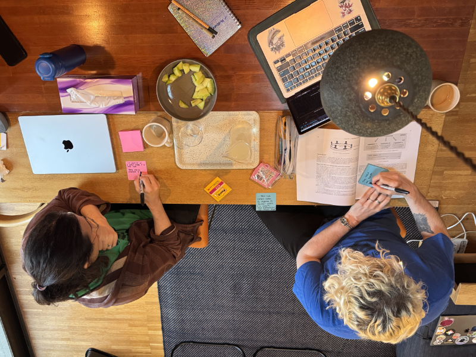
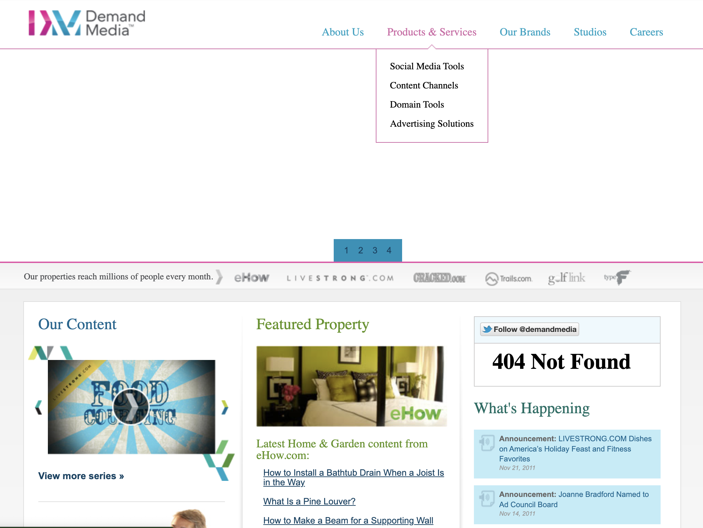
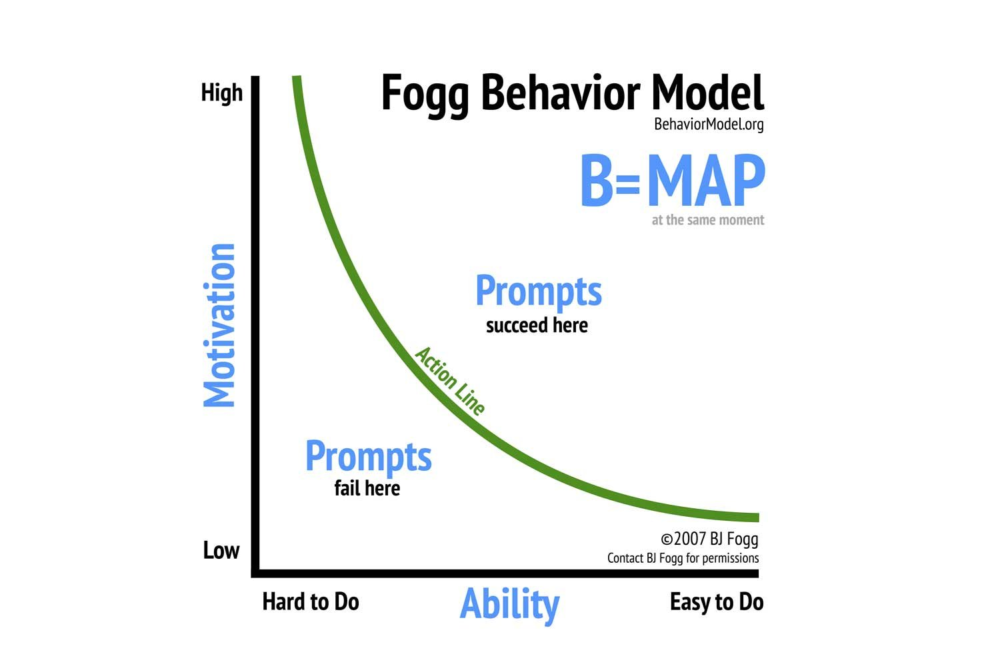
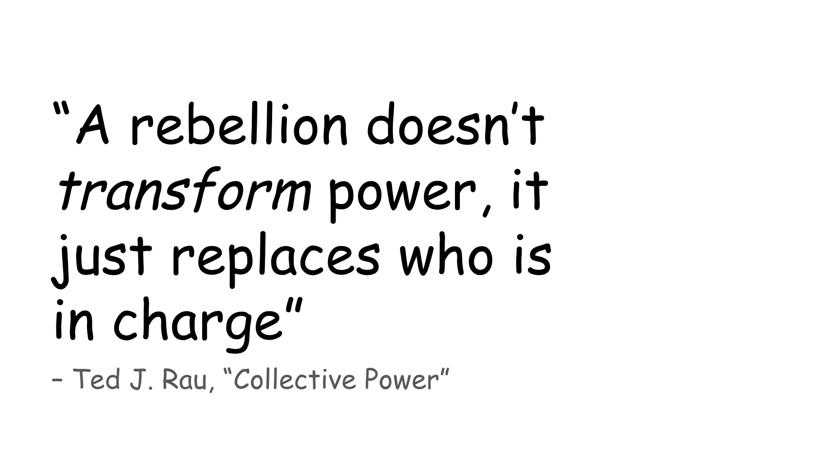
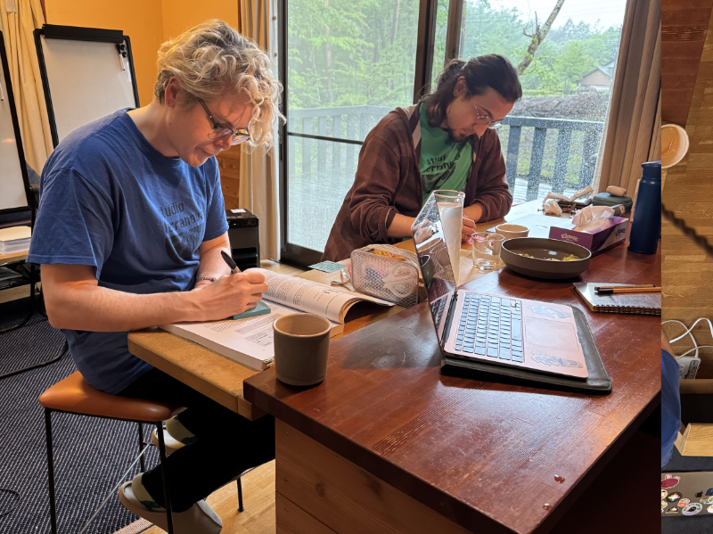

Though I normally post about games and fandom on my blog, this post is geared towards technologists and managersworking in the private sector who are looking to build more cooperative and consent-based models of decision making in their work and personal life.

mabbees and I cofounded Studio Terranova last year. We are two freelancers who work on games—we thought forming a studio would be a good way to maintain financial stability and continue to self-publish our games. As per our values, we are a cooperative and are in the process of amending our bylaws and governance to abide by the rules of the [International Cooperative Alliance](https://ica.coop/en).

This is a small peek into our journey of doing this.



In early June, I had the pleasure of organizing our company retreat. It lead to some revelations about the way we see our future as tech workers and indie game devs in this new era.

In the mid 00’s when we entered tech, mabbees and I truly believed internet platforms could become “the great equalizers.” With social media, undiscovered artists could be discovered. With Kickstarter, niche projects could be funded, and with AirBnB and Uber, anyone could turn their home or car into extra income. We were told that our work would help people, and we believed it.

While we designed systems to be seamless and engaging, amongst fellow techies there was talk of adopting [digital minimalism](https://medium.com/swlh/digital-minimalism-how-to-simplify-your-online-life-76b54838a877) and [putting our devices in lockboxes](https://www.nytimes.com/2019/02/23/business/cell-phone-addiction.html). We slowly started to notice a cognitive split—from the egalitarian world we wanted to live in to a world where the companies we worked for accumulated more and more wealth utilizing users’ data or low-paid contractors.

We wondered—how can we place our hopes on tech to revolutionize the world if it is built on unsustainable accumulation of wealth? Who is our technology giving power to, and who is losing power because of it? Is a society that values accumulation of individual power one we ***personally*** want to live in? One we want our children to live in?

In asking these questions, I stumbled upon sociocracy in a very unexpected place.

I learned that sociocracy is a type of decision-making process (also known as “governance”) made with the understanding that power, like water, if designed in a way that flows equitably, can give all members of its organization decision-making power.

That’s when it clicked for me—a system that doesn’t share power will, **by design,** build products that allow it **to hold onto that power for as long as it can, whether that be our wallets, our data, or our attention spans.** Holding on tightly to power does not serve our clients, our players, the community, or the world. It is not sustainable nor future-thinking. We wanted something different.

We wanted to try out sociocracy with the hopes it would change the way we thought; to re-energize us into a more cooperative mindset and be able to see the future outside of grim headlines of massive layoffs and displacement. We took a week and travelled to the mountains of Yamanashi, undisturbed by the hustle and bustle of the city, to put into words our cognitive dissonance with the current state and establish a new way of governance.

Below, I’ll share:

- why the old ways of doing business don’t work anymore
- how I came to learn about sociocracy
- some basics to setting up an organization with sociocracy and
- our learnings from our retreat

I hope you’ll be inspired to read more about this framework and try it out. Note: Sociocracy isn’t paying me to write about this, I just really have been enjoying using it in both volunteering and work so far.

We’re about to get deep into the weeds of how organizations are structured and how they make decisions, so...


## Why we're tired of the old ways

Herbert A. Simon, a major influencer in the field of human-computer interaction and artificial intelligence had this to say about decision-making in the late 90’s:

> *"[In order] to write about organizations, you had to write about decision-making process, and that was the heart of it… Modern economists think they can build theories without going out and inquiring about what human beings actually do."*

> Herbert A. Simon, (1998)

Simon’s initial work was on organizational structures in business, which then became the basis for how people and computers should work together. I mention this because lately the fields of computer science and artificial intelligence have been talking about transcending humanity when it, as a field, **was heavily influenced by the study of groups of people working together.** “The computer” or “The AI” is not an entity that stands on its own two “feet” as it were; it is deeply intertwined and enmeshed with the logic (or illogic) of how people make decisions, regardless of how sentient it appears.

Technology as being made by people and thus, having the same fallibility as people is both a mundane observation, and one that goes against a certain CEO-as-infallible rhetoric that we as a society can fall prey to. [Cennyd Bowles](https://cennydd.com/writing/datafication-and-ideological-blindness), a prominent technologist and ethicist, has spoken about this at length in his work, so if you still have doubts, I encourage you to read his blog.

So let’s say you believe me—if the way computers make decisions are intertwined with the decision making processes of people, who makes decisions in private tech?

The hot topic around the time I entered the field of design was ***who had the authority to implement and sustain design decisions***. Designers at the time were suffering from being seen as “just workers”—so leadership would make strategy decisions that would affect design—say, splitting the business into five separate properties and then asking for each of those properties to have their own section of the homepage—and then this decision would trickle down to designers.



> *Demand Media was a media company who, circa 2012 rocked a carousel and three-column layout showcasing various unrelated articles from different properties.*

> *Back in the day, if there was too much content the business wanted us to show, we’d use a rotating carousel to show it all. (via [Wayback Machine](https://web.archive.org/web/20120103145450/http://www.demandmedia.com/))*

Designers lobbied hard to “have a seat at the table” in these strategy meetings—that is, to be in the room where the decisions were being made by leadership so they too could have a voice.

Some senior technologists—myself included—finally *did* get their seat at the table. With our voices, we convinced business owners to simplify and to make their processes more streamlined, seamless and friendlier. This was seen as a net positive at the time; but after a few years of the trend shifting towards increasing simplicity, [companies started using design to streamline users to click on or buy things they didn’t want or need.](https://evilbydesign.info/sloth/path-of-least-resistance/)

It became a joke when we “couldn’t remember what we ordered on Amazon” despite having ordered it ourselves—the process was just so seamless.

What followed was a slow slip of design’s human-centered vision from “reducing clutter and design friction to do right by our customers” to “how to increase engagement and trigger desired behavior in users.” The more we framed our work as how we would “encourage” people to do things differently for the sake of monetization, the less human-centric we became.



> *The BJ Fogg model. It is a model of human behavior that explains how people take action on something - that is, to make someone take action, you should make it very easy for them to do and make sure they are motivated to do it. This can mean making a good product that people like or, 'I need this product, and it has been made unusable by ads unless I pay for it.' Both are effective motivators, but only one is ethical.*

We got our seat at the table, and in doing so, were shared a small piece of power—but, in my opinion, it was not worth what we had to give up.

In our focus on “the user” we found ourselves in the position of someone who could potentially manipulate others through psychology and behavioral economics.

> *“Golden Krishna, an expert in user experience who currently works on design strategy at Google, astutely pointed out during one of our conversations that the only people who refer to their customers as “users” are drug dealers—and technologists.”*

> Manoush Zomorodi

Most technologists I personally know are kind people. They got into tech for the same reasons I did; they wanted to build cool things and use their skills to make a difference. But while the tech industry overall talks a big game about saving the world, I rarely saw it intersect with the world of activism, transformative justice, and worker’s rights—things that have historically been at the forefront of culture and societal shifts. I found myself seeking out resources outside traditional tech blogs.

That’s essentially the state of the field today. Designers are at a crossroads where we can accept our seat at the table and become complicit in extractive logic, dig in our heels and fight the leadership, or leave. It is not an easy choice. One comes at the cost of our soul, the other, our health, and the last, our financial stability.

It is not an easy choice; and we are privileged to have had the experience and safety net to strike out on our own. mabbees and I decided to take the risk and leave. We started Studio Terranova to take ourselves out of the cycle, to give us time to work on our games, to work more in alignment with our values, and to explore different kinds of governance.

## Learning sociocracy through fandom

So, we went and founded a company—what’s next?

As I researched different types of organizational governance from social change groups to Fortune 500 companies, I wanted something that balanced clarity and structure with the more human elements of our work. I found inspiration in a very unexpected place.

For context, I am an old-school BL (boy’s love) fan. I enjoy attending conferences and writing about the meta-fandom—how fans self-organize to write the works they want to see. They have been using the internet to connect and swap stories since Usenet groups in the 80’s.


Technology heavily influences the way they interact with each other and how they create their work, so fans talk about the limitations of software a lot—what you can and can’t do, and how it can be hacked. And hack it they do.

From our article, [**The Birth, Death, and Rebirth of Slash**](https://zine.yesterweb.org/issue-00/index.php?page=7):

> Del.icio.us, in its heyday in the 00’s, was an ingenious bookmarking site that allowed users to “tag” websites for faster searching. Fans could also share the tags they made with others. *Normal* people might make tags like “travel” or “Japan,” but the slash community repurposed tagging in an entirely different way—using tags to cleverly make notes for themselves and for others, such as:

```markdown
  pairing:kirk/spock
  kink:D/s
  chapters-read:12
  ^allthefeels
  crack!fic
```

> Using del.icio.us, fans could search and tag fan works even if they were published on different sites. This allowed them to expertly search  within a single creator or to search for fan work they had lost links to.
> In 2010, del.icio.us was purchased by the founders of YouTube. As a way of "renewing" the service for new users, they removed many features, one of them being the ability to type the "/" character into the search box. It was clear what the new owners of del.icio.us wanted the site to be and what fans wanted the site to be were at odds with one another.


There was a mass migration to other sites like [Pinboard.in](https://idlewords.com/talks/fan_is_a_tool_using_animal.htm). 

Fan works were written [making fun of del.icio.us.](https://archiveofourown.org/works/258626) The owners were deeply confused.

This cycle of destruction and rebirth is ever-present in meta-fan discussions. The continual shutdown of fandom spaces, usually following either companies going public or bans of explicit material has caused so many fan works to be lost and more edgy creators to be pushed to the margins of the web. They were the victims of these sites becoming streamlined, something designers I know and love personally did for their work. At my job, it was played off as the “natural result of progress and innovation” but to these fans, we technologists were carelessly destroying their homes.

But they were not helpless. Some started to organize to build their own self-hosted communities on the web, which I followed with curiosity.

And then I heard Ms Boba of BobaBoard and her talk on [Rebuilding Community on the (Fujo)Web](https://www.essentialrandomness.com/posts/rebuilding-community-on-the-web/part-1), present at Citrus Con in 2024.

She started, like I did, from the tech industry and dreamed of making fan space better and more resilient, instead of rebuilding every several years when a platform went down. How could she make a collaborative network of people actively helping one another build better spaces on the web?

Do we rebel against the powers-that-be?



Again from [Rebuilding Community on the (Fujo)Web](https://www.essentialrandomness.com/posts/rebuilding-community-on-the-web/part-2):

> *“Indie projects are often born as a rebellion against large tech platforms, with the desire to shift the balance of power and put it closer to the users. But **shifting who is in power doesn’t change that a hierarchy exists,** no matter what intentions the power shift is born with.”*

I saw this as a warning to indie projects—the tools that you have used up until now will not liberate you from this cycle of destruction. **Inevitably, if you as an organizer take all the power, you’ll be perpetuating the cycle you wished to destroy.** The solution is not to watch it crumble or fade away, no—

> *“However, when people saw us come forward with our frustration and pain, and express the overwhelming weight of what we were carrying, it made it harder to continue the narrative of us vs them, platform user vs builder, server members vs moderators, person who can’t and person who can. After that discussion people saw us for who we truly are: **members of their same community that, for all their weaknesses and faults, are trying to build something that makes a difference.”***

—the solution was to be vulnerable and open the process up to others.

I reached out to Ms. Boba after the talk to pepper her with questions which she kindly answered. Soon after I joined BobaBoard as a volunteer to support what I felt was a worthwhile endeavor.

This process of being vulnerable and opening up the process to others as a name. Well, many names. But the one I learned through my volunteer work was sociocracy. The more I read and practiced sociocracy, the more it resonated with me—it is a decentralized governance system that has egalitarianism and human connection at its center. This is what I wanted more of—equality and community at the core of all my connections.

And I realized, *why* we wanted to run our business like a cooperative. Not to “gain points” with our friends or “gain efficiency” in the business, but because there comes a point where optimization drains color from our lives, not adds to it. We could not continue enjoying our lives if what we had to look forward to was black and white. We wanted to re-color the way we did work—to feel passionate and hopeful again.

A tall order for a humble framework.

So into sociocracy we dove.

[Read on for Part Two of **How Do We Share Power Dynamically?**](/blog/posts/2025-06-20-Sociocracy-Pt2/)



---

### Related Posts + Links

- [How Do We Share Power Dynamically? Part Two](/blog/posts/2025-06-20-Sociocracy-Pt2/)
- [What part does tech play in a hopeful future?](/blog/posts/2024-11-09-A-Hopeful-Future/)
- [The Birth, Death and Rebirth of Slash](https://yesterhost.neocities.org/zine/issue-00/07/)

See all posts tagged [Tech And Web](/tags/tech-and-web/).
